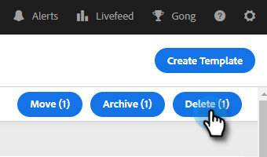

# テンプレートの管理 {#manage-templates}

## テンプレートの作成 {#create-a-new-template}

1. 「**テンプレート**」タブに移動します。

   

1. 「**テンプレートを作成**」をクリックします。

   

1. メールテンプレート用に、**名前**&#x200B;と&#x200B;**カテゴリ**&#x200B;を選択し、「**作成**」をクリックします。

   

1. テンプレートエディターで、メールの件名を作成し、必要なメッセージを入力します。編集ツール（フォント、テキストサイズなど）を使用して、表示方法をカスタマイズします。「**保存**」をクリックして、変更を確定します。

   

>[!TIP]
>
>必ずテンプレートに直接テキストを入力するか、プレーンテキストエディター（メモ帳や TextEdit など）からコピーするようにします。リッチテキストエディター（MS Word など）からコピー＆ペーストすると、書式が不揃いになる場合があります。

## テンプレートの詳細を表示 {#view-template-details}

「テンプレートの詳細」領域には、複数のタブが含まれています。

<table>
 <tr>
  <td><strong>テンプレート</strong></td>
  <td>レビューして編集したり、条件を設定してテンプレートを推奨テンプレートにしたり、メモを追加したりできます</td>
 </tr>
 <tr>
  <td><strong>分析</strong></td>
  <td>テンプレートのエンゲージメント分析を確認します。フィルターを適用した検索を実行します。</td>
 </tr>
 <tr>
  <td><strong>メール</strong></td>
  <td>このテンプレートを使用して送信されたすべてのメールを表示します。フィルターを適用した検索を実行します。</td>
 </tr>
 <tr>
  <td><strong>キャンペーン</strong></td>
  <td>テンプレートが使用されているキャンペーンを確認します。</td>
 </tr>
</table>

## テンプレートを共有 {#share-a-template}

チームアカウントを使用している場合、デフォルトでは、すべてのテンプレートがプライベートになっています。

1. 「**テンプレート**」タブに移動します。

   

1. 目的のテンプレートを検索して選択します。

   

1. 「**共有**」ボタンをクリックします。

   

   >[!NOTE]
   >
   >共有されているテンプレートは、テンプレートページの左側にある&#x200B;**チームテンプレート**&#x200B;ヘッダーの下に表示されます。チームは、Premium ユーザのみが使用できます。

1. 「共有するチーム」ドロップダウンをクリックし、共有するチームを選択します。

   

1. テンプレートを現在のカテゴリに保持するか、別のカテゴリに移動するかを選択できます。この例では、現在のカテゴリに保持します。完了したら「**共有**」をクリックします。

   

## テンプレートのお気に入りへの登録 {#favorite-a-template}

任意のカテゴリからお気に入りリストにテンプレートを追加できます。これにより、リストの一番上に新しいカテゴリが自動的に生成され、よく使用するテンプレートに素早くアクセスできるようになります。

1. 「**テンプレート**」タブに移動します。

   

1. 目的のテンプレートを見つけ、その上にポインターを合わせます。テンプレート名の左側に表示される星をクリックします。

   

   お気に入りに設定されると、星の表示が維持されます。

   

## テンプレート表示のカスタマイズ {#customize-template-view}

「**表示**」ドロップダウンから、すべてのテンプレート、自分のテンプレート、お気に入りのテンプレート、共有テンプレート、未共有のテンプレート、未使用のテンプレート（過去 90 日間使用されていないテンプレート）の表示を選択できます。

>[!NOTE]
>
>さらに、「表示」の右にある「設定」アイコンをクリックすると、テンプレートビューの列を追加／削除できます。

## テンプレートのアーカイブ {#archive-a-template}

テンプレートをアーカイブして、テンプレートデータを失うことなく、セールスコンテンツを整理して集中的に保ちます。

1. アーカイブするテンプレートの横にあるチェックボックスをオンにします。

   

1. 「**アーカイブ**」をクリックします。

   

1. 「**アーカイブ**」をクリックして確定します。

   

>[!NOTE]
>
>テンプレートをアーカイブすると、編集も使用もできなくなります。再度使用するには、テンプレートをアーカイブから他のカテゴリに移動します。

また、「未使用」フィルターを選択して、90 日以上使用されていないテンプレートを表示およびアーカイブできます。

## テンプレートの削除 {#delete-a-template}

テンプレートを削除するには、以下の手順に従います。

>[!CAUTION]
>
>テンプレートを削除すると、そのテンプレートに関連付けられているすべてのトラッキングと分析も削除されます。

1. 削除するテンプレートの横にあるチェックボックスをオンにします。

   

1. 「**削除**」をクリックします。

   

1. 「**削除**」をクリックして確定します。

   
