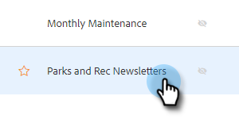
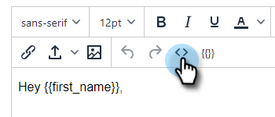
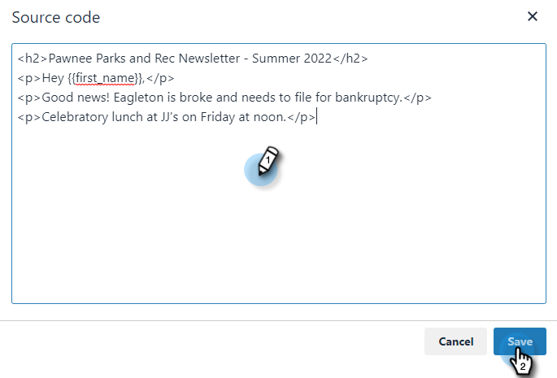

# HTML の使用 {#using-html}

1. HTML でメールを作成するために使用するツール（例：Marketo のメールエディター）で、メールからソースコードをコピーします。

1. HTML を追加したいテンプレートを選択します。

   

1. テンプレートエディターカードで、「**[!UICONTROL 編集]**」をクリックします。

   

1. テンプレートエディターの「**ソース**」ボタンをクリックします。

   

1. ソースコードを貼り付けて、「**[!UICONTROL 保存]**」をクリックします。

   

>[!NOTE]
>
>「Error - to remove the style/java/html tags」というエラーが表示された場合、サポートされていないスタイル設定が使用されています。 ソースコードで単語のスタイルを検索し、`` までをすべて削除する必要があります。
