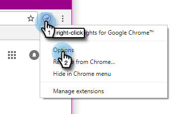
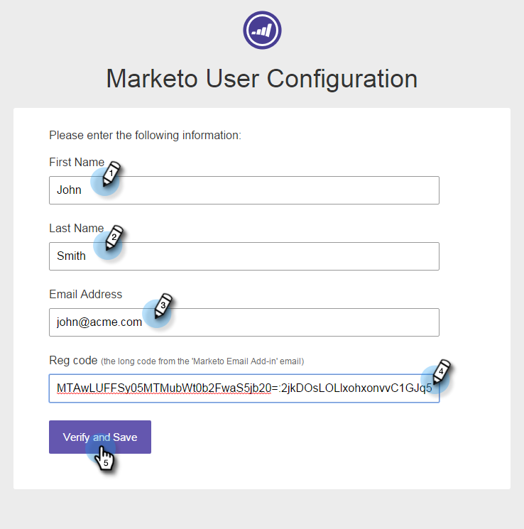

# [!DNL Google Chrome] への Marketo Insights のインストール {#install-marketo-insights-for-google-chrome}

次の手順に従って、強力な Chrome アドインの使用を開始します。 拡張機能をインストールするのに、Marketo 管理者である必要はありません。

>[!NOTE]
>
>セールスインサイトアクションの機能（セールスメールを送信、セールスキャンペーンに追加、タスクなど）は、Gmail および Outlook 用のセールスインサイトメールプラグインでは使用できません。 現時点では、ユーザは、セールスインサイトメールプラグインを使用している場合に、Marketo メールテンプレートを使用した／していないトラッキング可能なメールをお使いのメールクライアントから送信する機能のみ使用できます。

1. Chrome web ストアから、[Google Chrome アドイン拡張機能向け Marketo Insights](https://chrome.google.com/webstore/detail/marketo-for-google-mail/jjkfbhajlmoeegbjgjipliamplidmbjb){target="_blank"} をインストールします。

   

1. [!DNL Chrome] で Marketo のロゴを右クリックし、「**[!UICONTROL オプション]**」を選択します。

   

1. **[!UICONTROL Reg コード]**、**[!UICONTROL メールアドレス]**、**[!UICONTROL 名]**、**[!UICONTROL 姓]**&#x200B;を入力します。 「**[!UICONTROL 確認して保存]**」をクリックします。

   

   >[!CAUTION]
   >
   >このプラグインのエイリアスの使用はサポートされていないので、登録時には必ず&#x200B;**プライマリメールアカウント**&#x200B;を使用してください。

   >[!NOTE]
   >
   >Reg コードは、Marketo 管理者が [Marketo メールアドインライセンスを発行](/help/marketo/product-docs/marketo-sales-insight/msi-outlook-plugin/issue-a-marketo-email-add-in-license.md){target="_blank"}した後に送信されるメールに記載されています。 **Reg コードは 14 日後に有効期限が切れます**。

1. オフラインアクセスを許可するには、「**[!UICONTROL 許可]**」をクリックします。

   

>[!MORELIKETHIS]
>
>[Google Chrome 用 Marketo Insights の使用](/help/marketo/product-docs/marketo-sales-insight/msi-chrome-plugin/using-marketo-insights-for-google-chrome.md){target="_blank"}
