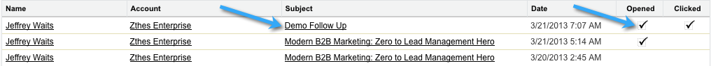

# Google ChromeでのMarketoインサイトの使用{#using-marketo-insights-for-google-chrome}

Google Chrome用のMarketoインサイトでGoogleの電子メールを送信し、追跡します。

>[!PREREQUISITES]
>
>[Google Chrome用Marketoインサイトのインストール](/help/marketo/product-docs/marketo-sales-insight/msi-chrome-plugin/install-marketo-insights-for-google-chrome.md)

## Marketoインサイトを含む電子メールの送信{#send-an-email-with-marketo-insights}

1. 「構成」ウィンドウで、「Marketo」アイコンをクリックします。

   

1. 「送信」ボタンがMarketoを紫に変更！ この電子メールは現在、Marketoと共に送信され、すべてのリンクが追跡され、トラッキングピクセルが電子メールに挿入されます。 これは、送信済みの販売用電子メールアクティビティとして記録されます。

   

   >[!NOTE]
   >
   >追跡ピクセルを使用すると、電子メールを開いたユーザーを特定できます。

   >[!TIP]
   >
   >オプションで、重複の矢印をクリックして、フルスクリーン表示に拡大します。

1. 電子メールに公開済みのMarketoテンプレートを事前入力する場合は、「**その他のオプション**」をクリックし、「**Marketoテンプレートを読み込む**」を選択します。

   

1. **利用可能なテンプレート**&#x200B;を選択し、**OK**&#x200B;をクリックします。

   

1. コンテンツと電子メールアドレスを入力し、「**送信**」をクリックします。

   

   >[!NOTE]
   >
   >メッセージは、**「**&#x200B;送信」ボタンが紫の場合にのみ追跡されます。

1. この電子メールは間もなくMarketoセールスインサイトに表示され、開いたクリックが追跡されます。

   

## Marketoとの電子メール返信をログ{#log-email-replies-with-marketo}

リードのアクティビティ履歴に返信や古いアクティビティを記録できます。

1. Googleメールのプレビューウィンドウで、**「Marketo**&#x200B;でログ」をクリックします。

   

1. それだけだ！ この電子メールは、間もなくMarketoセールスインサイトに表示されます。

   

   >[!MORELIKETHIS]
   >
   >* [Google Chrome用Marketoインサイトのインストール](/help/marketo/product-docs/marketo-sales-insight/msi-chrome-plugin/install-marketo-insights-for-google-chrome.md)
   >* [Googleメールの表示担当者とアカウント情報およびアクティビティ](/help/marketo/product-docs/marketo-sales-insight/msi-chrome-plugin/view-person-and-account-information-and-activities-in-google-mail.md)

