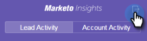

# Google メールでリードとアカウントの情報とアクティビティを表示 {#view-person-and-account-information-and-activities-in-google-mail}

## Google メールでのアクティビティの表示 {#view-activities-in-google-mail}

コンテキスト情報の豊富な Marketo Insights ペインを使って、リードアカウントの情報と最近のアクティビティを確認できます。

このペインは、全画面モードのメール作成ウィンドウでも、通常の Google メール閲覧モードでも表示されます。作成ウィンドウの場合は、「宛先」フィールドに入力されている最初の人に関する情報とアクティビティが表示され、閲覧モードの場合は、今読んでいるメールの送信者に関する情報とアクティビティが表示されます。

「リードのアクティビティ」タブには、名前、肩書き、写真など、リードに関する関連情報が表示されます。Web ページへの訪問、フォームの入力、リンクのクリック、イベント参加、メールの開封など、メール送信後に発生した最新のアクティビティについても確認できます。

「アカウントのアクティビティ」タブには、会社名、web サイトの URL、所在地など、アカウントの関連情報が表示されます。同じタブに、アカウントの最新のアクティビティも示されます。アカウントは、リードのドメイン別に識別されます。サブスクリプションにおけるセールスインサイトのユーザーが、既にメールをやりとりしている場合には、アクティビティがリストに表示されます。

まだリードとセールスメールをやり取りしていない場合、アクティビティは表示されません。

アイコンをクリックすると、ペインが縮小されます。

Marketo アイコンをクリックすると、ペインが拡大されます。

## Google Chrome でのアクティビティの表示 {#view-activities-in-google-chrome}

また、Google Chrome のグローバルアクティビティペインを使用して、最近やり取りしたすべての人に対して発生した最新のアクティビティの完全なリストを確認できます。これは、アイコンに未読のアクティビティの数を継続的に表示する、リアルタイムに更新されたフィードです。

Marketo アイコンをクリックして、ペインを開きます。

>[!MORELIKETHIS]
>
>[Google Chrome への Marketo Insights の使用](/help/marketo/product-docs/marketo-sales-insight/msi-chrome-plugin/using-marketo-insights-for-google-chrome.md)
