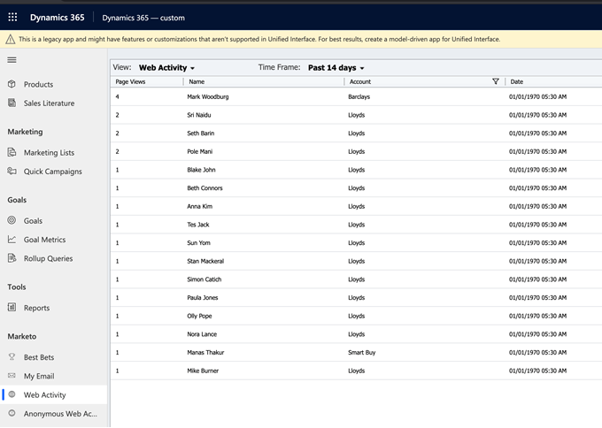

# Web アクティビティ {#web-activities}

「Web アクティビティ」タブには、リード／連絡先の web アクティビティが表示されます。
リードの最新の web アクティビティをレビューし、ページ訪問数と各アカウントを参照します。 結果をフィルターして、指定したページ数に制限できます。

## 匿名の web アクティビティ {#anonymous-web-activities}

「匿名の web アクティビティ」タブには、**匿名**&#x200B;の web ページ訪問者の web アクティビティが表示されます。 ページ訪問数を参照して、最新の web アクティビティを確認します。
