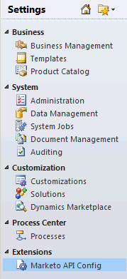

# [!DNL Microsoft Dynamics 2011] での [!DNL Marketo Sales Insight] のインストールと設定 {#install-and-configure-marketo-sales-insight-in-microsoft-dynamics}

[!DNL Marketo Sales Insight] は、セールスチームが使えるとても便利なツールです。[!DNL Microsoft Dynamics 2011] オンプレミスで Marketo セールスインサイトをインストールし、設定する方法を、以下に順を追って説明します。

>[!PREREQUISITES]
>
>Marketo と Microsoft の統合を完了します。
>
>お使いのバージョンの [!DNL Microsoft Dynamics] CRM に[適したソリューションをダウンロードします](/help/marketo/product-docs/marketo-sales-insight/msi-for-microsoft-dynamics/installing/download-the-marketo-sales-insight-solution-for-microsoft-dynamics.md)。

## ソリューションの読み込み {#import-solution}

1. [!DNL Microsoft Dynamics] CRM にログインします。左下のメニューで「**[!UICONTROL 設定]**」をクリックします。

   

1. ツリーで「**[!UICONTROL ソリューション]**」を選択します。

   

1. **インポート**（）をクリックします。

   

   >[!NOTE]
   >
   >次に進む前に、あらかじめ Marketo ソリューションを[インストールして設定](/help/marketo/product-docs/marketo-sales-insight/msi-for-microsoft-dynamics/installing/install-and-configure-marketo-sales-insight-in-microsoft-dynamics-2011.md)しておく必要があります。

1. 「**[!UICONTROL 参照]**」をクリックします。[ダウンロード](/help/marketo/product-docs/marketo-sales-insight/msi-for-microsoft-dynamics/installing/download-the-marketo-sales-insight-solution-for-microsoft-dynamics.md)した [!DNL Marketo Sales Insight] ソリューションを選択します。「**[!UICONTROL 次へ]**」をクリックします。

   

1. ソリューションの詳細を確認し、「**[!UICONTROL 次へ]**」をクリックします。

   

1. 「SDK メッセージ」オプションがオンになっていることを確認します。「**[!UICONTROL 次へ]**」をクリックします。

   

1. インポートが完了するまで待ちます。

   

1. 「**[!UICONTROL 閉じる]**」をクリックします。

   

1. [!DNL Marketo Sales Insight] がソリューションリストに表示されます。これで完了です。

   

1. 「[!DNL Marketo Sales Insight]」を選択し、「**すべてのカスタマイズを公開**」（）をクリックします。

   

## Marketo と Sales Insight の接続  {#connect-marketo-and-sales-insight}

>[!NOTE]
>
>**管理者権限が必要**

1. Marketo にログインし、**[!UICONTROL 管理]**&#x200B;をクリックします。

   

1. **[!UICONTROL Sales Insight]** セクションで、「**[!UICONTROL API 設定を編集]**」をクリックします。

   

1. 「**[!UICONTROL Marketo ホスト]**」、「**[!UICONTROL API URL]**」、「**[!UICONTROL API ユーザー ID]**」をコピーして、後の手順で使用します。任意の **[!UICONTROL API 秘密鍵]**&#x200B;を入力し、「**[!UICONTROL 保存]**」をクリックします。

   >[!CAUTION]
   >
   >API 秘密鍵にはアンパサンド（&amp;）を使用しないでください。

   

   >[!NOTE]
   >
   >Sales Insight を機能させるには、_リードと連絡先の両方_&#x200B;で、次のフィールドを Marketo と同期する必要があります。
   >
   >* 優先度
   >* 緊急度
   >* 相対スコア
   >
   >これらのフィールドのいずれかが見つからない場合は、見つからないフィールドの名前のエラーメッセージが Marketo に表示されます。これを修正するには、[この手順](/help/marketo/product-docs/marketo-sales-insight/msi-for-microsoft-dynamics/setting-up-and-using/required-fields-for-syncing-marketo-with-dynamics.md)を実行します。

1. Dynamics に戻り、「**[!UICONTROL 設定]**」を選択します。

   

1. ツリーで「**[!UICONTROL Marketo API 設定]**」を選択します。

   

1. 「**[!UICONTROL デフォルト設定]**」をクリックします。

   

1. 先ほど Marketo から取得した情報を入力します。

   

1. 「**[!UICONTROL 保存]**」をクリックします。

   

## ユーザーアクセスの設定 {#set-user-access}

特定のユーザに [!DNL Sales Insight] へのアクセス権を付与するユーザのロールを設定します。

1. 「**[!UICONTROL 設定]**」を選択します。

   

1. ツリーで&#x200B;**[!UICONTROL 「管理」]**&#x200B;を選択します。

   

1. 「**[!UICONTROL ユーザー]**」をクリックします。

   

1. アクセス権を付与するユーザーを選択し、「**[!UICONTROL 役割を管理]**」をクリックします。

   

1. **[!UICONTROL Marketo セールスインサイト]**&#x200B;のロールを選択し、「**[!UICONTROL OK]**」をクリックします。

   

   これで完了です。これで、アクセス権を持つユーザーすべてが、リード／取引先責任者の詳細ビューで Sales Insight のセクションを閲覧できるようになりました。

   

   おめでとうございます。これで、[!DNL Marketo Sales Insight] を活用できるようになりました。

>[!MORELIKETHIS]
>
>[リード／取引先責任者レコードの星と炎の設定](/help/marketo/product-docs/marketo-sales-insight/msi-for-microsoft-dynamics/setting-up-and-using/setting-up-stars-and-flames-for-lead-contact-records.md)
