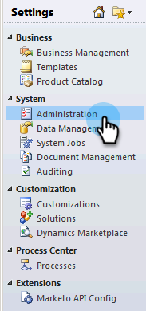

# Microsoft Dynamics 2011でのMarketo Sales Insightのインストールと構成 {#install-and-configure-marketo-sales-insight-in-microsoft-dynamics}

Marketo Sales Insightは、セールスチームにとって素晴らしいツールです。 Microsoft Dynamics 2011オンプレミスでのインストールと構成の手順を説明します。

>[!PREREQUISITES]
>
>Marketoと [Microsoftの統合を完了します](http://docs.marketo.com/x/DoA2)。
>
>[お使いのバージョンのMicrosoft Dynamics CRMに適したソリューション](http://docs.marketo.com/x/LoJo) をダウンロードしてください。

## ソリューションのインポート {#import-solution}

1. Microsoft Dynamics CRMにサインインします。 左下のメニューで **設定** (Settings)をクリックします。

   

1. ツリーで **「Solutions** 」を選択します。

   

1. [ **インポート** ] ( )をクリックします。

   

   >[!NOTE]
   >
   >**Reminder**
   >
   >
   >先に進む前に、Marketo Solutionをすでに [インストールして設定しておく必要があります](install-and-configure-marketo-sales-insight-in-microsoft-dynamics-2011.md) 。

1. 「 **参照**」をクリックします。 ダウンロードしたMarketo Sales Insightソリューションを選択 [します](download-the-marketo-sales-insight-solution-for-microsoft-dynamics.md)。 「 **次へ**」をクリックします。

   

1. ソリューションの詳細を確認し、「 **次へ**」をクリックします。

   

1. 「SDKメッセージ」オプションがオンになっていることを確認します。 「 **次へ**」をクリックします。

   

1. 次に、インポートが終了するのを待ちます。

   

1. 「 **閉じる**」をクリックします。

   

1. Marketo Sales Insightがソリューションリストに表示されます。 やった！

   

1. 「Marketor Sales Insight」を選択し、「 **Publish All Customizations** ( )」をクリックします。

   

## MarketorとSales Insightの接続  {#connect-marketo-and-sales-insight}

>[!NOTE]
>
>**必要な管理者権限**

1. Marketorにログインし、「 **管理者**」をクリックします。

   

1. 「**Sales Insight **」セクションで、「API設定を **編集**」をクリックします。

   

1. 後の手順で使用するた **めに、** Marketo Host **、** API URL **、** API User Idをコピーします。 任意の **API秘密キーを入力し** 、「 **保存**」をクリックします。

   >[!CAUTION]
   >
   >API秘密鍵にアンパサンド(&amp;)を使用しないでください。

   

   >[!NOTE]
   >
   >Sales Insightのリードと連絡先の ** 両方が機能するには、次のフィールドをMarketorと同期する必要があります。
   >
   >    
   >    
   >    * 優先度
   >    * 緊急度
   >    * 相対スコア

   >    
   >    
   >これらのフィールドのいずれかが見つからない場合は、Marketorに、見つからないフィールドの名前のエラーメッセージが表示されます。 これを修正するには、 [次の手順を実行します](../../../../product-docs/marketo-sales-insight/msi-for-microsoft-dynamics/setting-up-and-using/required-fields-for-syncing-marketo-with-dynamics.md)。

1. [ダイナミクス]に戻り、[ **設定**]を選択します。

   

1. ツリーで **Marketo API Config** を選択します。

   

1. 「 **デフォルト設定**」をクリックします。

   

1. 以前にマーケティング担当者から受け取った情報を入力します。

   

1. 「 **保存」をクリックします。**

   ** 

   **

## ユーザーアクセスの設定 {#set-user-access}

特定のユーザーにSales Insightへのアクセス権を与えるユーザーロールを設定します。

1. 「 **設定**」を選択します。

   

1. ツリーで「 **管理** 」を選択します。

   

1. 「 **ユーザー**」をクリックします。

   

1. アクセス権を付与するユーザーを選択し、「ロール **の管理**」をクリックします。

   

1. 「 **Marketo Sales Insight** 」ロールを選択し、「 **OK**」をクリックします。

   

   それだ！ すべてのユーザーがアクセス権を持つと、リード/連絡先の詳細表示の「販売インサイト」セクションを表示できます。

   

   おめでとう。 これで、Marketo Sales Insightの機能が解放されました。

>[!NOTE]
>
>**関連記事**
>
>[リード/接触レコードの星と炎の設定](http://docs.marketo.com/x/BICMAg)

