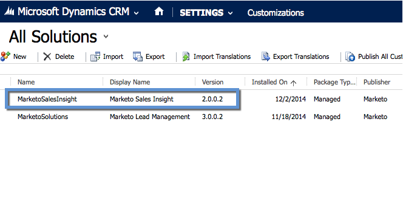

# [!DNL Marketo Sales Insight] での [!DNL Microsoft Dynamics 2013] のインストールと設定 {#install-and-configure-marketo-sales-insight-in-microsoft-dynamics}

[!DNL Marketo Sales Insight] は、マーケティングチームが持つ豊富なデータに対する「窓口」をセールスチームに提供するための素晴らしいツールです。 インストールと設定方法を次に示します。

>[!PREREQUISITES]
>
>Marketo と Microsoft の統合を完了します。
>
>お使いのバージョンの [ CRM の ](/help/marketo/product-docs/marketo-sales-insight/msi-for-microsoft-dynamics/installing/download-the-marketo-sales-insight-solution-for-microsoft-dynamics.md) 正しいソリューションをダウンロード [!DNL Microsoft Dynamics] します。

## ソリューションのインポート {#import-solution}

OK、[!DNL Marketo Sales Insight] しいソリューションを [!DNL Microsoft Dynamics] に読み込みます。

1. **[!UICONTROL Microsoft Dynamics CRM]** で、「**[!UICONTROL 設定]**」をクリックします。

   

1. 「**[!UICONTROL 設定]**」で、「**[!UICONTROL カスタマイズ]**」をクリックします。

   

1. 「**[!UICONTROL ソリューション]**」をクリックします。

   

   >[!NOTE]
   >
   >次に進む前に、あらかじめ Marketo をインストールして設定しておく必要があります

1. 「**[!UICONTROL インポート]**」をクリックします。

   

1. 新しいウィンドウで、「**[!UICONTROL 参照]**」をクリックします。

   

1. 上記でダウンロードしたソリューションを見つけて選択します。

   

1. 「**[!UICONTROL 次へ]**」をクリックします。

   

1. ソリューションがアップロードされます。必要に応じて、パッケージの内容を表示できます。「**[!UICONTROL 次へ]**」をクリックします。

   

1. ボックスがチェックされていることを確認して、「**[!UICONTROL インポート]**」をクリックします。

   

1. ログファイルを自由にダウンロードしてください。 「**[!UICONTROL 閉じる]**」をクリックします。

   

1. これで完了です。ソリューションがすぐに表示されます。表示されない場合は、画面を更新します。

   

## Marketo と Sales Insight の接続 {#connect-marketo-and-sales-insight}

Marketo インスタンスを [!DNL Sales Insight] で [!DNL Dynamics] に関連付けましょう。

>[!NOTE]
>
>管理者権限が必要。

1. Marketo にログインし、「**[!UICONTROL 管理者]**」セクションに移動します。

   

1. **[!UICONTROL Sales Insight]** セクションで、「**[!UICONTROL API 設定を編集]**」をクリックします。

   

1. 「**[!UICONTROL Marketo ホスト]**」、「**[!UICONTROL API URL]**」、「**[!UICONTROL API ユーザー ID]**」をコピーして、後の手順で使用します。任意の **[!UICONTROL API 秘密鍵]**&#x200B;を入力し、「**[!UICONTROL 保存]**」をクリックします。

   >[!CAUTION]
   >
   >API 秘密鍵にはアンパサンド（&amp;）を使用しないでください。

   

   >[!NOTE]
   >
   >Sales Insight を機能させるには、_リードと連絡先の両方_&#x200B;で、次のフィールドを Marketo と同期する必要があります。
   >
   >* 優先度
   >* 緊急度
   >* 相対スコア
   >
   >これらのフィールドのいずれかが見つからない場合は、見つからないフィールドの名前のエラーメッセージが Marketo に表示されます。これを修正するには、[この手順](/help/marketo/product-docs/marketo-sales-insight/msi-for-microsoft-dynamics/setting-up-and-using/required-fields-for-syncing-marketo-with-dynamics.md)を実行します。

1. [!DNL Microsoft Dynamics] に戻り、**[!UICONTROL 設定]** に移動します。

   

1. 「**[!UICONTROL 設定]**」で、「**[!UICONTROL Marketo API 設定]**」をクリックします。

   

1. 「**[!UICONTROL 新規]**」をクリックします。

   

1. 先ほど Marketo から取得した情報を入力し、「**[!UICONTROL 保存]**」をクリックします。

   

## ユーザーアクセスの設定 {#set-user-access}

最後に、特定のユーザーに [!DNL Marketo Sales Insight] へのアクセス権を付与できます。

1. 「**[!UICONTROL 設定]**」に移動します。

   

1. 「**[!UICONTROL ユーザー]**」をクリックします。

   

1. Sales Insight へのアクセス権を付与するユーザーを選択し、「**[!UICONTROL 役割の管理]**」をクリックします。

   

1. **[!UICONTROL Marketo Sales Insight]** の役割を選択し、「**[!UICONTROL OK]**」をクリックします。

   

   これですべて完了です。最後に、テストするには、[!DNL Dynamics] へのアクセス権を持つユーザーとして [!DNL Marketo Sales Insight] にログインし、リードまたは連絡先を確認します。

   

これで、セールスチームの [!DNL Marketo Sales Insight] の力を解放できました。

>[!MORELIKETHIS]
>
>[リード／連絡先レコードの星と炎の設定](/help/marketo/product-docs/marketo-sales-insight/msi-for-microsoft-dynamics/setting-up-and-using/setting-up-stars-and-flames-for-lead-contact-records.md)
