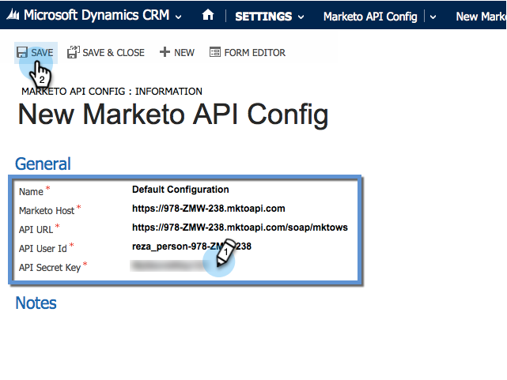

# Microsoft Dynamics 2013でのMarketo Sales Insightのインストールと構成 {#install-and-configure-marketo-sales-insight-in-microsoft-dynamics}

Marketo Sales Insightは、マーケティングチームが持つ豊富なデータをセールスチームに「窓口」として提供する素晴らしいツールです。 以下に、インストールおよび設定の方法を示します。

>[!PREREQUISITES]
>
>Marketoと [Microsoftの統合を完了します](http://docs.marketo.com/x/EIA2)。
>
>[お使いのバージョンのMicrosoft Dynamics CRMに適したソリューション](http://docs.marketo.com/x/LoJo) をダウンロードしてください。

## ソリューションのインポート {#import-solution}

次に、Marketo Sales InsightソリューションをMicrosoft Dynamicsにインポートします。

1. 「 **Microsoft Dynamics CRM** 」の「 **設定**」をクリックします。

   

1. 「 **設定**」で、「 **カスタマイズ」をクリックします**。

   

1. 「 **ソリューション**」をクリックします。

   

   >[!NOTE]
   >
   >**Reminder**
   >
   >
   >次に進む前に、Marketoを既にインストールし、設定しておく必要があります

1. 「 **読み込み**」をクリックします。

   

1. 新しいウィンドウで、「 **参照**」をクリックします。

   

1. 上記でダウンロードしたソリューションを探して選択します。

   

1. 「 **次へ**」をクリックします。

   

1. ソリューションがアップロードされます。 必要に応じて、パッケージの内容を表示できます。 「 **次へ**」をクリックします。

   

1. チェックボックスをオンのままにして、「 **読み込み**」をクリックします。

   

1. ログファイルは自由にダウンロードできます。 「 **閉じる**」をクリックします。

   

1. すごい！ 解決策を今すぐ見てみましょう。 表示されていない場合は、画面を更新します。

   

## MarketorとSales Insightの接続 {#connect-marketo-and-sales-insight}

MarketorのインスタンスをDynamicsのSales Insightに結び付けます。

>[!NOTE]
>
>管理者権限が必要です。

1. Marketorにログインし、「 **管理者** 」セクションに移動します。

   

1. 「 **Sales Insight** 」セクションで、「 **Edit API Configuration**」をクリックします。

   

1. 後の手順で使用するた **めに、** Marketo Host **、** API URL **、** API User Idをコピーします。 任意の **API秘密キーを入力し** 、「 **保存**」をクリックします。

   >[!CAUTION]
   >
   >API秘密鍵にアンパサンド(&amp;)を使用しないでください。

   

   >[!NOTE]
   >
   >Sales Insightのリードと連絡先の ** 両方が機能するには、次のフィールドをMarketorと同期する必要があります。
   >
   >    
   >    
   >    * 優先度
   >    * 緊急度
   >    * 相対スコア

   >    
   >    
   >これらのフィールドのいずれかが見つからない場合は、Marketorに、見つからないフィールドの名前のエラーメッセージが表示されます。 これを修正するには、 [次の手順を実行します](../../../../product-docs/marketo-sales-insight/msi-for-microsoft-dynamics/setting-up-and-using/required-fields-for-syncing-marketo-with-dynamics.md)。

1. Microsoft Dynamicsに戻り、「 **設定**」に移動します。

   

1. 「 **設定**」で、「 **Marketto API Config**」をクリックします。

   

1. 「 **新規**」をクリックします。

   

1. 以前にMarketorから取得した情報を入力し、「 **保存**」をクリックします。

   

## ユーザーアクセスの設定 {#set-user-access}

最後に、特定のユーザーにMarketor Sales Insightへのアクセスを与えることができます。

1. 「 **設定**」に移動します。

   

1. 「 **ユーザー**」をクリックします。

   

1. Sales Insightへのアクセス権を付与するユーザーを選択し、「 **Manage Roles**」をクリックします。

   

1. 「 **Marketo Sales Insight** 」ロールを選択し、「 **OK**」をクリックします。

   

   お前は全部終わらなきゃ！ 最後に、テストを行うには、Marketor Sales Insightにアクセスし、リードや連絡先を調べるユーザーとしてDynamicsにログインします。

   

これで、Marketo Sales Insightのセールスチームの機能がロック解除されました。

>[!NOTE]
>
>**関連記事**
>
>[リード/接触レコードの星と炎の設定](http://docs.marketo.com/x/BICMAg)

