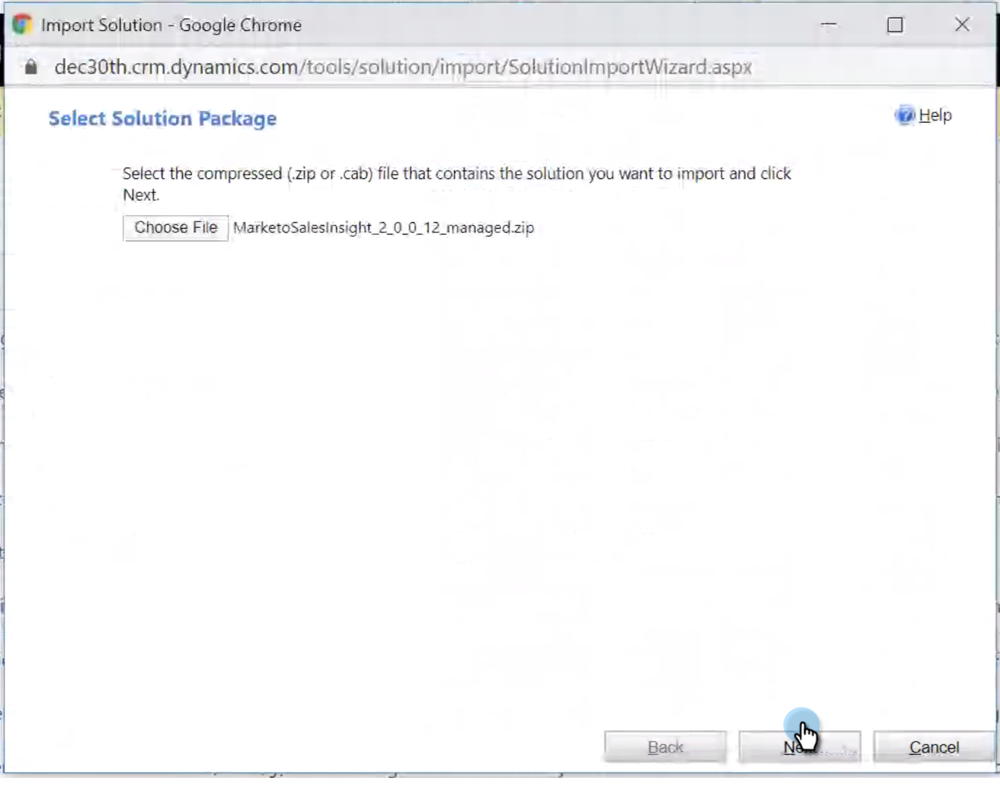

# Microsoft Dynamics OnlineでのMarketor Sales Insightのインストールと構成 {#install-and-configure-marketo-sales-insight-in-microsoft-dynamics-online}

Marketo Sales Insightは、マーケティングチームが持つ豊富なデータをセールスチームに「窓口」として提供する素晴らしいツールです。 Microsoft Dynamics Onlineにインストールして構成する方法を次に示します。

>[!PREREQUISITES]
>
>Marketoと [Microsoftの統合を完了します](http://docs.marketo.com/x/E4A2)。
>
>[お使いのバージョンのMicrosoft Dynamics CRMに適したソリューション](http://docs.marketo.com/x/LoJo) をダウンロードしてください。

## ソリューションのインポート {#import-solution}

>[!NOTE]
>
>統合インターフェイスを使用している場合は、下の手順1より前に、右上隅の設定アイコンをクリックし、「 **詳細設定**」を選択します。

1. Microsoft Dynamics CRMで、「 **設定**」をクリックします。

   

1. [設定]で、[ **カスタマイズ**]をクリックします。

   

1. 「 **ソリューション**」をクリックします。

   

   >[!NOTE]
   >
   >**Reminder**
   >
   >
   >先に進む前に、Marketoソリューションを既にインストールして設定しておく必要があります。

1. 「 **読み込み**」をクリックします。

   

1. 新しいウィンドウで、「 **参照**」をクリックします。

   

1. ダウンロードしたソリューションをコンピューターで探し、インストールします。
1. 「 **次へ**」をクリックします。

   

1. ソリューションがアップロードされます。 必要に応じて、パッケージの内容を表示できます。 「 **次へ**」をクリックします。

   

1. チェックボックスをオンのままにして、「 **読み込み**」をクリックします。

   

1. ログファイルを自由にダウンロードして、「 **閉じる**」をクリックします。

   

1. すごい！ 解決策を今すぐ見てみましょう。 表示されていない場合は、画面を更新します。

   

1. 「 **公開のカスタマイズ**」をクリックします。

   >[!NOTE]
   >
   >グローバルMS Dynamicsの同期を有効にしてください。

## MarketorとSales Insightの接続 {#connect-marketo-and-sales-insight}

MarketorのインスタンスをDynamicsのSales Insightに結び付けます。 その方法を次に示します。

>[!NOTE]
>
>**必要な管理者権限**

1. Marketingにログインし、「**Admin **」セクションに移動します。

   

1. 「Sales Insight」セクションで、「 **Edit API Configuration**」をクリックします。

   

1. 後の手順で使用するた **めに、** Marketo Host **、** API URL **、** API User Idをコピーします。 任意のAPI秘密キーを入力し、「 **保存**」をクリックします。

   >[!CAUTION]
   >
   >API秘密鍵にアンパサンド(&amp;)を使用しないでください。

   

   >[!NOTE]
   >
   >Sales Insightのリードと連絡先の ** 両方が機能するには、次のフィールドをMarketorと同期する必要があります。
   >
   >    
   >    
   >    * 優先度
   >    * 緊急度
   >    * 相対スコア

   >    
   >    
   >これらのフィールドのいずれかが見つからない場合は、Marketorに、見つからないフィールドの名前のエラーメッセージが表示されます。 これを修正するには、 [次の手順を実行します](../../../../product-docs/marketo-sales-insight/msi-for-microsoft-dynamics/setting-up-and-using/required-fields-for-syncing-marketo-with-dynamics.md)。

1. Microsoft Dynamicsに戻り、「 **設定**」に移動します。

   

1. 「 **設定**」で、「 **Marketto API Config**」をクリックします。

   

1. 「 **新規**」をクリックします。

   

1. 以前にMarketorから取得した情報を入力し、「 **保存**」をクリックします。

   

## 同期を有効にする {#enable-sync}

1. Marketorで、「 **管理者**」をクリックします。

   

1. 「統合」で、「 **Microsoft Dynamics**」を選択します。

   

1. 「同期を **有効にする**」をクリックします。

   

1. 「フィールドの同期の詳細」の **横にある「編集** 」をクリックします。

   

1. これは *自動的に* 、以前無効にされたMSIフィールド（緊急度、相対スコア、優先度）を選択します。 「 **Save** to開始syncing data」をクリックするだけで済みます。

   

## ユーザーアクセスの設定 {#set-user-access}

最後に、特定のユーザーに、Marketor Sales Insightの使用に対するアクセス権を与える必要があります。

1. 「 **設定**」に移動します。

   

1. 「 **セキュリティ**」に移動します。

   

1. 「 **ユーザー**」をクリックします。

   

1. Sales Insightへのアクセス権を付与するユーザーを選択し、「ロールの **管理**」をクリックします。

   

1. Marketo Sales Insightロールを選択し、「 **OK**」をクリックします。

   

   お前は全部終わらなきゃ！ 最後に、テストを行うには、Marketor Sales Insightにアクセスし、リードや連絡先を調べるユーザーとしてDynamicsにログインします。

   

>[!NOTE]
>
>**関連記事**
>
>[リード/接触レコードの星と炎の設定](http://docs.marketo.com/x/BICMAg)

