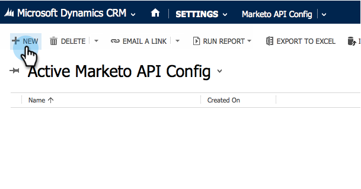

# Marketo Sales Insight の Microsoft Dynamics Online へのインストールおよび設定 {#install-and-configure-marketo-sales-insight-in-microsoft-dynamics-online}

Marketo Sales Insight は、マーケティングチームが持つ豊富なデータをセールスチームに「窓」として提供するための素晴らしいツールです。Microsoft Dynamics Online にインストールして設定する方法を次に示します。

>[!PREREQUISITES]
>
>Marketo と Microsoft の統合を完了します。
>
>お使いのバージョンの Microsoft Dynamics CRM に[適したソリューションをダウンロードします](/help/marketo/product-docs/marketo-sales-insight/msi-for-microsoft-dynamics/installing/download-the-marketo-sales-insight-solution-for-microsoft-dynamics.md)。

## ソリューションのインポート {#import-solution}

>[!NOTE]
>
>統合インターフェイスを使用している場合は、下の手順 1 より前に、右上隅の「設定」アイコンをクリックし、「**詳細設定**」を選択します。

1. Microsoft Dynamics CRM で、「**設定**」をクリックします。

   

1. 「設定」で、「**カスタマイズ**」をクリックします。

   

1. 「**ソリューション**」をクリックします。

   

   >[!NOTE]
   >
   >次に進む前に、あらかじめ Marketo ソリューションをインストールして設定しておく必要があります。

1. 「**インポート**」をクリックします。

   

1. 新しいウィンドウで、「**参照**」をクリックします。

   

1. お使いのコンピューターで、ダウンロードしたソリューションを探してインストールします。

1. 「**次へ**」をクリックします。

   

1. ソリューションがアップロードされます。必要に応じて、パッケージの内容を表示できます。「**次へ**」をクリックします。

   

1. ボックスがチェックされていることを確認して、「**インポート**」をクリックします。

   

1. ログファイルを任意にダウンロードして、「**閉じる**」をクリックします。

   

1. これで完了です。ソリューションがすぐに表示されます。表示されない場合は、画面を更新します。

   

1. 「**カスタマイズを公開**」をクリックします。

   >[!NOTE]
   >
   >必ず Global MS Dynamics 同期を有効にしてください。

## Marketo と Sales Insight の接続 {#connect-marketo-and-sales-insight}

Marketo インスタンスを Dynamics の Sales Insight に接続します。手順は次のとおりです。

>[!NOTE]
>
>**管理者権限が必要**

1. Marketo にログインし、**管理者**&#x200B;セクションに移動します。

   

1. Sales Insight セクションで、「**API 設定を編集**」をクリックします。

   

1. 「**Marketo ホスト**」、「**API URL**」、「**API ユーザー ID**」をコピーして、後の手順で使用します。任意の API 秘密鍵を入力し、「**保存**」をクリックします。

   >[!CAUTION]
   >
   >API 秘密鍵にはアンパサンド（&amp;）を使用しないでください。

   

   >[!NOTE]
   >
   >Sales Insight を機能させるには、_リードと連絡先の両方_&#x200B;で、次のフィールドを Marketo と同期する必要があります。
   >
   >* 優先度
   >* 緊急度
   >* 相対スコア
   >
   >これらのフィールドのいずれかが見つからない場合は、見つからないフィールドの名前のエラーメッセージが Marketo に表示されます。これを修正するには、[この手順](/help/marketo/product-docs/marketo-sales-insight/msi-for-microsoft-dynamics/setting-up-and-using/required-fields-for-syncing-marketo-with-dynamics.md)を実行します。

1. Microsoft Dynamics に戻り、「**設定**」に移動します。

   

1. 「**設定**」で、「**Marketo API 設定**」をクリックします。

   

1. 「**新規**」をクリックします。

   

1. 先ほど Marketo から取得した情報を入力し、「**保存**」をクリックします。

   

## 同期の有効化 {#enable-sync}

1. Marketo で、「**管理者**」をクリックします。

   

1. 「統合」で、「**Microsoft Dynamics**」を選択します。

   

1. 「**同期を有効にする**」をクリックします。

   

1. 「フィールド同期の詳細」の横にある「**編集**」をクリックします。

   

1. これにより、以前に無効にした MSI フィールド（緊急度、相対スコア、優先度）が&#x200B;_自動的に_&#x200B;選択されます。「**保存**」をクリックして、データの同期を開始します。

   

## ユーザーアクセスの設定 {#set-user-access}

最後に、Marketo Sales Insight を使用するには、特定のユーザーにアクセス権を付与する必要があります。

1. 「**設定**」に移動します。

   

1. 「**セキュリティ**」に移動します。

   

1. 「**ユーザー**」をクリックします。

   

1. Sales Insight へのアクセス権を付与するユーザーを選択し、「**役割の管理**」をクリックします。

   

1. Marketo Sales Insight の役割を選択し、「**OK**」をクリックします。

   

   これですべて完了です。最後に、Marketo Sales Insight にアクセスし、リードや連絡先を調べるユーザーとして Dynamics にログインし、テストを実施します。

   

>[!MORELIKETHIS]
>
>[リード／連絡先レコードの星と炎の設定](/help/marketo/product-docs/marketo-sales-insight/msi-for-microsoft-dynamics/setting-up-and-using/setting-up-stars-and-flames-for-lead-contact-records.md)
