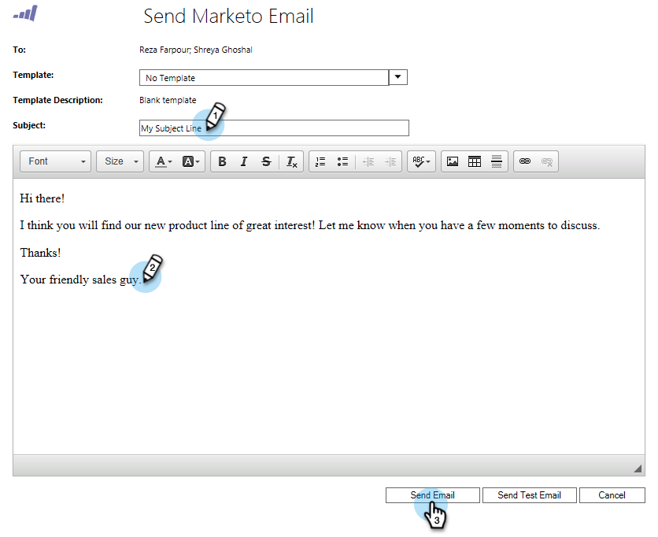

# Microsoft Dynamics {#send-a-marketo-sales-email-from-microsoft-dynamics}からのMarketor Sales Eメールの送信

販売チームは電子メールを送信し、Microsoft Dynamics内から直接、開いたりクリックしたりするために電子メールを追跡できます。 これが方法です。

1. Dynamicsで、**販売**&#x200B;領域に移動します。

   

1. **システム表示**&#x200B;を選択します。

   

1. 1つまたは複数のリードを選択します。

   

1. **をクリック…「**」タブをクリックし、「**電子メールにマーケティングを送信**」をクリックします。

   

   >[!TIP]
   >
   >[電子メールをテンプレート](../../../../product-docs/marketo-sales-insight/msi-for-salesforce/features/actions-in-the-msi-panel/send-marketo-email/publish-an-email-to-sales-insight.md)として発行して、販売チームが使用できるようにします。

1. 件名を入力し追加、電子メールを作成し、**電子メールを送信**&#x200B;をクリックします。 （必要に応じてテンプレートを選択します）。

   

   最初に[**テスト用電子メールの送信**]をクリックすると、実際の電子メールを送信する前に電子メールが（Microsoft Dynamicsのプライマリ電子メールアドレス）自分に送信されます。

うまくいった！ これで、Microsoft Dynamics内からMarketto追跡電子メールを直接送信する方法を理解できました。

>[!MORELIKETHIS]
>
>* [Microsoft Dynamics追加のMarketing Serverキャンペーンへのリード/連絡先](add-a-lead-contact-to-a-marketo-campaign-from-microsoft-dynamics.md)

>

