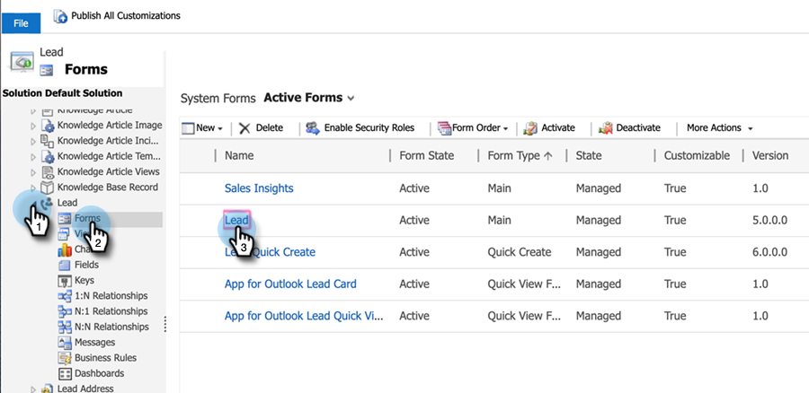

# リード／連絡先レコードの星と炎の設定 {#setting-up-stars-and-flames-for-lead-contact-records}

リード／連絡先レコードの星と炎は、「リードスコア」、「相対スコア」、「緊急度」および「優先度」フィールド項目に依存します。これらのフィールドは、MSI ソリューションをインストールして設定した後、デフォルトで使用できます。星と炎がない場合は、以前の設定／カスタマイズによって、星と炎が削除された可能性があります。以下の手順に従って、それらを追加します。

1. Microsoft Dynamics で、「セールス」ドロップダウンをクリックし、「**設定**」を選択します。「**カスタマイズ**」、「**システムのカスタマイズ**」の順にクリックします。

1. 左側のパネルで、「**エンティティ**」をクリックします。

1. 「**リード**」を探してクリックし、「**フォーム**」をクリックして、編集するフォームを選択します。

   

1. 左側のパネルで、「**Marketo Sales Insight**」をクリックします。右側のパネルで、「フィルター」ドロップダウンをクリックし、「**カスタムフィールド**」を選択します。

   

1. 「リードスコア」、「相対スコア」、「緊急度」および「優先度」フィールドをドラッグ＆ドロップします。自分に最適な方法で配置します。任意のフィールドをダブルクリックして書式設定することもできます。

1. 完了したら、「**保存して閉じる**」をクリックします。
