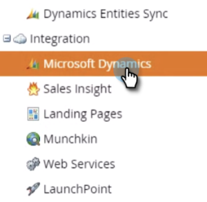

# グローバル [!DNL MS Dynamics] 同期の無効化 {#disable-global-ms-dynamics-sync}

以下の簡単な手順に従って、[!DNL MS Dynamics] 同期を無効にします。

1. Marketo で、「**[!UICONTROL 管理者]**」をクリックします。

   

1. 「[!UICONTROL 統合]」で、「**[!UICONTROL Microsoft Dynamics]**」をクリックします。

   

1. 「**[!UICONTROL 同期を無効にする]**」をクリックします。

   

   >[!NOTE]
   >
   >インスタンスに「[!UICONTROL 同期を無効にする]」ボタンが表示されない場合は、[Marketo サポート](https://nation.marketo.com/t5/Support/ct-p/Support)にお問い合わせください。
