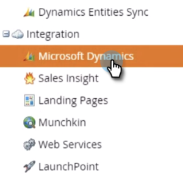

# グローバルMS Dynamics同期を無効にする{#disable-global-ms-dynamics-sync}

MS Dynamicsの同期を無効にするには、次の簡単な手順に従います。

1. Marketoで、「**管理者**」をクリックします。

   

1. [統合]で[**Microsoft Dynamics**]をクリックします。

   

1. 「**同期を無効にする**」をクリックします。

   

   >[!NOTE]
   >
   >インスタンスに「同期を無効にする」ボタンが表示されない場合は、[マーケティング担当者](http://nation.marketo.com/community/support_solutions)にお問い合わせください。

