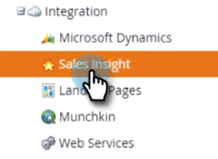
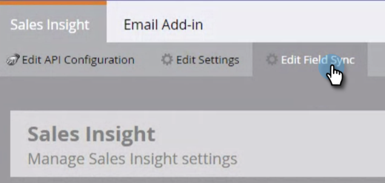

# MS [!DNL Dynamics] インスタンスから MSI をアンインストール {#uninstall-msi-from-your-ms-dynamics-instance}

MS [!DNL Dynamics] インスタンスから MSI をアンインストールするには、Marketo と MS [!DNL Dynamics] の両方で手順を実行する必要があります。

>[!PREREQUISITES]
>
>[グローバル MS  [!DNL Dynamics]  同期の無効化](/help/marketo/product-docs/marketo-sales-insight/msi-for-microsoft-dynamics/uninstalling/disable-global-ms-dynamics-sync.md)

1. Marketo で、「**[!UICONTROL 管理者]**」をクリックします。

   

1. 「**[!UICONTROL セールスインサイト]**」をクリックします。

   

1. 「**[!UICONTROL フィールド同期を編集]**」をクリックします。

   

1. 「**[!UICONTROL 同期を無効にする]**」チェックボックスを選択して、「**[!UICONTROL 保存]**」をクリックします。

   >[!NOTE]
   >
   >フィールドの同期を無効にする前に、必ず[グローバル MS Dynamics 同期](/help/marketo/product-docs/marketo-sales-insight/msi-for-microsoft-dynamics/uninstalling/disable-global-ms-dynamics-sync.md)を無効にしてください。

   

## 次の手順は、MS [!DNL Dynamics] インスタンスで実行します。 {#the-following-steps-take-place-in-your-ms-dynamics-instance}

1. 「**[!UICONTROL 詳細設定]**」をクリックします。

1. 「**[!UICONTROL ソリューション]**」をクリックします。

1. **[!UICONTROL Marketo セールスインサイト]**&#x200B;を選択し、削除アイコンをクリックします。

1. ソリューションをアンインストールモーダルが表示されたら、「**[!UICONTROL OK]**」をクリックします。

   MS [!DNL Dynamics] ソリューションが完全にアンインストールされるまで、通常 20 分ほどかかります。 ただし、大きな MS [!DNL Dynamics] インスタンスがある場合は、もう少し時間がかかる場合があります。

   >[!NOTE]
   >
   >MSI をアンインストールしたら、必ずグローバル MS [!DNL Dynamics] 同期をオンにしてください。
