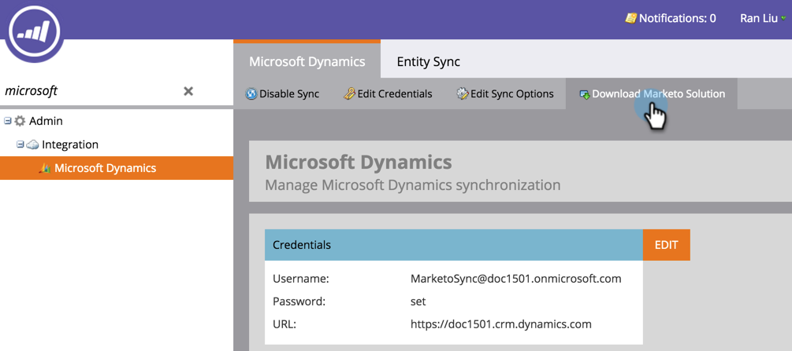

# Microsoft Dynamics向けMarketo Sales Insight Solutionの更新 {#update-the-marketo-sales-insight-solution-for-microsoft-dynamics}

Sales Insight用の新しいMicrosoft Dynamicsソリューションがリリースされると、アカウントの[管理者]領域から更新プログラムをダウンロードできます。

>[!NOTE]
>
>**必要な管理者権限**

1. 「 **管理者** 」領域に移動します。

   

1. [ **Microsoft Dynamics**]をクリックします。

   

1. 「Markettor Solutionを **ダウンロード**」を選択します。

   

1. お使いのMicrosoft Dynamicsバージョンに適したソリューションを選択してください。

   

   すごい！ ソリューションのzipファイルがデバイスにダウンロードされます。

