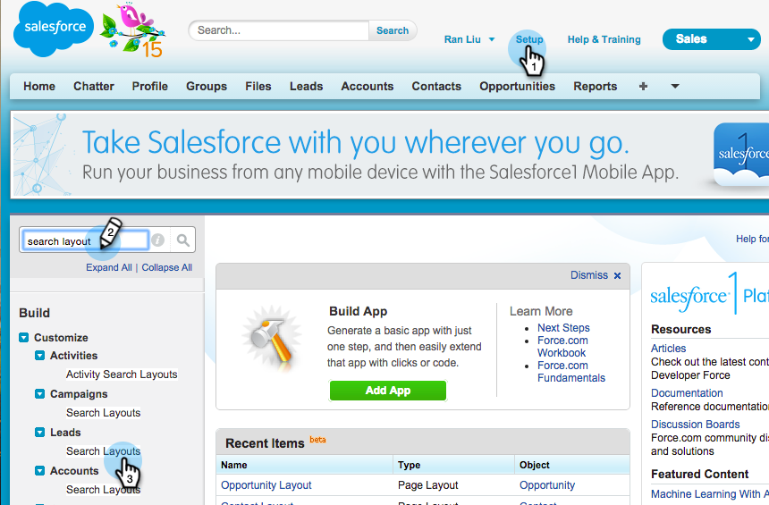

# [!DNL Salesforce] への一括アクションボタンの追加{#add-bulk-action-buttons-to-salesforce-classic}

[!DNL Salesforce] レイアウトに Marketo ボタンを追加できます。 次に例を示します。

1. 「**[!UICONTROL 設定]**」をクリックします。 「[!UICONTROL 検索レイアウト]」を検索し、「**[!UICONTROL リード]**」の下の「**[!UICONTROL 検索レイアウト]**」をクリックします。

   

1. 「**[!UICONTROL リードリストビュー]**」行で「**[!UICONTROL 編集]**」をクリックします。

   

1. 「**[!UICONTROL Marketo キャンペーンに追加]**」、「**[!UICONTROL Marketo メールを送信]**」、「**[!UICONTROL ウォッチリストに追加]**」ボタンを「**[!UICONTROL 選択したボタン]**」に追加し、「**[!UICONTROL 保存]**」します。

   

   >[!TIP]
   >
   >Shift キーを押しながら 3 つのボタンを同時に選択します。

1. 連絡先（3 つのボタンすべて）とアカウント（1 つのボタン「ウォッチリストに追加」のみ）に対して、次の手順を繰り返します。

   >[!NOTE]
   >
   >商談に Marketo ボタンを追加することはできません。
