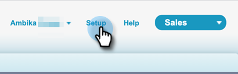

# Sales Insight 権限セットの追加 {#add-sales-insight-permission-set}

Salesforce で Sales Insight 機能へのアクセスを追加するには、次の手順を実行します。 Salesforce Classic および Lightning に適用可能

>[!PREREQUISITES]
>
>[Sales Insight Salesforce パッケージの更新](/help/marketo/product-docs/marketo-sales-insight/msi-for-salesforce/upgrading/upgrading-your-msi-package.md)この機能を使用するには、{target=&quot;_blank&quot;} からバージョン 1.8000 以降を使用します。

>[!IMPORTANT]
>
>すべてのプロファイルに Sales Insight のアクセス権を付与したことがある場合や、すべてのユーザーに Sales Insight を実装したことがある場合は、 [プロファイルレベルアクセスの削除](/help/marketo/product-docs/marketo-sales-insight/msi-for-salesforce/configuration/remove-sales-insight-access.md){target=&quot;_blank&quot;} でこの権限セットを使用します。

## 概要 {#overview}

「Marketo App」権限は、Sales Insight Salesforce パッケージの一部です。 これには、以下に示すオブジェクト、apex クラス、visualforce ページへのアクセスが含まれます。 これらは、すべての Sales Insight 機能にアクセスするために必要です。

**オブジェクト設定**

<table> 
 <tbody> 
 <tr> 
   <td>BestBetsCache</td> 
   <td>読み取り、作成、編集、削除、すべて表示、すべて変更</td> 
  </tr> 
  <tr> 
   <td>最優先ビューの詳細</td> 
   <td>読み取り、作成、編集、削除、すべて表示、すべて変更</td> 
  </tr> 
  <tr> 
   <td>最優先ビュー</td> 
   <td>読み取り、作成、編集、削除、すべて表示、すべて変更</td> 
  </tr> 
  <tr> 
   <td>EmailActivityCache</td> 
   <td>読み取り、作成、編集、削除、すべて表示、すべて変更</td> 
  </tr> 
  <tr> 
   <td>GetMethodArgus</td> 
   <td>読み取り、作成、編集、削除、すべて表示、すべて変更</td> 
  </tr> 
  <tr> 
   <td>GroupedWebActivityCache</td> 
   <td>読み取り、作成、編集、削除、すべて表示、すべて変更</td> 
  </tr> 
  <tr> 
   <td>InterestingMomentsCache</td> 
   <td>読み取り、作成、編集、削除、すべて表示、すべて変更</td> 
  </tr> 
  <tr> 
   <td>Marketo Sales Insight の設定</td> 
   <td>読み取り、作成、編集、削除、すべて表示、すべて変更</td> 
  </tr> 
  <tr> 
   <td>ScoringCache</td> 
   <td>読み取り、作成、編集、削除、すべて表示、すべて変更</td> 
  </tr> 
  <tr> 
   <td>値</td> 
   <td>読み取り、作成、編集、削除、すべて表示、すべて変更</td> 
  </tr> 
  <tr> 
   <td>WebActivityCache</td> 
   <td>読み取り、作成、編集、削除、すべて表示、すべて変更</td> 
  </tr> 
 </tbody> 
</table>

* Apex クラスアクセス：159 「mkto_si」で始まる Apex クラス
* Visualforce ページアクセス：64 「mkto_si」で始まる Visualforce ページ
* カスタム設定の定義：mkto_si.Marketo設定&amp; mkto_si.ユーザーの環境設定

## Marketoアプリの権限セットのユーザーへの追加 {#adding-marketo-app-permission-set-to-users}

1. Salesforce アカウントにログインします。

1. 「**設定**」をクリックします。

   

1. [ 管理者 ] で、をクリックして展開します。 **ユーザーを管理**&#x200B;を、 **ユーザー**.

   

1. 「すべてのユーザー」で、アクセス権を付与するユーザーを選択し、「 **権限セットの割り当て**.

   

1. クリック **割り当てを編集**.

   

1. 選択 **Marketo App Access** 使用可能な権限セットから、 **追加**. 「**保存**」をクリックします。

   

1. ユーザーの詳細ページを下にスクロールすると、「権限セットの割り当て」の下に「Marketo App Access」が表示されます。

   

>[!NOTE]
>
>Sales Insight へのアクセス権を持たないユーザーには、次のメッセージが表示されます。「このタブにアクセスするのに十分な権限がありません。」

それだ！ Sales Insight アクセス権が正常に追加されました。 アクセスを追加する他のプロファイルに対しても同じ手順を繰り返します。
