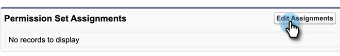
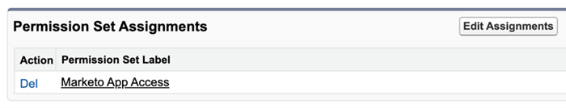

# [!DNL Sales Insight] 権限セットの追加 {#add-sales-insight-permission-set}

次の手順を使用して、[!DNL Salesforce] の [!DNL Sales Insight] 機能へのアクセス権を追加します。 [!DNL Salesforce] Classic および Lightning に適用可能

>[!PREREQUISITES]
>
>この機能を使用するには、バージョン 1.8000 以降に [&#x200B; [!DNL Sales Insight] [!DNL Salesforce] パッケージを更新](/help/marketo/product-docs/marketo-sales-insight/msi-for-salesforce/upgrading/upgrading-your-msi-package.md){target="_blank"}します。

>[!IMPORTANT]
>
>* 以前にすべてのプロファイルに[!DNL Sales Insight] アクセス権を付与したり、すべてのユーザーに[!DNL Sales Insight]を実装したりしたことがある場合は、この権限セットを使用するには、[&#x200B; プロファイルレベルのアクセス権](/help/marketo/product-docs/marketo-sales-insight/msi-for-salesforce/configuration/remove-sales-insight-access.md){target="_blank"}を削除する必要があります。
>
>* MSIの全機能を使用するには、標準のSalesforce ライセンスが必要です。 Salesforce Platform ライセンス（制限付きライセンスクラス）を持つユーザーには、特定のアクションの実行や一部のタブへのアクセスに関するエラーが表示される場合があります。

## 概要 {#overview}

「Marketo アプリ」権限は、[!DNL Sales Insight] [!DNL Salesforce] パッケージの一部です。 これには、以下に示すオブジェクト、apex クラス、visualforce ページへのアクセスが含まれます。 これらは、すべての [!DNL Sales Insight] 機能にアクセスするために必要です。

**オブジェクト設定**

<table>
 <tbody>
 <tr>
   <td>BestBetsCache</td>
   <td>読み取り、作成、編集、削除、すべて表示、すべて変更</td>
  </tr>
  <tr>
   <td>最有望見込客ビューの詳細</td>
   <td>読み取り、作成、編集、削除、すべて表示、すべて変更</td>
  </tr>
  <tr>
   <td>最有望見込客ビュー</td>
   <td>読み取り、作成、編集、削除、すべて表示、すべて変更</td>
  </tr>
  <tr>
   <td>EmailActivityCache</td>
   <td>読み取り、作成、編集、削除、すべて表示、すべて変更</td>
  </tr>
  <tr>
   <td>GetMethodArgus</td>
   <td>読み取り、作成、編集、削除、すべて表示、すべて変更</td>
  </tr>
  <tr>
   <td>GroupedWebActivityCache</td>
   <td>読み取り、作成、編集、削除、すべて表示、すべて変更</td>
  </tr>
  <tr>
   <td>InterestingMomentsCache</td>
   <td>読み取り、作成、編集、削除、すべて表示、すべて変更</td>
  </tr>
  <tr>
   <td>Marketo [!DNL Sales Insight] 設定</td>
   <td>読み取り、作成、編集、削除、すべて表示、すべて変更</td>
  </tr>
  <tr>
   <td>ScoringCache</td>
   <td>読み取り、作成、編集、削除、すべて表示、すべて変更</td>
  </tr>
  <tr>
   <td>値</td>
   <td>読み取り、作成、編集、削除、すべて表示、すべて変更</td>
  </tr>
  <tr>
   <td>WebActivityCache</td>
   <td>読み取り、作成、編集、削除、すべて表示、すべて変更</td>
  </tr>
 </tbody>
</table>

* Apex クラスアクセス：&quot;mkto_si&quot;で始まる159個のApex クラス
* Visualforce ページアクセス：「mkto_si」で始まる64のVisualforce ページ
* カスタム設定の定義：mkto_si.Marketo 設定と mkto_si.User 環境設定

## Marketo アプリ権限セットをユーザに追加 {#adding-marketo-app-permission-set-to-users}

1. [!DNL Salesforce] アカウントにログインします。

1. 「**[!UICONTROL 設定]**」をクリックします。

   

1. 「管理者」で、「**[!UICONTROL ユーザを管理]**」をクリックし、「**[!UICONTROL ユーザ]**」をクリックします。

   

1. 「すべてのユーザ」で、アクセス権を付与するユーザを選択し、「**[!UICONTROL 権限セットの割り当て]**」をクリックします。

   

1. 「**[!UICONTROL 割り当てを編集]**」をクリックします。

   

1. 使用可能な権限セットから「**[!UICONTROL Marketo アプリアクセス]**」を選択し、「**[!UICONTROL 追加]**」を選択します。 「**[!UICONTROL 保存]**」をクリックします。

   

1. ユーザーの詳細ページを下にスクロールすると、権限セットの割り当ての下に「Marketo アプリアクセス」が表示されます。

   

>[!NOTE]
>
>[!DNL Sales Insight]へのアクセス権を持たないユーザーには、「このタブにアクセスするための十分な権限がありません」というメッセージが表示されます。

これで完了です。 [!DNL Sales Insight] アクセスが正常に追加されました。 アクセス権を追加する他のプロファイルについても、同じ手順を繰り返します。
