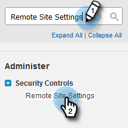

# 既存顧客の設定 {#configuration-for-existing-customers}

新しいインサイトダッシュボードの使用を開始するには、次の設定を行ってください。

>[!PREREQUISITES]
>
>Salesforce パッケージが最新バージョンにアップグレードされていることを確認してください

## Marketo での Sales Insight の設定 {#configure-sales-insight-in-marketo}

1. ブラウザーで新しいタブを開き、Marketo アカウントから Marketo Sales Insights の資格情報を取得します。

1. 「**管理者**」領域に移動します。

   

1. 「**Sales Insight**」をクリックします。

   

1. 「**表示**」を使用して、Rest API 資格情報を設定します。

   

1. 確認ポップアップが表示されます。「**OK**」をクリックします。

## Salesforce での Sales Insight の設定 {#configure-sales-insight-in-salesforce}

1. Salesforce で、「**設定**」をクリックします。

   

1. 「**リモートサイトの設定**」を検索して選択します。

   

1. 「**新規リモートサイト**」をクリックします。

   

1. リモートサイト名（「MarketoRestAPI」など）とリモートサイト URL（Marketo の Rest API 設定パネルの API URL）を入力します。

   

1. 「**保存**」をクリックします。

   

   Rest API 用のリモートサイト設定が作成されました。

## Marketo Sales Insight へのアクセス {#access-marketo-sales-insight}

1. Marketo の Sales Insight 管理ページの Rest API パネルから資格情報をコピーします。Salesforce の Sales Insight 設定ページの Rest API セクションに貼り付けます。

1. API 秘密鍵を入力します。

   
