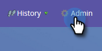
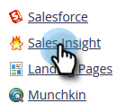
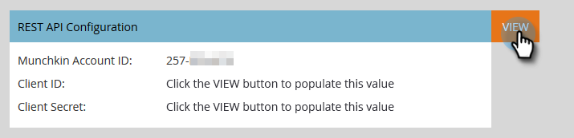
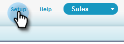
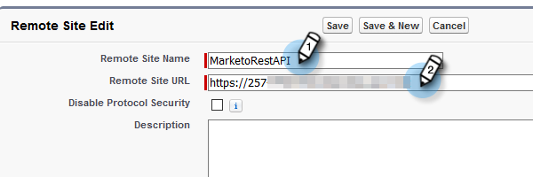
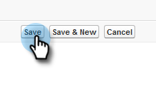

# 既存顧客の設定 {#configuration-for-existing-customers}

新しいインサイトダッシュボードの使用を開始するには、次の設定を行ってください。

>[!PREREQUISITES]
>
>[!DNL Salesforce] パッケージが最新バージョンにアップグレードされていることを確認してください。

## Marketo での [!DNL Sales Insight] の設定 {#configure-sales-insight-in-marketo}

1. ブラウザーで新しいタブを開き、Marketo アカウントから [!DNL Marketo Sales Insights] の資格情報を取得します。

1. 「**[!UICONTROL 管理者]**」領域に移動します。

   

1. 「**[!UICONTROL セールスインサイト]**」をクリックします。

   

1. 「**[!UICONTROL 表示]**」を使用して、Rest API 資格情報を設定します。

   

1. 確認ポップアップが表示されます。 「**[!UICONTROL OK]**」をクリックします。

## [!DNL Salesforce] での [!DNL Sales Insight] の設定 {#configure-sales-insight-in-salesforce}

1. Salesforce で、「**[!UICONTROL 設定]**」をクリックします。

   

1. 「**[!UICONTROL リモートサイトの設定]**」を検索して選択します。

   

1. 「**[!UICONTROL 新規リモートサイト]**」をクリックします。

   

1. [!UICONTROL リモートサイト名]（「MarketoRestAPI」など）と[!UICONTROL リモートサイト URL]（Marketo の Rest API 設定パネルの API URL）を入力します。

   

1. 「**[!UICONTROL 保存]**」をクリックします。

   

   Rest API 用のリモートサイト設定が作成されました。

## Marketo セールスインサイトへのアクセス {#access-marketo-sales-insight}

1. [!DNL Marketo’s Sales Insight] 管理ページの Rest API パネルから資格情報をコピーします。 Salesforce の [!DNL Sales Insight] 設定ページの Rest API セクションに貼り付けます。

1. [!UICONTROL API 秘密鍵]を入力します。

   
