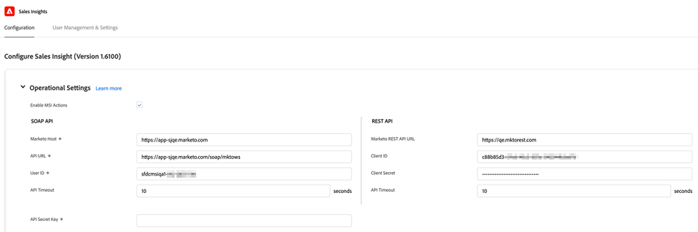

# 既存顧客の設定 {#configuration-for-existing-customers}

新しいインサイトダッシュボードの使用を開始するには、次の設定を行ってください。

>[!PREREQUISITES]
>
>Salesforceパッケージが最新バージョンにアップグレードされていることを確認してください。

## Marketoでの販売インサイトの設定 {#configure-sales-insight-in-marketo}

1. ブラウザーで新しいタブを開き、MarketoアカウントからMarketo Sales Insightsの資格情報を取得します。

1. **管理**&#x200B;領域に移動します。

   

1. 「**Sales Insight**」をクリックします。

   

1. 「**表示**」をクリックして、Rest APIの資格情報を設定します。

   

1. 確認のポップアップが表示されます。 「**OK**」をクリックします。

## Salesforceでの販売インサイトの設定 {#configure-sales-insight-in-salesforce}

1. Salesforceで、「**設定**」をクリックします。

   

1. **リモートサイト設定**&#x200B;を検索して選択します。

   

1. 「**新しいリモートサイト**」をクリックします。

   

1. 「リモートサイト名」（「MarketoRestAPI」など）と、「リモートサイトURL」(MarketoのRest API設定パネルのAPI URL)を入力します。

   

1. 「**保存**」をクリックします。

   

   これで、Rest API用のリモートサイト設定が作成されました。

## Marketo Sales Insight にアクセス {#access-marketo-sales-insight}

1. MarketoのSales Insight AdminページのRest APIパネルから資格情報をコピーします。 それらを、SalesforceのSales Insight設定ページのRest APIセクションに貼り付けます。

1. API秘密鍵を入力します。

   
