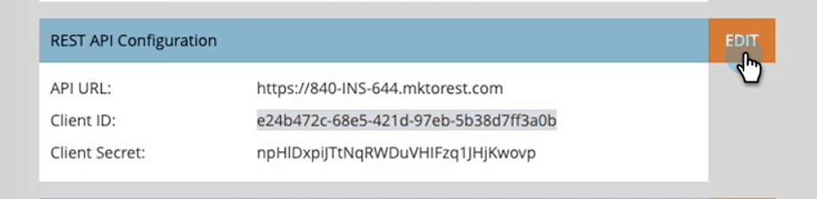
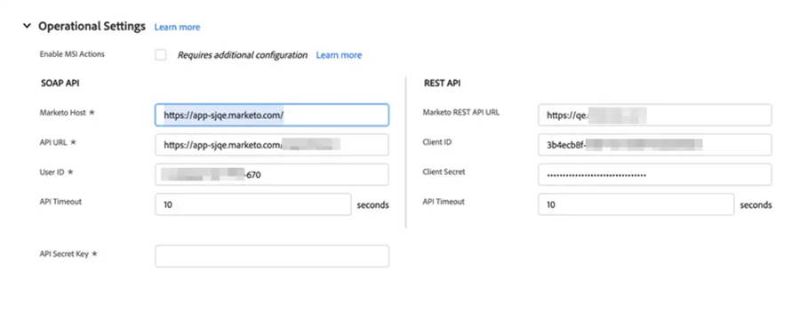

# [!DNL Salesforce] Enterprise/Unlimited での [!DNL Marketo Sales Insight] の設定 {#configure-marketo-sales-insight-in-salesforce-enterprise-unlimited}

次の手順を実行して、Salesforce Enterprise／Unlimited エディションで Marketo セールスインサイトを設定します。

>[!PREREQUISITES]
>
>[ [!DNL Salesforce]  AppExchange での  [!DNL Marketo Sales Insight]  パッケージのインストール](/help/marketo/product-docs/marketo-sales-insight/msi-for-salesforce/installation/install-marketo-sales-insight-package-in-salesforce-appexchange.md)

>[!NOTE]
>
>**管理者権限が必要です。**

## Marketo Engage での Sales Insight の設定 {#configure-sales-insight-in-marketo}

1. Marketo Engage で Marketo セールスインサイト資格情報を取得するには、**[!UICONTROL 管理者]**&#x200B;領域に移動し、「**[!UICONTROL セールスインサイト]**」を選択します。

   

1. 「**[!UICONTROL API 設定を編集]**」をクリックします。

   

1. 任意の API 秘密鍵を入力し、「**[!UICONTROL 保存]**」をクリックします。API 秘密鍵にアンパサンド（`&`）を使用しないでください。

   

   >[!NOTE]
   >
   >API 秘密鍵は組織のパスワードと同じです。安全に保管してください。

1. 資格情報を入力するには、_[!UICONTROL Rest API 設定]_&#x200B;パネルで「**[!UICONTROL 表示]**」をクリックします。

   

1. 確認ダイアログが表示されたら、「**[!UICONTROL OK]**」をクリックします。

   

   >[!TIP]
   >
   >このウィンドウは開いたままにしておきます。この情報は、後で Salesforce の設定で必要になります。

## 新しい Rest API 資格情報の入力 {#populate-new-rest-api-credentials}

1. Rest API 資格情報を初めて入力する場合、「_表示_」ボタンが _編集_ に変わります。 「**編集** ボタンをクリックします。

   

1. API 資格情報を再生成することを確認するメッセージが表示されます。 「**保存**」をクリックします。

   {width="800" zoomable="yes"}

1. 新しい資格情報が入力されたら、Salesforce インスタンスの「_Marketo設定_」タブで更新します。

   

## [!DNL Salesforce] での [!DNL Sales Insight] の設定 {#configure-sales-insight-in-salesforce}

1. Salesforce で、「**[!UICONTROL 設定]**」をクリックします。

   

1. 「リモートサイト」を検索し、「**[!UICONTROL リモートサイトの設定]**」を選択します。

   

1. 「**[!UICONTROL 新規リモートサイト]**」をクリックします。

   

1. リモートサイト名を入力します（`MarketoSoapAPI` など）。Marketo Engage の _[!UICONTROL Soap API 設定]_&#x200B;パネルの Marketo ホスト URL であるリモートサイト URL を入力します。「**[!UICONTROL 保存]**」をクリックします。これで、Soap API 用のリモートサイト設定が作成されました。

   

1. もう一度「**[!UICONTROL 新規リモートサイト]**」をクリックします。

   

1. リモートサイト名を入力します（`MarketoAPI` など）。Marketo Engage の _[!UICONTROL Rest API 設定]_&#x200B;パネルの API URL であるリモートサイト URL を入力します。「**[!UICONTROL 保存]**」をクリックします。Rest API 用のリモートサイト設定が作成されました。

   >[!NOTE]
   >
   >__「**[!UICONTROL リモートサイト名]**」を選択します（`MarketoAPI` はここで使用されます）。**[!UICONTROL リモートサイト URL]** は、「Marketo での Sales Insight の設定」節の手順 3、API 設定を編集ダイアログの「Marketo ホスト」フィールドにあります。

## Sales Insight ユーザのプロファイルに標準の Salesforce オブジェクトへのアクセス権を付与 {#grant-sales-insight-users-profile-access}

Salesforce のセキュリティ強化により、AppExchange パッケージは標準オブジェクトに権限を付与できなくなり、Salesforce ユーザのプロファイルから関連する Salesforce オブジェクトにアクセス権を付与する必要があります。必要な権限を付与するには、次の手順に従います。

1. 「**[!UICONTROL 設定]**」をクリックします。

1. クイック検索で「プロファイル」を検索します。

1. Salesforce ユーザが使用しているプロファイルの横にある「**[!UICONTROL 編集]**」をクリックします。

1. 「_[!UICONTROL 標準オブジェクト権限]_」セクションで、[!UICONTROL リード]、[!UICONTROL 取引先責任者]、[!UICONTROL アカウント]、[!UICONTROL 商談]の各オブジェクトに対して&#x200B;**[!UICONTROL 読み取り]**&#x200B;アクセス権を有効にします。

1. 「**[!UICONTROL 保存]**」をクリックします。

## ページレイアウトのカスタマイズ {#customize-page-layouts}

1. 「**[!UICONTROL 設定]**」をクリックします。

   

1. 「ページレイアウト」を検索し、「**[!UICONTROL リード]**」の下の「**[!UICONTROL ページレイアウト]**」を選択します。

   

1. 左側の「**[!UICONTROL Visualforce Pages]**」をクリックします。「**[!UICONTROL セクション]**」を「_[!UICONTROL カスタムリンク]_」セクションの下のレイアウトにドラッグします。

   

1. **[!UICONTROL セクション名]**&#x200B;として「Marketo セールスインサイト」と入力し、「**[!UICONTROL 1 列]**」を選択して、「**[!UICONTROL OK]**」をクリックします。

   

1. 「**[!UICONTROL リード]**」を新しいセクションにドラッグ＆ドロップします。

   

   >[!TIP]
   >
   >このボックスの名前は、オブジェクトタイプに基づいて変更されます。例えば、取引先責任者のページレイアウトを変更する場合、「取引先責任者」と表示されます。

1. 先ほど追加した「**[!UICONTROL リード]**」ブロックをダブルクリックします。

   

1. 高さを **450** ピクセルに編集し、「**[!UICONTROL OK]**」をクリックします。

   

   >[!NOTE]
   >
   >スクロールを使用してアクティビティにアクセスする必要がある場合は、「**[!UICONTROL スクロールバーを表示]**」をチェックします。

   >[!TIP]
   >
   >アカウントオブジェクトおよび商談オブジェクトの推奨される高さは 410 ピクセルです。

1. 左側の「**[!UICONTROL フィールド]**」をクリックします。次に、「**[!UICONTROL 緊急度]**」ラベルを検索して、**[!UICONTROL Marketo セールスインサイト]**&#x200B;レイアウトにドラッグします。

   

1. 以下のフィールドについても、上記の手順を繰り返します。

   * 最新の注目のアクション
   * 最新の注目のアクション発生日
   * 最新の注目のアクションの詳細
   * 最新の注目のアクションのソース
   * 最新の注目のアクションのタイプ
   * セールスによる最後のアクティビティ
   * セールスによる最後のエンゲージメント
   * MSI 取引先責任者 ID
   * 相対スコア
   * 相対スコア値
   * 緊急度
   * 緊急度の値
   * Marketo 内に表示

1. 終了したら「**[!UICONTROL 保存]**」をクリックします。

   

1. 手順 5〜7 を繰り返して、**[!UICONTROL 取引先責任者]**、**[!UICONTROL アカウント]**、**[!UICONTROL 商談]**&#x200B;のそれぞれについて Visualforce ページセクションと Sales Insight フィールドを追加します。

1. 手順 8〜10 を繰り返して、**[!UICONTROL 取引先責任者]**&#x200B;にこれらの Sales Insight のフィールドを追加します。変更したら必ず保存します。

   * 最新の注目のアクション
   * 最新の注目のアクション発生日
   * [!UICONTROL 最新の注目のアクションの詳細]
   * [!UICONTROL 最新の注目のアクションのソース]
   * [!UICONTROL 最新の注目のアクションのタイプ]
   * [!UICONTROL セールスによる最後の Marketo アクティビティ]
   * [!UICONTROL セールスによる最後の Marketo エンゲージメント]
   * [!UICONTROL MKTO リードスコア]
   * [!UICONTROL 相対スコア]
   * [!UICONTROL 相対スコア値]
   * [!UICONTROL Sales Insight] - 取引先責任者の完全なリストページを開きます。
   * [!UICONTROL 緊急度]
   * [!UICONTROL 緊急度の値]

## カスタムユーザフィールドのマッピング {#map-custom-person-fields}

コンバージョンの際にデータが失われないように、Marketo のユーザフィールドを Salesforce の取引先責任者フィールドにマッピングする必要があります。次の手順に従って、マッピングします。

1. 「**[!UICONTROL 設定]**」をクリックします。

   

1. 検索バーで「フィールド」を検索し、「**[!UICONTROL リード]**」の下の「**[!UICONTROL フィールド]**」をクリックします。

   

1. 「**[!UICONTROL リードフィールドをマッピング]**」をクリックします。

   

1. **[!UICONTROL エンゲージメント]**&#x200B;の右側にあるドロップダウンをクリックします。

   

1. リストから「**[!UICONTROL 取引先責任者、エンゲージメント]**」を選択します。

   

1. 上の手順を繰り返して、以下のフィールドもマッピングします。

   | Marketo の人物のカスタムフィールド | Salesforce の取引先責任者のカスタムフィールド |
   |--- |--- |
   | `Engagement` | `Contact.Engagement` |
   | `Relative Score Value` | `Contact.Relative Score Value` |
   | `Urgency Value` | `Contact.Urgency Value` |
   | `Last Interesting Moment Date` | `Contact.Last Interesting Moment Date` |
   | `Last Interesting Moment Desc` | `Contact.Last Interesting Moment Desc` |
   | `Last Interesting Moment Source` | `Contact.Last Interesting Moment Source` |
   | `Last Interesting Moment Type` | `Contact.Last Interesting Moment Type` |

1. 完了したら、「**[!UICONTROL 保存]**」をクリックします。

## Marketo セールスインサイトの「設定」タブ {#marketo-sales-insight-configuration-tab}

1. Salesforce で、タブバーの最後にある「**+**」をクリックし、「**[!UICONTROL Marketo セールスインサイトの設定]**」をクリックします。

1. [Marketo Sales Insight Admin ページの Soap API パネルから資格情報をコピーして ](/help/marketo/product-docs/marketo-sales-insight/msi-for-salesforce/configuration/configure-marketo-sales-insight-in-salesforce-professional-edition.md#set-up-marketo-sales-insight){target="_blank"}[!DNL Salesforce] [!DNL Sales Insight] Configuration ページの Soap API セクションに貼り付けます。

1. [Marketo Sales Insight管理者ページの Rest API パネルから資格情報をコピーして ](/help/marketo/product-docs/marketo-sales-insight/msi-for-salesforce/configuration/configure-marketo-sales-insight-in-salesforce-professional-edition.md#set-up-marketo-sales-insight){target="_blank"}[!DNL Salesforce] [!DNL Sales Insight] Configuration ページの Rest API セクションに貼り付けます。

   

「Marketo セールスインサイト」フィールドで、リード、取引先責任者、アカウント、商談の詳細を確認できます。

>[!NOTE]
>
>診断テストが失敗した場合は、[ページレイアウトにフィールドを追加](https://nation.marketo.com:443/t5/knowledgebase/how-to-repair-marketo-sales-insight-setup-configuration-problems/ta-p/248218){target="_blank"}すると問題が修正される可能性があります。

>[!NOTE]
>
>アカウントの場合、Sales Insight にはすべてのメールが含まれますが、最新の注目のアクション、web アクティビティ、スコアの変更のみが含まれます。

>[!MORELIKETHIS]
>
>* [優先度、緊急度、相対スコア、最有望見込客](/help/marketo/product-docs/marketo-sales-insight/msi-for-salesforce/features/stars-and-flames/priority-urgency-relative-score-and-best-bets.md)
>* [ [!DNL Salesforce]](/help/marketo/product-docs/marketo-sales-insight/msi-for-salesforce/configuration/add-marketo-tab-to-salesforce.md) への「Marketo」タブの追加
>* [Sales Insight へのアクセスをプロファイルに追加](/help/marketo/product-docs/marketo-sales-insight/msi-for-salesforce/configuration/add-sales-insight-access-to-profiles.md){target="_blank"}
