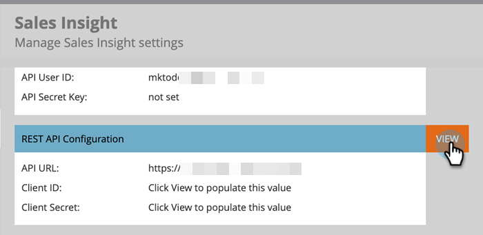

# Salesforce Enterprise/無制限でのMarketo Sales Insightの設定 {#configure-marketo-sales-insight-in-salesforce-enterprise-unlimited}

Salesforce Enterprise/Unlimited EditionsでMarketo Sales Insightを設定するために必要な手順を次に示します。 始めましょう。

>[!PREREQUISITES]
>
>* [Marketo Sales InsightパッケージのSalesforceAppExchange](/help/marketo/product-docs/marketo-sales-insight/msi-for-salesforce/installation/install-marketo-sales-insight-package-in-salesforce-appexchange.md)

>[!NOTE]
**管理者権限が必要**

## Marketoでの販売インサイトの設定 {#configure-sales-insight-in-marketo}

1. MarketoでMSI資格情報を取得します。 「管理者」領域に移動し、「**販売インサイト**」を選択します。

   

1. 「**API設定を編集**」をクリックします。

   

1. 任意のAPI秘密鍵を入力し、「**保存**」をクリックします。 API秘密鍵にアンパサンド(&amp;)を使用しないでください。

   

   >[!NOTE]
   API秘密鍵は、組織のパスワードのようなもので、安全である必要があります。

1. Rest API設定パネルの「**表示**」をクリックして、資格情報を設定します。

   

1. 確認ポップアップが表示されます。 「**OK**」をクリックします。

   

   >[!TIP]
   このウィンドウは開いたままにしておきます。 この情報は、後でSalesforceで必要になります。

## Salesforceでの販売インサイトの設定 {#configure-sales-insight-in-salesforce}

1. Salesforceで、「**設定**」をクリックします。

   

1. 「remote site」を検索し、「**Remote Site Settings**」を選択します。

   

1. 「**新しいリモートサイト**」をクリックします。

   

1. リモートサイト名を入力します（「MarketoSoapAPI」など）。 MarketoのSoap API設定パネルから、「リモートサイトURL」に「 MarketoホストURL 」と入力します。 「**保存**」をクリックします。 これで、Soap API用のリモートサイト設定が作成されました。

   

1. もう一度「**新しいリモートサイト**」をクリックします。

   

1. リモートサイト名を入力します（「MarketoAPI」など）。 「リモートサイトURL」に、MarketoのRest API設定パネルのAPI URLを入力します。 「**保存**」をクリックします。 Rest API用のリモートサイト設定が作成されました。

   >[!NOTE]
   __ リモートサ **イト名を選択します** （ここではMarketoAPIを使用します）。**リモートサイトURL**&#x200B;は、「MarketoでのSales Insightの設定」セクションの手順3の「API設定を編集」ダイアログボックスの「Marketoホスト」フィールドにあります。

## ページレイアウトのカスタマイズ {#customize-page-layouts}

1. 「**設定**」をクリックします。

   

1. 「ページレイアウト」を検索し、「**リード**」の下の「**ページレイアウト**」を選択します。

   

1. 左側の&#x200B;**Visualforce Pages**&#x200B;をクリックします。 **セクション**&#x200B;を「カスタムリンク」セクションの下のレイアウトにドラッグします。

   

1. 「**セクション名**」に「Marketo Sales Insight」と入力します。 **1 — 列**&#x200B;を選択し、「**OK**」をクリックします。

   

1. **リード**&#x200B;を新しいセクションにドラッグ&amp;ドロップします。

   

   >[!TIP]
   このボックスの名前は、オブジェクトの種類に基づいて変更されます。 例えば、連絡先のページレイアウトを変更する場合、「連絡先」と表示されます。

1. 先ほど追加した&#x200B;**リード**&#x200B;ブロックをダブルクリックします。

   

1. 高さを&#x200B;**450**&#x200B;ピクセルに編集し、「**OK**」をクリックします。

   

   >[!TIP]
   AccountsオブジェクトとOpportunitiesオブジェクトの高さは410ピクセルにすることをお勧めします。

1. 左側の&#x200B;**Fields**&#x200B;をクリックします。 次に、「**Engagement**」ラベルを&#x200B;**Marketo Sales Insight**&#x200B;レイアウトに検索してドラッグします。

   

1. これらのフィールドに対しても上記の手順を繰り返します。

   <table> 
    <tbody> 
     <tr> 
      <td colspan="1">エンゲージメント</td> 
     </tr> 
     <tr> 
      <td colspan="1" rowspan="1">
相対スコア値
</td> 
     </tr> 
     <tr> 
      <td colspan="1" rowspan="1">
緊急度の値
</td> 
     </tr> 
     <tr> 
      <td colspan="1" rowspan="1">
最新の注目のアクション発生日
</td> 
     </tr> 
     <tr> 
      <td colspan="1" rowspan="1">
最新の注目のアクションの詳細
</td> 
     </tr> 
     <tr> 
      <td colspan="1" rowspan="1">
最新の注目のアクションのソース
</td> 
     </tr> 
     <tr> 
      <td colspan="1" rowspan="1">
最新の注目のアクションのタイプ
</td> 
     </tr> 
    </tbody> 
   </table>

1. 終了したら「**保存**」をクリックします。

   

1. この手順を繰り返して、**Contact**、**Account**&#x200B;および&#x200B;**Opportunity**&#x200B;のVisualforceページセクションとSales Insightフィールドを追加します。

1. 手順5～7を繰り返して、「Contact」、「Account」、「Opportunity」にVisualforceページのセクションを追加します。 次に、手順8～10を繰り返して、**Contact**&#x200B;の「Sales Insight」フィールドを追加します。 変更があったら必ず保存してください。

## カスタムユーザーフィールドのマッピング {#map-custom-person-fields}

変換が正しく機能するように、MarketoのユーザーフィールドをSalesforceの連絡先フィールドにマッピングする必要があります。 どうやって。

1. 「**設定**」をクリックします。

   

1. 検索バーで「フィールド」を検索し、**リード**&#x200B;の下の&#x200B;**フィールド**&#x200B;をクリックします。

   

1. 「**リードフィールドのマッピング**」をクリックします。

   

1. 右側のドロップダウンをクリックし、「**エンゲージメント**」を選択します。

   

1. リストから&#x200B;**Contact.Engagement**&#x200B;を選択します。

   

1. これらのフィールドも繰り返し、マッピングします。

   <table> 
    <tbody> 
     <tr> 
      <th colspan="1" rowspan="1">Marketo Person Custom Field</th> 
      <th colspan="1" rowspan="1">Salesforce連絡先カスタムフィールド</th> 
     </tr> 
     <tr> 
      <td colspan="1" rowspan="1">
エンゲージメント
</td> 
      <td colspan="1" rowspan="1">
Contact.Engagement
</td> 
     </tr> 
     <tr> 
      <td colspan="1" rowspan="1">
相対スコア値
</td> 
      <td colspan="1" rowspan="1">
Contact.Relative Score値
</td> 
     </tr> 
     <tr> 
      <td colspan="1" rowspan="1">
緊急度の値
</td> 
      <td colspan="1" rowspan="1">
Contact.Ergentityの値
</td> 
     </tr> 
     <tr> 
      <td colspan="1" rowspan="1">
最新の注目のアクション発生日
</td> 
      <td colspan="1" rowspan="1">
Contact.Last Intersitive Moment Date
</td> 
     </tr> 
     <tr> 
      <td colspan="1" rowspan="1">
最新の注目のアクションの詳細
</td> 
      <td colspan="1" rowspan="1">
Contact.Last Intersit Moment Desc
</td> 
     </tr> 
     <tr> 
      <td colspan="1" rowspan="1">
最新の注目のアクションのソース
</td> 
      <td colspan="1" rowspan="1">
Contact.Last Intersit Moment Source
</td> 
     </tr> 
     <tr> 
      <td colspan="1" rowspan="1">
最新の注目のアクションのタイプ
</td> 
      <td colspan="1" rowspan="1">
Contact.Last Intersit Moment Type
</td> 
     </tr> 
    </tbody> 
   </table>

1. 完了したら、「**保存**」をクリックします。

## Marketo Sales Insight 構成 {#marketo-sales-insight-config}

1. 「**+**」をクリックし、「**Marketo Sales Insight Config**」を選択します。

   

1. 「**Marketo API**&#x200B;を有効にする」をオンにします。 次に、Marketo Admin](#set-up-marketo-sales-insight)のAPI設定情報を入力します。 [完了したら、「**変更を保存**」をクリックします。

   

   >[!NOTE]
   診断テストに失敗した場合は、[ページレイアウトにフィールドを追加](https://nation.marketo.com/docs/DOC-1115)する必要が生じる場合があります。

それで終わりだ！ 「リード」、「連絡先」、「アカウント」、「オポチュニティ」の「Marketo Sales Insight」フィールドを表示できます。

>[!NOTE]
アカウントの場合、Sales Insightにはすべての電子メールが含まれますが、最新の興味深い瞬間、Webアクティビティ、スコアの変更のみが含まれます。

## Marketo Sales Insight にアクセス {#access-marketo-sales-insight}

1. Salesforceで、タブバーの最後にある&#x200B;**+**&#x200B;をクリックし、「**Marketo Sales Insight Config**」をクリックします。

1. 「**Marketo APIを有効にする**」チェックボックスをオンにします。

1. MarketoのSales Insight Adminページの「Soap API」パネルから資格情報をコピーし、「Salesforce Sales Insight Configuration」ページの「Soap API」セクションに貼り付けます。

1. MarketoのSales Insight AdminページのRest APIパネルから資格情報をコピーし、Salesforce Sales Insight ConfigurationページのRest APIセクションに貼り付けます。

   

>[!MORELIKETHIS]
* [優先度、緊急度、相対スコア、ベストベスト](/help/marketo/product-docs/marketo-sales-insight/msi-for-salesforce/features/stars-and-flames/priority-urgency-relative-score-and-best-bets.md)
* [Marketo Sales InsightのタブとボタンのSalesforceへの追加](/help/marketo/product-docs/marketo-sales-insight/msi-for-salesforce/features/bulk-actions/add-marketo-sales-insight-tab-and-buttons-to-salesforce.md)
* [チーム向けの販売インサイトの設定](/help/marketo/product-docs/marketo-sales-insight/msi-for-salesforce/configuration/setting-up-sales-insight-for-your-team.md)

