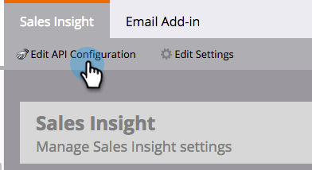
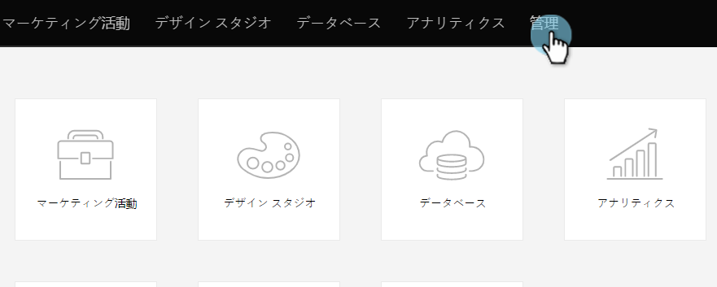

# Salesforce Professional Edition での Marketo Sales Insight の設定 {#configure-marketo-sales-insight-in-salesforce-professional-edition}

Salesforce Professional Edition でMarketo Sales Insight を設定するために必要な手順を次に示します。 それでは始めましょう。

>[!PREREQUISITES]
>
>* Salesforce Professional Edition にMarketoをインストールします。
>
>* [Salesforce AppExchange での Marketo Sales Insight パッケージのインストール](/help/marketo/product-docs/marketo-sales-insight/msi-for-salesforce/installation/install-marketo-sales-insight-package-in-salesforce-appexchange.md)

>[!NOTE]
>
>**管理者権限が必要**

## Marketo での Sales Insight の設定 {#configure-sales-insight-in-marketo}

1. 新しいブラウザーウィンドウを開き、Marketo アカウントから Marketo Sales Insight の認証情報を取得します。
1. 管理エリアに移動し、「**Sales Insight**」を選択します。

   

1. 「**API 設定を編集**」をクリックします。

   

1. 任意の API 秘密鍵を入力し、「**保存**」をクリックします。API 秘密鍵にアンパサンド（&amp;）を使用しないでください。

   

   >[!NOTE]
   >
   >API 秘密鍵は組織のパスワードと同じです。安全に保管してください。

1. Rest API 設定パネルの「**表示**」をクリックして、認証情報を設定します。

   

1. 確認ポップアップが表示されます。「**OK**」をクリックします。

   

## Salesforce での Sales Insight の設定 {#configure-sales-insight-in-salesforce}

1. Salesforce で、「**設定**」をクリックします。

   

1. 「リモートサイト」を検索し、「**リモートサイトの設定**」を選択します。

   

1. 「**新規リモートサイト**」をクリックします。

   

1. リモートサイト名を入力します（「MarketoSoapAPI」など）。Marketo の Soap API 設定パネルから、「リモートサイト URL」に「Marketo ホスト URL」と入力します。「**保存**」をクリックします。これで、Soap API 用のリモートサイト設定が作成されました。

   

1. もう一度「**新規リモートサイト**」をクリックします。

   

1. リモートサイト名を入力します（「MarketoRestAPI」など）。「リモートサイト URL」に、Marketo の Rest API 設定パネルの API URL を入力します。「**保存**」をクリックします。Rest API 用のリモートサイト設定が作成されました。

## Marketo Sales Insight の設定 {#set-up-marketo-sales-insight}

1. Marketo インスタンスにログインし、**管理**&#x200B;をクリックします。

   

1. 「**Sales Insight**」をクリックします。

   

1. 「**API 設定を編集**」をクリックします。

   

1. **API 秘密鍵**&#x200B;を入力し、「**保存**」をクリックします。

   >[!CAUTION]
   >
   >API 秘密鍵にはアンパサンド（&amp;）を使用しないでください。

   

   >[!TIP]
   >
   >このウィンドウは開いたままにしておきます。この情報は、後で Salesforce で必要になります。

1. Salesforce に戻り、「**設定**」をクリックします。

   

1. 「リモートサイト」を検索し、「**セキュリティコントロール**」の下の「**リモートサイト設定**」をクリックします。

   

1. 「**新規リモートサイト**」をクリックします。

   

1. 「**リモートサイト名**」と「**リモートサイト URL**」を入力し、「**保存**」をクリックします。

   

   >[!NOTE]
   >
   >「**リモートサイト名**」を選択します（MarketoAPI はここで使用されます）。「**リモートサイトの URL**」は、手順 4 の、API 設定を編集ダイアログボックスの「Marketo ホスト」フィールドにあります。

## ページレイアウトのカスタマイズ {#customize-page-layouts}

1. 「**設定**」をクリックします。

   

1. 「ページレイアウト」を検索し、「**リード**」の下の「**ページレイアウト**」を選択します。

   

1. 左側の「**Visualforce Pages**」をクリックします。「**セクション**」をカスタムリンクセクションの下のレイアウトにドラッグします。

   

1. 「**セクション名**」に「Marketo Sales Insight」と入力します。「**1 列**」を選択し、「**OK**」をクリックします。

   

1. 「**リード**」を新しいセクションにドラッグ＆ドロップします。

   

   >[!TIP]
   >
   >このボックスの名前は、オブジェクトの種類に基づいて変更されます。例えば、連絡先のページレイアウトを変更する場合、「連絡先」と表示されます。

1. 先ほど追加した「**リード**」ブロックをダブルクリックします。

   

1. 高さを **450** ピクセルに編集し、「**OK**」をクリックします。

   

   >[!TIP]
   >
   >オブジェクトがアカウントと商談の場合、推奨値は 410 ピクセルです。

1. 左側の「**フィールド**」をクリックします。次に、「**エンゲージメント**」ラベルを検索して、**Marketo Sales Insight** レイアウトにドラッグします。

   

1. 以下のフィールドについても、上記の手順を繰り返します。

<table> 
 <tbody> 
  <tr> 
   <td colspan="1">エンゲージメント</td> 
  </tr> 
  <tr> 
   <td colspan="1" rowspan="1">
相対スコア値
</td> 
  </tr> 
  <tr> 
   <td colspan="1" rowspan="1">
緊急度の値
</td> 
  </tr> 
  <tr> 
   <td colspan="1" rowspan="1">
最新の注目のアクション発生日
</td> 
  </tr> 
  <tr> 
   <td colspan="1" rowspan="1">
最新の注目のアクションの詳細
</td> 
  </tr> 
  <tr> 
   <td colspan="1" rowspan="1">
最新の注目のアクションのソース
</td> 
  </tr> 
  <tr> 
   <td colspan="1" rowspan="1">
最新の注目のアクションのタイプ
</td> 
  </tr> 
 </tbody> 
</table>

1. クリック **保存** 終了したとき。

   

1. この手順を繰り返して、**連絡先**、**アカウント**&#x200B;および&#x200B;**商談**&#x200B;の Visualforce ページセクションと Sales Insight フィールドを追加します。
1. 手順 5〜7 を繰り返して、連絡先、アカウント、商談のそれぞれについて Visualforce ページセクションを追加します。次に、手順 8〜10 を繰り返して、**連絡先**&#x200B;に Sales Insight のフィールドを追加します。変更したら必ず保存します。

## カスタムユーザーフィールドのマッピング {#map-custom-person-fields}

コンバージョンの際にデータが失われないように、Marketo の「リード」フィールドを Salesforce の「連絡先」フィールドにマッピングする必要があります。手順は以下のとおりです。

1. 「**設定**」をクリックします。

   

1. 検索バーで「フィールド」を検索し、「**リード**」の下の「**フィールド**」をクリックします。

   

1. 「**リードフィールドをマッピング**」をクリックします。

   

1. 右側のドロップダウンをクリックし、「**エンゲージメント**」を選択します。

   

1. リストから「**連絡先、エンゲージメント**」を選択します。

   

1. 上の手順を繰り返して、以下のフィールドもマッピングします。

<table> 
 <tbody> 
  <tr> 
   <th colspan="1" rowspan="1">Marketo のリードのカスタムフィールド</th> 
   <th colspan="1" rowspan="1">Salesforce の連絡先のカスタムフィールド</th> 
  </tr> 
  <tr> 
   <td colspan="1" rowspan="1">
エンゲージメント
</td> 
   <td colspan="1" rowspan="1">
連絡先、エンゲージメント
</td> 
  </tr> 
  <tr> 
   <td colspan="1" rowspan="1">
相対スコア値
</td> 
   <td colspan="1" rowspan="1">
連絡先、相対スコア値
</td> 
  </tr> 
  <tr> 
   <td colspan="1" rowspan="1">
緊急度の値
</td> 
   <td colspan="1" rowspan="1">
連絡先、緊急度の値
</td> 
  </tr> 
  <tr> 
   <td colspan="1" rowspan="1">
最新の注目のアクション発生日
</td> 
   <td colspan="1" rowspan="1">
連絡先、最新の注目のアクション発生日
</td> 
  </tr> 
  <tr> 
   <td colspan="1" rowspan="1">
最新の注目のアクションの詳細
</td> 
   <td colspan="1" rowspan="1">
連絡先、最新の注目のアクションの詳細
</td> 
  </tr> 
  <tr> 
   <td colspan="1" rowspan="1">
最新の注目のアクションのソース
</td> 
   <td colspan="1" rowspan="1">
連絡先、最新の注目のアクションのソース
</td> 
  </tr> 
  <tr> 
   <td colspan="1" rowspan="1">
最新の注目のアクションのタイプ
</td> 
   <td colspan="1" rowspan="1">
連絡先、最新の注目のアクションのタイプ
</td> 
  </tr> 
 </tbody> 
</table>

1. 完了したら、「**保存**」をクリックします。

   

## Marketo Sales Insight の設定 {#marketo-sales-insight-config}

1. 「**+**」をクリックし、「**Marketo Sales Insight の設定**」を選択します。

   

1. 「**Marketo API** を有効にする」をオンにします。次に、[Marketo Admin の API 設定情報](#set-up-marketo-sales-insight)を入力します。クリック **変更を保存** 完了したら

   

   >[!NOTE]
   >
   >診断テストに失敗した場合は、[ページレイアウトにフィールドを追加](https://nation.marketo.com/docs/DOC-1115)する必要が生じる場合があります。

これで完了です。Marketo Sales Insight セクションで、リード、連絡先、アカウント、商談の詳細を確認できます。

>[!NOTE]
>
>アカウントの場合、Sales Insight にはすべての電子メールが含まれますが、最新の注目のアクション、web アクティビティ、スコアの変更のみが含まれます。

## Marketo Sales Insight へのアクセス {#access-marketo-sales-insight}

1. Salesforce で、タブバーの最後にある「**+**」をクリックし、「**Marketo Sales Insight の設定**」をクリックします。

1. 「**Marketo API を有効にする**」チェックボックスをオンにします。

1. Marketo の Sales Insight 管理ページの Soap API パネルから認証情報をコピーし、Salesforce Sales Insight の設定ページの Soap API セクションに貼り付けます。

1. Marketo の Sales Insight 管理ページの Rest API パネルから認証情報をコピーし、Salesforce Sales Insight の設定ページの Rest API セクションに貼り付けます。

   

>[!MORELIKETHIS]
>
>* [優先度、緊急度、相対スコア、最有望見込客](/help/marketo/product-docs/marketo-sales-insight/msi-for-salesforce/features/stars-and-flames/priority-urgency-relative-score-and-best-bets.md)
>* [Marketoタブを Salesforce に追加](/help/marketo/product-docs/marketo-sales-insight/msi-for-salesforce/configuration/add-marketo-tab-to-salesforce.md)
>* [チーム向けの Sales Insight の設定](/help/marketo/product-docs/marketo-sales-insight/msi-for-salesforce/configuration/setting-up-sales-insight-for-your-team.md)

