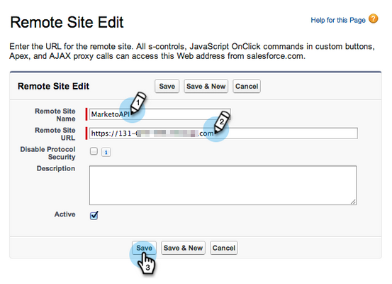

# Salesforce Professional EditionでのMarketor Sales Insightの設定 {#configure-marketo-sales-insight-in-salesforce-professional-edition}

Salesforce Professional EditionでMarketon Sales Insightを設定するために必要な手順を次に示します。 始めましょう。

>[!PREREQUISITES]
>
>[Salesforce Professional EditionにMarketoをインストールする](http://docs.marketo.com/display/docs/professional+edition)
>
>[SalesforceAppExchangeへのMarketo Sales Insightパッケージのインストール](../../../../product-docs/marketo-sales-insight/msi-for-salesforce/installation/install-marketo-sales-insight-package-in-salesforce-appexchange.md)

>[!NOTE]
>
>**必要な管理者権限**

## MarketorでのSales Insightの設定 {#configure-sales-insight-in-marketo}

1. 新しいブラウザーウィンドウを開き、MarketoアカウントからMarketo Sales Insightの資格情報を取得します。
1. 「管理者」領域に移動し、「 **販売インサイト**」を選択します。

   

1. 「 **API設定を編集**」をクリックします。

   

1. 選択したAPI秘密キーを入力し、「 **保存**」をクリックします。 API秘密鍵にはアンパサンド(&amp;)を使用しないでください。

   

   >[!NOTE]
   >
   >API秘密キーは、組織のパスワードのようなもので、セキュリティで保護する必要があります。

1. Rest API設定パネルで **表示** をクリックして、秘密鍵証明書を入力します。

   

1. 確認ポップアップが表示されます。 「 **OK**」をクリックします。

   

## SalesforceでのSales Insightの設定 {#configure-sales-insight-in-salesforce}

1. Salesforceで、「 **セットアップ**」をクリックします。

   

1. 「remote site」を検索し、「 **Remote Site Settings**」を選択します。

   

1. [ **新規リモートサイト**]をクリックします。

   

1. リモートサイト名を入力します（「MarketoSoapAPI」など）。 MarketoのSoap API設定パネルから、MarketoホストURLである「リモートサイトURL」を入力します。 「 **保存**」をクリックします。 Soap APIのリモートサイト設定が作成されました。

   

1. [ **新しいリモートサイト** ]を再度クリックします。

   

1. リモートサイト名を入力します（「MarketoRestAPI」など）。 リモートサイトURLを入力します。これは、MarketoのRest API設定パネルから取得したAPI URLです。 「 **保存**」をクリックします。 Rest APIのリモートサイト設定が作成されました。

## Marketor Sales Insightの設定 {#set-up-marketo-sales-insight}

1. Marketorインスタンスにログインし、「 **管理者**」をクリックします。

   

1. 「** Sales Insight**」をクリックします。

   

1. 「 **API設定を編集**」をクリックします。

   

1. **API秘密キーを入力し** 、「 **保存**」をクリックします。

   >[!CAUTION]
   >
   >API秘密鍵にアンパサンド(&amp;)を使用しないでください。

   

   >[!TIP]
   >
   >この窓は開いたままにしておけ。 この情報は、後でSalesforceで必要になります。

1. Salesforceに戻り、「 **セットアップ**」をクリックします。

   

1. 「remote site」を検索し、「 **Security Controls** 」の「 **Remote Site Setting**」をクリックします。

   

1. [ **新規リモートサイト**]をクリックします。

   

1. 「 **リモートサイト名** 」と「 **リモートサイトURL**」を入力し、「 **保存**」をクリックします。

   

   >[!NOTE]
   >
   >「 **リモートサイト名** 」を選択します（MarketoAPIはここで使用します）。 リ **モートサイトURLは** 、手順4のAPI設定を編集ダイアログボックスのMarketo Hostフィールドにあります。

## ページレイアウトのカスタマイズ {#customize-page-layouts}

1. 「 **設定**」をクリックします。

   

1. 「page layout」を検索し、「 **Leads** 」の下の「 **Page Layout**」を選択します。

   

1. 左側の「**Visualforceページ**」をクリックします。 「 **セクション** 」を「カスタムリンク」セクションの下のレイアウトにドラッグします。

   

1. 「 **セクション名**」に「Marketto Sales Insight」と入力します。 「 **1-Column** 」を選択し、「 **OK**」をクリックします。

   

1. リー **ド** を新しいセクションにドラッグ&amp;ドロップします。

   

   >[!TIP]
   >
   >このボックスの名前は、オブジェクトの種類に応じて変わります。 例えば、連絡先のページレイアウトを変更する場合は、「連絡先」と表示されます。

1. 先ほど追加した **リード** ブロックを重複クリックします。

   

1. 高さを450 **ピクセルに編集し、** 「OK ****」をクリックします。

   

   >[!TIP]
   >
   >AccountsおよびOpportunitiesオブジェクトの高さは、410ピクセルにすることをお勧めします。

1. 左側の「**フィールド**」をクリックします。 次に、「 **Engagement** 」ラベルを検索し、 **Marketor Sales Insight** レイアウトにドラッグします。

   

1. これらのフィールドに対しても、上記の手順を繰り返します。

<table> 
 <tbody> 
  <tr> 
   <td colspan="1">関与</td> 
  </tr> 
  <tr> 
   <td colspan="1" rowspan="1">
相対スコア値
</td> 
  </tr> 
  <tr> 
   <td colspan="1" rowspan="1">
緊急度の値
</td> 
  </tr> 
  <tr> 
   <td colspan="1" rowspan="1">
最後の興味深い瞬間の日付
</td> 
  </tr> 
  <tr> 
   <td colspan="1" rowspan="1">
最後の注目モーメントの説明
</td> 
  </tr> 
  <tr> 
   <td colspan="1" rowspan="1">
最後の興味深い瞬間の源
</td> 
  </tr> 
  <tr> 
   <td colspan="1" rowspan="1">
最後の興味深いモーメントのタイプ
</td> 
  </tr> 
 </tbody> 
</table>

1. 終了したら、 **「保存** 」をクリックします。

   

1. この手順を繰り返して、 **Contact**、 **Account** 、 **OpportunityのVisualforceページセクションとSales Insightフィールドを追加します**。
1. 手順5 ～ 7を繰り返して、連絡先、アカウント、オポチュニティのVisualforceページセクションを追加します。 次に、手順8 ～ 10を繰り返して、 **ContactにSales Insightフィールドを追加します**。 変更があったら必ず保存してください。

## ユーザー設定のユーザーフィールドのマッピング {#map-custom-person-fields}

変換が正しく機能するように、Marketing担当者のフィールドをSalesforceの連絡先フィールドにマッピングする必要があります。 これが方法です。

1. 「 **設定**」をクリックします。

   

1. 検索バーで「フィールド」を検索し、「リード **」の下にある「** フィールド **」をクリックし**&#x200B;ます。

   

1. 「リードフィールドの **マップ**」をクリックします。

   ** 

   **

1. 右側のドロップダウンをクリックして、「 **エンゲージメント**」を選択します。

   

1. リストで「**Contact.Engagement **」を選択します。

   

1. これらのフィールドも同様に繰り返してマッピングします。

<table> 
 <tbody> 
  <tr> 
   <th colspan="1" rowspan="1">マーケティング担当者のカスタムフィールド</th> 
   <th colspan="1" rowspan="1">Salesforce連絡先カスタムフィールド</th> 
  </tr> 
  <tr> 
   <td colspan="1" rowspan="1">
関与
</td> 
   <td colspan="1" rowspan="1">
Contact.Engagement
</td> 
  </tr> 
  <tr> 
   <td colspan="1" rowspan="1">
相対スコア値
</td> 
   <td colspan="1" rowspan="1">
Contact.Relative Score Value
</td> 
  </tr> 
  <tr> 
   <td colspan="1" rowspan="1">
緊急度の値
</td> 
   <td colspan="1" rowspan="1">
Contact.Ergency値
</td> 
  </tr> 
  <tr> 
   <td colspan="1" rowspan="1">
最後の興味深い瞬間の日付
</td> 
   <td colspan="1" rowspan="1">
Contact.Last Intersion Moment Date
</td> 
  </tr> 
  <tr> 
   <td colspan="1" rowspan="1">
最後の注目モーメントの説明
</td> 
   <td colspan="1" rowspan="1">
Contact.Last Intersion Moment Desc
</td> 
  </tr> 
  <tr> 
   <td colspan="1" rowspan="1">
最後の興味深い瞬間の源
</td> 
   <td colspan="1" rowspan="1">
Contact.Last Oftirution Moment Source
</td> 
  </tr> 
  <tr> 
   <td colspan="1" rowspan="1">
最後の興味深いモーメントのタイプ
</td> 
   <td colspan="1" rowspan="1">
Contact.Last Ofterist Moment Type
</td> 
  </tr> 
 </tbody> 
</table>

1. 終了したら「**保存**」をクリックします。

   

## Marketto Sales Insightの設定 {#marketo-sales-insight-config}

1. 「**+ **」をクリックし、「 **Marketto Sales Insight Config**」を選択します。

   

1. 「Marketto APIを **有効にする**」を選択します。 次に、Markettor管理者の [API設定情報を入力します](http://docs.marketo.com/display/DOCS/Configure+Marketo+Sales+Insight+in+Salesforce+Professional+Edition#ConfigureMarketoSalesInsightinSalesforceProfessionalEdition-SetupMarketoSalesInsight)。 終了したら「**変更を保存**」をクリックします。

   

   >[!NOTE]
   >
   >診断テストが失敗した場合は、ページレイアウトにフィールドを [追加する必要がある場合があります](http://nation.marketo.com/docs/DOC-1115)。

それだ！ リード、連絡先、アカウント、オポチュニティの「Marketo Sales Insight」フィールドを表示できるはずです。

>[!NOTE]
>
>アカウントの場合、Sales Insightにはすべての電子メールが含まれますが、最新の興味深い瞬間、Webアクティビティ、スコアの変更のみが含まれます。

## マーケティングに対する販売インサイトへのアクセス {#access-marketo-sales-insight}

1. Salesforceで、タブバーの最後にある **+をクリック** し、「 **Marketor Sales Insight Config**」をクリックします。
1. 「Marketto APIを **有効にする** 」チェックボックスを選択します。
1. MarketorのSales Insight管理者ページのSoap APIパネルから秘密鍵証明書をコピーし、Salesforce Sales Insight ConfigurationページのSoap APIセクションに貼り付けます。
1. MarketorのSales Insight管理者ページのRest APIパネルから秘密鍵証明書をコピーし、Salesforce Sales Insight ConfigurationページのRest APIセクションに貼り付けます。

   

>[!NOTE]
>
>**関連記事**
>
>* [優先度、緊急度、相対スコア、ベストベット](../../../../product-docs/marketo-sales-insight/msi-for-salesforce/features/stars-and-flames/priority-urgency-relative-score-and-best-bets.md)
>* [Marketor追加の「Sales Insight」タブとSalesforce用のボタン](../../../../product-docs/marketo-sales-insight/msi-for-salesforce/features/bulk-actions/add-marketo-sales-insight-tab-and-buttons-to-salesforce.md)

>

hh