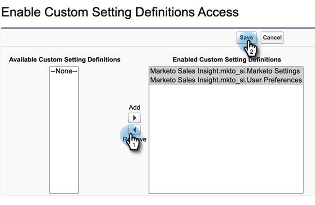

# Sales Insight アクセスの削除 {#remove-sales-insight-access}

次の手順を使用して、Salesforce の Sales Insight 機能へのアクセスを削除します。 Salesforce Classic および Lightning に適用可能。

## 概要 {#overview}

すべての Sales Insight 機能にアクセスするには、以下に示すオブジェクト、apex クラス、および visualforce ページに対する権限が必要です。 これらを削除すると、Sales Insight へのアクセス権が削除されます。

**オブジェクト設定**

<table> 
 <tbody> 
 <tr> 
   <td>BestBetsCache</td> 
   <td>読み取り、作成、編集、削除、すべて表示、すべて変更</td> 
  </tr> 
  <tr> 
   <td>最優先ビューの詳細</td> 
   <td>読み取り、作成、編集、削除、すべて表示、すべて変更</td> 
  </tr> 
  <tr> 
   <td>最優先ビュー</td> 
   <td>読み取り、作成、編集、削除、すべて表示、すべて変更</td> 
  </tr> 
  <tr> 
   <td>EmailActivityCache</td> 
   <td>読み取り、作成、編集、削除、すべて表示、すべて変更</td> 
  </tr> 
  <tr> 
   <td>GetMethodArgus</td> 
   <td>読み取り、作成、編集、削除、すべて表示、すべて変更</td> 
  </tr> 
  <tr> 
   <td>GroupedWebActivityCache</td> 
   <td>読み取り、作成、編集、削除、すべて表示、すべて変更</td> 
  </tr> 
  <tr> 
   <td>InterestingMomentsCache</td> 
   <td>読み取り、作成、編集、削除、すべて表示、すべて変更</td> 
  </tr> 
  <tr> 
   <td>Marketo Sales Insight の設定</td> 
   <td>読み取り、作成、編集、削除、すべて表示、すべて変更</td> 
  </tr> 
  <tr> 
   <td>ScoringCache</td> 
   <td>読み取り、作成、編集、削除、すべて表示、すべて変更</td> 
  </tr> 
  <tr> 
   <td>値</td> 
   <td>読み取り、作成、編集、削除、すべて表示、すべて変更</td> 
  </tr> 
  <tr> 
   <td>WebActivityCache</td> 
   <td>読み取り、作成、編集、削除、すべて表示、すべて変更</td> 
  </tr> 
 </tbody> 
</table>

* Apex クラスアクセス：159 「mkto_si」で始まる Apex クラス
* Visualforce ページアクセス：64 「mkto_si」で始まる Visualforce ページ
* カスタム設定の定義：mkto_si.Marketo設定&amp; mkto_si.ユーザーの環境設定

## Sales Insight へのアクセスの削除 {#removing-access-to-sales-insight}

1. Salesforce アカウントにログインします。

1. 「**設定**」をクリックします。

   

1. [ 管理者 ] で、[ **ユーザーを管理**&#x200B;を、 **プロファイル**.

1. 更新するプロファイルをクリックし、 **編集**.

1. 「タブ設定」の下の「カスタムタブ設定」まで下にスクロールします。

1. 「Marketo Sales Insight 構成」および「MSI Marketo Sales Outbox」のドロップダウンから「タブ非表示」オプションを選択します。

   

   

1. 下にスクロールして「Custom Object Permissions」を表示します。

1. 次のオブジェクトから「読み取り、作成、編集、削除」アクセスを削除します。

   * BestBetsCache
   * 最優先ビューの詳細
   * 最優先ビュー
   * EmailActivityCache
   * GetMethodArgus
   * GroupedWebActivityCache
   * InterestingMomentsCache
   * Marketo Sales Insight の設定
   * ScoringCache
   * 値
   * WebActivityCache

1. 「Enabled Apex Class Access」セクションまで下にスクロールします。 「**編集**」をクリックします。

1. 「Enabled Apex Classes」セクションで、「mkto_si」で始まるすべてのクラスを選択します。 これは、最大 159 個のクラスを追加する必要があります。

1. クリック **削除**&#x200B;を、 **保存**.

   

1. 下にスクロールして「Enabled Visualforce Page Access」セクションを表示します。 「**編集**」をクリックします。

1. 「Enabled Visualforce Pages」セクションで、「mkto_si」で始まるすべてのページを選択します。 合計で 64 ページになります。

1. クリック **削除**&#x200B;を、 **保存**.

   

1. 下にスクロールして、「Enabled Custom Setting Definitions Access」セクションを表示します。 「**編集**」をクリックします。

1. 「Marketo Sales Insight.mkto_si.Marketo設定」および「Marketo Sales Insight.mkto_si.ユーザーの環境設定」を選択します。

1. クリック **削除**&#x200B;を、 **保存**.

   

それだ！ Sales Insight へのアクセス権を正常に削除しました。 アクセスを削除する他のプロファイルに対しても同じ手順を繰り返します。
