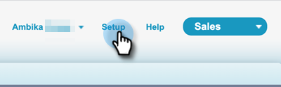

# Sales Insight アクセスの削除 {#remove-sales-insight-access}

次の手順を使用して、Salesforce の Sales Insight 機能へのアクセスを削除します。Salesforce Classic および Lightning に適用可能。

## 概要 {#overview}

Sales Insight のすべての機能にアクセスするには、以下に示すオブジェクト、apex クラスおよび visualforce ページに対する権限が必要です。これらを削除すると、Sales Insight へのアクセス権が削除されます。

**オブジェクト設定**

<table> 
 <tbody> 
 <tr> 
   <td>BestBetsCache</td> 
   <td>読み取り、作成、編集、削除、すべて表示、すべて変更</td> 
  </tr> 
  <tr> 
   <td>最有望見込客ビューの詳細</td> 
   <td>読み取り、作成、編集、削除、すべて表示、すべて変更</td> 
  </tr> 
  <tr> 
   <td>最有望見込客ビュー</td> 
   <td>読み取り、作成、編集、削除、すべて表示、すべて変更</td> 
  </tr> 
  <tr> 
   <td>EmailActivityCache</td> 
   <td>読み取り、作成、編集、削除、すべて表示、すべて変更</td> 
  </tr> 
  <tr> 
   <td>GetMethodArgus</td> 
   <td>読み取り、作成、編集、削除、すべて表示、すべて変更</td> 
  </tr> 
  <tr> 
   <td>GroupedWebActivityCache</td> 
   <td>読み取り、作成、編集、削除、すべて表示、すべて変更</td> 
  </tr> 
  <tr> 
   <td>InterestingMomentsCache</td> 
   <td>読み取り、作成、編集、削除、すべて表示、すべて変更</td> 
  </tr> 
  <tr> 
   <td>Marketo Sales Insight の設定</td> 
   <td>読み取り、作成、編集、削除、すべて表示、すべて変更</td> 
  </tr> 
  <tr> 
   <td>ScoringCache</td> 
   <td>読み取り、作成、編集、削除、すべて表示、すべて変更</td> 
  </tr> 
  <tr> 
   <td>値</td> 
   <td>読み取り、作成、編集、削除、すべて表示、すべて変更</td> 
  </tr> 
  <tr> 
   <td>WebActivityCache</td> 
   <td>読み取り、作成、編集、削除、すべて表示、すべて変更</td> 
  </tr> 
 </tbody> 
</table>

* Apex クラスアクセス：「mkto_si」で始まる 159 個の Apex クラス
* Visualforce ページアクセス：「mkto_si」で始まる 64 個の Visualforce ページ
* カスタム設定の定義：mkto_si.Marketo 設定と mkto_si.User 環境設定

## Sales Insight へのアクセスの削除 {#removing-access-to-sales-insight}

1. Salesforce アカウントにログインします。

1. 「**設定**」をクリックします。

   

1. 「管理者」で、「**ユーザを管理**」をクリックし、「**プロファイル**」をクリックします。

1. 更新するプロファイルをクリックし、「**編集**」をクリックします。

1. 「タブ設定」で、「カスタムタブ設定」まで下にスクロールします。

1. 「Marketo Sales Insight 設定」および「MSI Marketo Sales 送信トレイ」のドロップダウンから「タブ非表示」オプションを選択します。

   

   

1. 下にスクロールして「カスタムオブジェクト権限」を表示します。

1. 次のオブジェクトから「読み取り、作成、編集、削除」アクセスを削除します。

   * BestBetsCache
   * 最有望見込客ビューの詳細
   * 最有望見込客ビュー
   * EmailActivityCache
   * GetMethodArgus
   * GroupedWebActivityCache
   * InterestingMomentsCache
   * Marketo Sales Insight の設定
   * ScoringCache
   * 値
   * WebActivityCache

1. 「有効にされた Apex クラスアクセス」セクションまで下にスクロールします。「**編集**」をクリックします。

1. 「有効にされた Apex クラスアクセス」セクションで、「mkto_si」で始まるすべてのクラスを選択します。クラスの合計は 159 個になります。

1. 「**削除**」をクリックして、「**保存**」をクリックします。

   

1. 下にスクロールして「有効にされた Visualforce ページアクセス」セクションを表示します。「**編集**」をクリックします。

1. 「有効にされた Visualforce ページアクセス」セクションで、「mkto_si」で始まるすべてのページを選択します。ページの合計は 64 個になります。

1. 「**削除**」をクリックして、「**保存**」をクリックします。

   

1. 下にスクロールして、「有効にされたカスタム設定の定義」セクションを表示します。「**編集**」をクリックします。

1. 「Marketo Sales Insight.mkto_si.Marketo 設定」および「Marketo Sales Insight.mkto_si.User 環境設定」を選択します。

1. 「**削除**」をクリックして、「**保存**」をクリックします。

   

これで完了です。Sales Insight へのアクセス権を正常に削除しました。アクセスを削除する他のプロファイルに対しても同じ手順を繰り返します。
