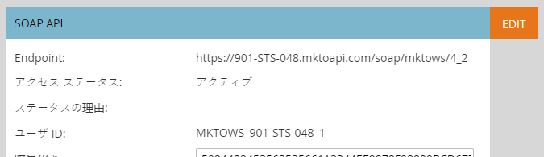
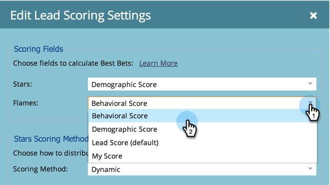

# Marketo 管理者向け Sales Insight ページ {#sales-insight-page-for-marketo-admins}

Marketo管理者には、Sales Insight に関する特定の権限があります。 以下の内容を学びます。

## SOAP API 設定 {#soap-api-configuration}

Salesforce で MSI を使用するために、これらの資格情報を使用して Salesforce アカウントをMarketoインスタンスに接続します。

## Rest API 設定 {#rest-api-configuration}

Salesforce で MSI インサイトダッシュボードを使用するために、これらの資格情報を使用して Salesforce アカウントをMarketoインスタンスに接続します。

## 担当者スコア設定 {#person-score-settings}

* **星**:星は、他のリードと比較した合計リードスコアを表します。
* **炎**:炎は緊急度を表し、リードのスコアが最近どの程度変化したかを示します。

デフォルトでは、Marketo Sales Insight は「リードスコア」フィールドを使用して星と炎を計算します。 別のフィールドを選択する場合は、次の方法を使用できます。

1. 内 **管理者** 「Marketo」領域で、「 **Sales Insight**.

   

1. 「リードスコア設定」で、 **編集**.

   

1. 星に使用するフィールドを選択します。

   

1. 炎に使用するフィールドを選択します。

   

1. 「**保存**」をクリックします。セールスインサイトの再計算には時間がかかります。 後で CRM をチェックして星と炎を確認できます。

   

   >[!TIP]
   >
   >カスタムスコアフィールドがまだない場合は、次の方法を使用します。 [作成する](/help/marketo/product-docs/administration/field-management/create-a-custom-field-in-marketo.md).

   >[!MORELIKETHIS]
   >
   >[星と炎](/help/marketo/product-docs/marketo-sales-insight/msi-for-salesforce/features/stars-and-flames/customize-stars-and-flames.md)

## 設定 {#settings}

**配信停止設定:**

テンプレートなし、標準メール、オペレーショナルメールに対して、次の配信停止設定から選択できます

* 配信停止設定を優先
* 1 人以上の受信者の場合に配信停止設定を優先
* 受信者が 5 人以上の場合に配信停止設定を優先
* 配信停止設定を無視

**テンプレートをロックする機能を有効化:**

有効にすると、Salesforce からメールを送信する際に、MSI ユーザはテンプレートを編集できなくなります

**RSS フィードの有効化:**

有効にすると、MSI ユーザは（Salesforce のリードフィードに加えて）RSS フィードでリードフィードを表示できます。 RSS フィードは、「トークンの有効期限」機能が無効な場合にのみ機能します。

**トークンの有効期限:**

トークンの有効期限は、機能マネージャで制御します。 有効/無効を切り替えるには、次の場所にお問い合わせください： [Marketoサポート](https://nation.marketo.com/t5/Support/ct-p/Support). 有効にした場合、すべてのMarketoトークンは 10 分以内に期限切れになります。 無効にした場合、Marketoトークンは期限切れになりません。

トークンの有効期限を有効にする前に生成されたトークンには、検証の有効期限がないので、この機能が現在有効になっていても期限切れになりません。

トークンの有効期限を有効にした後に生成されたトークンの有効期限は 10 分になるので、無効化後も 10 分で有効期限が切れます。

トークンの動作は、生成された日時（トークンの有効期限機能が有効/無効の場合、現在の機能のステータスではなく）に基づいておこなわれます。
