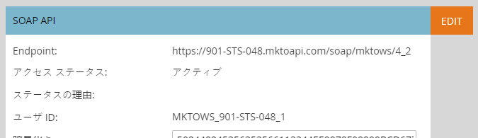
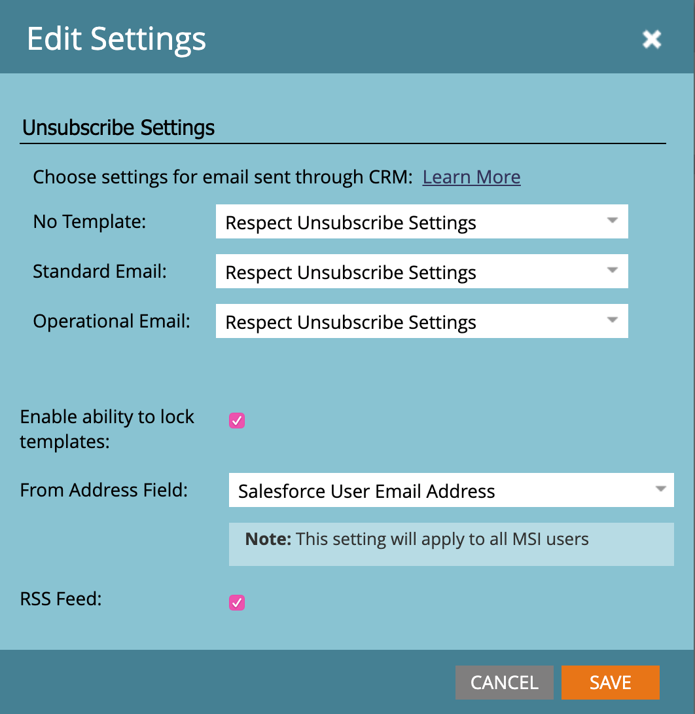

# Marketo 管理者向け [!DNL Sales Insight] ページ {#sales-insight-page-for-marketo-admins}

Marketo 管理者には、[!DNL Sales Insight] に関する特定の権限があります。 それらについて説明します。

## SOAP API 設定 {#soap-api-configuration}

[!DNL Salesforce] で MSI を使用するには、これらの資格情報を使用して [!DNL Salesforce] アカウントを Marketo インスタンスに接続します。

## Rest API 設定 {#rest-api-configuration}

[!DNL Salesforce] で MSI Insights ダッシュボードを使用するには、これらの資格情報を使用して [!DNL Salesforce] アカウントを Marketo インスタンスに接続します。

## 人物スコア設定 {#person-score-settings}

* **[!UICONTROL 星]**：星は、他のリードと比較した合計リードスコアを表します。
* **[!UICONTROL 炎]**：炎は緊急度を表し、リードのスコアが最近どの程度変化したかを示します。

デフォルトでは、[!DNL Marketo Sales Insight] は「リードスコア」フィールドを使用して星と炎を計算します。 別のフィールドを選択する場合は、次の方法を使用できます。

1. Marketo の&#x200B;**[!UICONTROL 管理者]**&#x200B;領域で、「**[!UICONTROL セールスインサイト]**」をクリックします。

   

1. 「[!UICONTROL リードスコアリング設定]」で、「**[!UICONTROL 編集]**」をクリックします。

   

1. 星に使用するフィールドを選択します。

   

1. 炎に使用するフィールドを選択します。

   

1. 「**[!UICONTROL 保存]**」をクリックします。 セールスインサイトの再計算には時間がかかります。 後で CRM をチェックして星と炎を確認できます。

   

   >[!TIP]
   >
   >カスタムスコアフィールドがまだない場合は、こちらを参照して[作成します](/help/marketo/product-docs/administration/field-management/create-a-custom-field-in-marketo.md)。

   >[!MORELIKETHIS]
   >
   >[星と炎](/help/marketo/product-docs/marketo-sales-insight/msi-for-salesforce/features/stars-and-flames/customize-stars-and-flames.md)

## 設定 {#settings}

**配信停止設定：**

[!UICONTROL テンプレートなし]、[!UICONTROL 標準メール]、[!UICONTROL オペレーショナルメール]に対して、次の登録解除設定から選択できます。

* [!UICONTROL 登録解除設定を優先]
* [!UICONTROL 1 人以上の受信者の場合に登録解除設定を優先]
* [!UICONTROL 受信者が 5 人以上の場合に登録解除設定を優先]
* [!UICONTROL 登録解除設定を無視]

**テンプレートをロックする機能を有効化：**

有効にすると、[!DNL Salesforce] からメールを送信する際に、MSI ユーザはテンプレートを編集できなくなります

**RSS フィードの有効化：**

有効にすると、MSI ユーザは（[!DNL Salesforce] のリードフィードに加えて）RSS フィードでリードフィードを表示できます。 RSS フィードは、「[!UICONTROL トークンの有効期限]」機能が無効な場合にのみ機能します。

**トークンの有効期限：**

トークンの有効期限は、機能マネージャーで制御します。 有効／無効を切り替えるには、[Marketo サポート](https://nation.marketo.com/t5/Support/ct-p/Support)にお問い合わせください。 有効にすると、すべての Marketo トークンは 10 分以内に期限切れになります。 無効にすると、Marketo トークンは期限切れになりません。

トークンの有効期限を有効にする前に生成されたトークンについては、認証の有効期限がないため、この機能が現在有効である場合でも期限切れになりません。

トークンの有効期限を有効にした後に生成されたトークンについては、有効期限が 10 分となり、この機能が無効になった後も 10 分で有効期限切れになります。

トークンの動作は、現在の機能のステータスではなく、生成された時点のトークンの有効期限機能が有効／無効であるかに基づきます。
