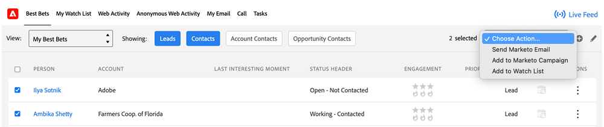

# Sales Insight でのアクションの選択 {#choose-an-action-in-sales-insight}

Salesforce Classic と Lightning の Sales Insight ドロップダウンから、次のアクションを使用できます。

* Marketo メールの送信
* Marketo キャンペーンに追加
* ウォッチリストに追加

これらの各機能には、次の場所からアクセスできます。

**単一のアクションでのページレイアウト**

* リードレイアウトパネル：単一のアクションで、ユーザープロファイルで制御可能
* 連絡先レイアウトパネル：単一のアクションで、ユーザープロファイルで制御可能
* リードレイアウトボタン：単一のアクション。ユーザープロファイルでは制御できません
* 連絡先レイアウトボタン：単一のアクション。ユーザープロファイルでは制御できません

   

**グループアクションを含むページレイアウト**

* アカウントレイアウトパネル：グループアクションと、ユーザープロファイルで制御可能
* 商談のレイアウトパネル：グループアクションと、ユーザープロファイルで制御可能

   

**「最優先」タブ**

* 最優先バルクアクションタブ：グループアクションと、ユーザープロファイルで制御可能

   

* 最優先のインラインアクションタブ：単一のアクションで、ユーザープロファイルで制御可能

   

**一括アクションによるリスト表示**

* リードリスト表示：一括アクション。ユーザープロファイルでは制御できません
* 連絡先リスト表示：一括アクション。ユーザープロファイルでは制御できません

   
