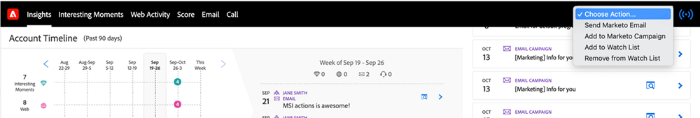

# [!DNL Sales Insight] でのアクションの選択 {#choose-an-action-in-sales-insight}

[!DNL Salesforce] Classic と Lightning の [!DNL Sales Insight] ドロップダウンから、次のアクションを使用できます。

* Marketo メールの送信
* Marketo キャンペーンに追加
* ウォッチリストに追加

これらの各機能には、次の場所からアクセスできます。

**単一のアクションのページレイアウト**

* リードレイアウトパネル：単一のアクション。ユーザープロファイルで制御可能
* 連絡先レイアウトパネル：単一のアクション。ユーザープロファイルで制御可能
* 「リードレイアウト」ボタン：単一のアクション。ユーザープロファイルで制御できません
* 「連絡先レイアウト」ボタン：単一のアクション。ユーザープロファイルでは制御できません

  

**グループアクションのページレイアウト**

* アカウントレイアウトパネル：グループアクション。ユーザープロファイルで制御可能
* 商談レイアウトパネル：グループアクション。ユーザープロファイルで制御可能

  

**[!DNL Best Bets]タブ**

* 「[!DNL Best Bets] 一括アクション」タブ：グループアクション。ユーザプロファイルで制御できます

  

* 「[!DNL Best Bets] インラインアクション」タブ：単一のアクション。ユーザプロファイルで制御できます

  

**一括アクションのリスト表示**

* リードリスト表示：一括アクション。ユーザープロファイルでは制御できません
* 連絡先リスト表示：一括アクション。ユーザープロファイルでは制御できません

  
