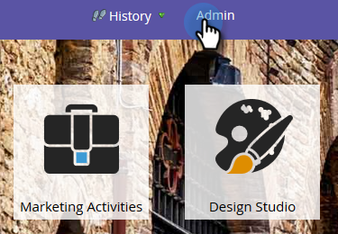
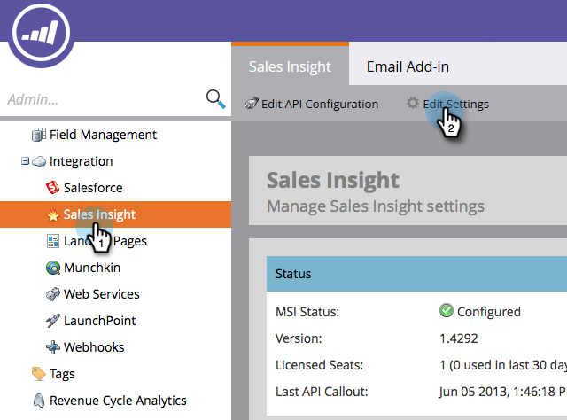
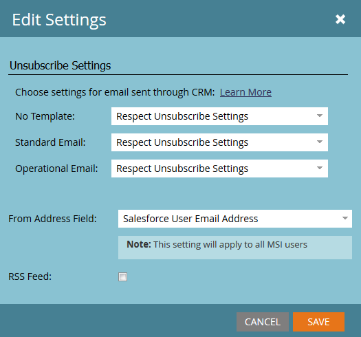

# [!DNL Marketo Sales Insight] の登録解除フッターの設定 {#configure-unsubscribe-footers-in-marketo-sales-insight}

セールスメールでは、配信停止フッターが自動的に下部に表示されます。ただし、必要に応じて設定を調整できます。

>[!NOTE]
>
>**管理者権限が必要**

>[!NOTE]
>
>**定義**
>
>**セールスメール**&#x200B;は、[!DNL Sales Insight] から送信されるものです（Marketo Outlook プラグインから送信されたものは含まれません）。

1. 「**[!UICONTROL 管理者]**」領域に移動します。

   

1. 「**[!UICONTROL セールスインサイト]**」をクリックし、「**[!UICONTROL 設定を編集]**」をクリックします。

   

   いくつかのオプションがあります。まず、設定を変更できるメールのタイプを見てみましょう。

   

   * **[!UICONTROL テンプレートなし]** - セールスユーザーが手動で作成。
   * **[!UICONTROL 標準メール]** - テンプレートに基づくメール。
   * **[!UICONTROL オペレーショナルメール]** - 配信停止、マーケティングの中断、通信制限を無視するメール（何があっても送信されます）

   タイプごとに異なる動作を設定するオプションがあります。

   >[!CAUTION]
   >
   >**[!UICONTROL 配信停止設定を優先]**：配信停止済みのリードは、公開されたメールが「オペレーショナル」の場合でもメールを受信しません
   >
   >**[!UICONTROL 配信停止設定を無視]**：配信停止済みのリードはメールを受信します

1. 必要な変更を行い、「**[!UICONTROL 保存]**」をクリックします。

   >[!TIP]
   >
   >最後の 2 つの選択肢を使用すると、受信者の数（「1 より大きい」または「5 より大きい」）に応じて、配信停止フッターを動的に含めたり除外したりできます。

   

お疲れさまでした。少し複雑ですが柔軟ですね。
