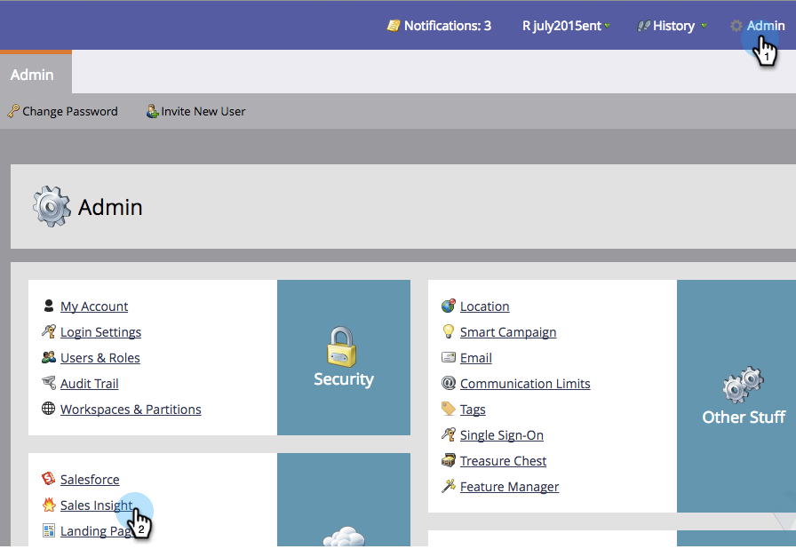
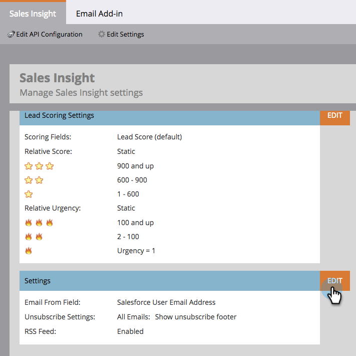
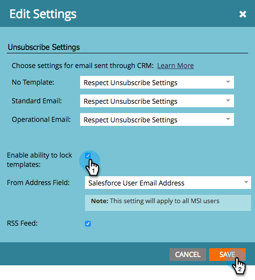
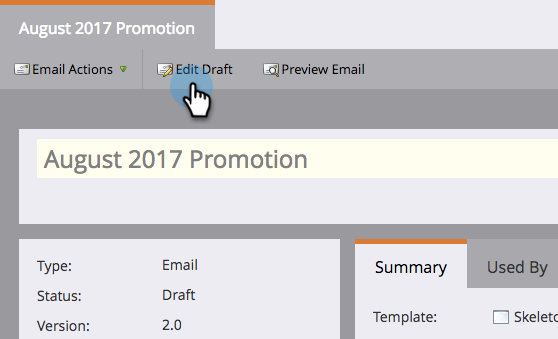
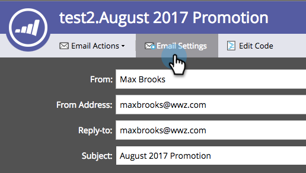
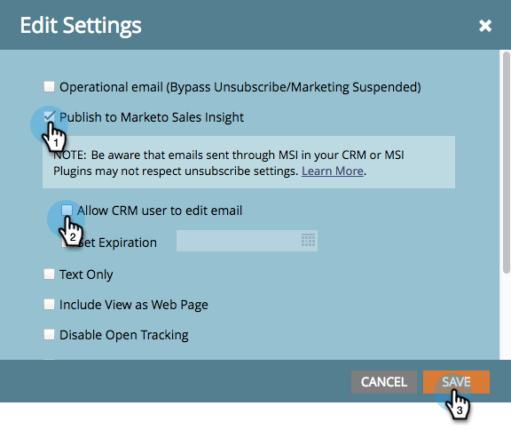

# セールステンプレートのロック {#lock-sales-template}

CRM ユーザーがセールステンプレートを編集できないように、管理者はテンプレートをロックできるので、ユーザーはメールエディターでテンプレートを個別にロックできます。

>[!CAUTION]
>
>この機能は [!DNL Salesforce] でのみ機能し、[!DNL Microsoft Dynamics] やその他の CRM とは互換性がありません。 [!DNL Outlook] または Gmail プラグインからアクセスするテンプレートは、Marketo によってエディターは制御されないので、ロックされません。

## テンプレートのロックを有効にする {#enable-lock-template}

>[!NOTE]
>
>**管理者権限が必要**

1. 「**[!UICONTROL 管理者]**」に移動し、「**[!UICONTROL セールスインサイト]**」をクリックします。

   

1. 「**[!UICONTROL 設定]**」で、「**[!UICONTROL 編集]**」をクリックします。

   

1. 「**[!UICONTROL テンプレートをロックする機能を有効化]**」をチェックします。 「**[!UICONTROL 保存]**」をクリックします。

   

>[!NOTE]
>
>デフォルトでは、このボックスはオンになっており、テンプレートをロックする機能が有効になっています。 これをオフにすると、メールエディターのロックテンプレート機能が無効になります。

>[!NOTE]
>
>管理者がこの設定を変更しても、既存のテンプレートに遡って影響を与えることは&#x200B;**ありません**。つまり、既存のテンプレートは自動的にロックされません。

## メールエディターでテンプレートをロック {#lock-template-in-the-email-editor}

1. ロックするメールを選択し、「**[!UICONTROL ドラフトを編集]**」をクリックします。

   

1. メールエディターで、「**[!UICONTROL メール設定]**」をクリックします。

   

1. まだチェックされていない場合は、**[!UICONTROL Marketo Sales Insightへの公開]**&#x200B;を確認してください。 これで、「**[!UICONTROL CRM ユーザーにメールの編集を許可する]**」のチェックを外して、テンプレートをロックできます。 「**[!UICONTROL 保存]**」をクリックします。

   

   >[!NOTE]
   >
   >デフォルトでは、このボックスはオンになっており、CRM ユーザーはメールの編集が許可されています。
