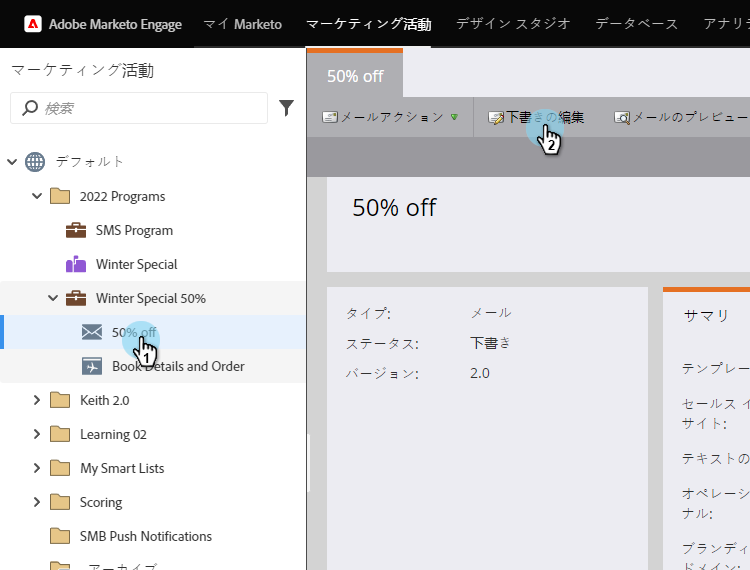
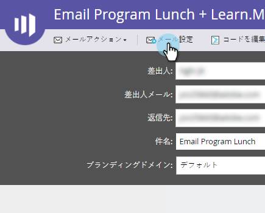

# [!DNL Sales Insight] へのメールの公開 {#publish-an-email-to-sales-insight}

[!DNL Sales Insight] に公開する設定を有効にして、セールスチームが [!DNL Sales Insight] だけでなく、[!DNL Outlook] および Gmail アドインでもメールを利用できるようにします。 また、有効期限を指定することもできます。

1. 目的のメールを選択して、「**[!UICONTROL ドラフトを編集]**」をクリックします。

   

1. エディターが開いたら、「**[!UICONTROL メール設定]**」をクリックします。

   

1. 「**[!UICONTROL Marketo セールスインサイトに公開]**」をオンにします。

   

1. 有効期限を設定するには（オプション）、「**[!UICONTROL 有効期限を設定]**」をオンにして日付を選択します。

   

   >[!NOTE]
   >
   >（設定した場合）有効期限日の午後 11:59（CST）に、使用可能にしたメールが [!DNL Sales Insight] およびアドインから削除されます。 もちろん、Marketo では引き続きアクセスできます。

1. 「**[!DNL Save]**」をクリックします。

   

これで完了です。 セールスチームが CRM 側で送信するメールを使用できるようにし、必要に応じて利用可能な期間を制限する方法が理解できました。

>[!NOTE]
>
>[!DNL Microsoft Dynamics] または [!DNL Salesforce] の [!DNL Sales Insight] からメールを送信しても、[マイトークン](/help/marketo/product-docs/core-marketo-concepts/programs/tokens/understanding-my-tokens-in-a-program.md)は解決されません。標準のトークン（リード、会社など）のみが入力されます。 ただし、トークンのデフォルト値は機能します。

>[!TIP]
>
>変更を有効にするために、忘れずにこのメールを承認してください。 [電子メールの承認](/help/marketo/product-docs/email-marketing/general/creating-an-email/approve-an-email.md)方法を参照してください。
