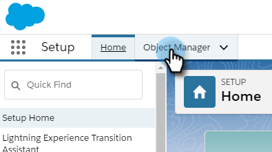

# Salesforce Lightningのバルクアクション{#bulk-actions-in-salesforce-lightning}

Salesforce Lightningでバルクアクションを設定する方法を次に示します。

1. Salesforceで、設定アイコンをクリックし、「**設定**」を選択します。

   

1. 「**オブジェクトマネージャー**」タブをクリックします。

   

1. **リード**&#x200B;ラベルを探して選択します。

   

1. 「**Salesforce Classicの検索レイアウト**」をクリックします。

   

   リスト表示のレイアウトを探します。 右側のドロップダウンをクリックし、「**編集**」を選択します。

   

1. 「カスタムボタン」で、「Marketoキャンペーン（稲妻）」追加&#x200B;**と「** Marketo Email（稲妻）**に**&#x200B;送信」を探して選択します。 **追加**&#x200B;ボタンをクリックします。

   

1. 「**保存**」をクリックします。

   

   これで、リードリスト表示にバルクアクションボタンを表示できます。

   >[!NOTE]
   >
   >同じ手順を繰り返して、連絡先リスト表示にバルクアクションを追加します。

