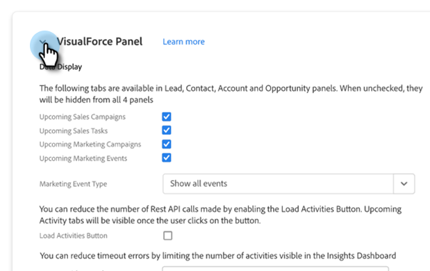
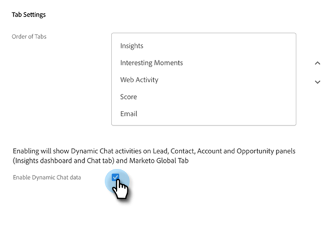
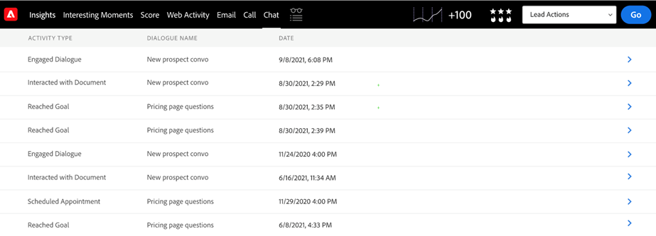
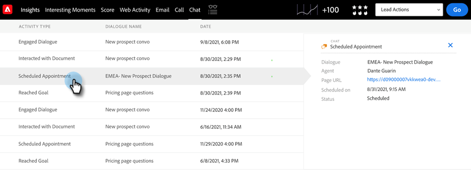
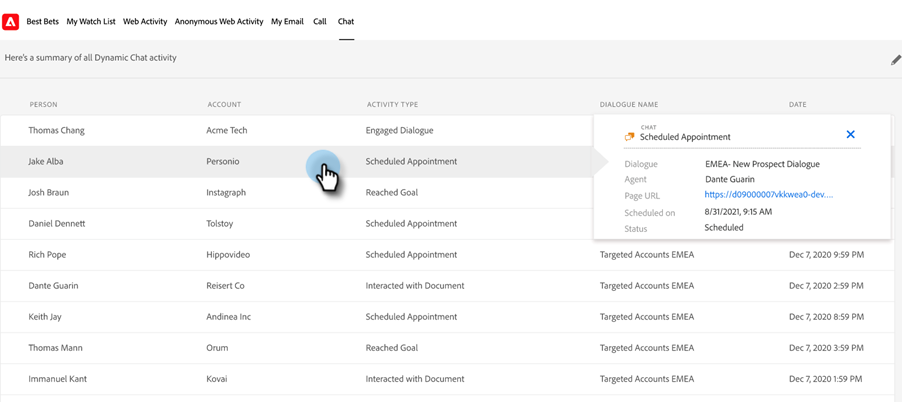

# 動的チャットの統合 {#dynamic-chat-integration}

セールスインサイトと Dynamic Chat の統合について詳しく説明します。

>[!PREREQUISITES]
>
>* セールスインサイト SFDC パッケージは、[2.4.0 以降](/help/marketo/product-docs/marketo-sales-insight/msi-for-salesforce/upgrading/upgrading-your-msi-package.md){target="_blank"}のバージョンである必要があります。
>
>* [Dynamic Chat の統合](/help/marketo/product-docs/demand-generation/dynamic-chat/dynamic-chat-overview.md){target="_blank"}が設定されている必要があります。
>
>* セールスインサイトの[オペレーショナル設定](/help/marketo/product-docs/marketo-sales-insight/msi-for-salesforce/configuration/marketo-sales-insight-configuration-tab-in-salesforce.md#operational-settings){target="_blank"}で、「API 秘密鍵」フィールドに値が入力されていることを確認します。 入力されていない場合は、[こちら](/help/marketo/product-docs/marketo-sales-insight/msi-for-salesforce/configuration/configure-marketo-sales-insight-in-salesforce-enterprise-unlimited.md#configure-sales-insight-in-marketo){target="_blank"}で取得方法を確認してください。

## 「[!DNL Marketo Sales Insight] の設定」タブ {#marketo-sales-insight-configuration-tab}

[!DNL Dynamic Chat] の統合を有効にする手順は以下のとおりです。

1. [!DNL Salesforce] アカウントにログインし、タブバーの最後にある「+」をクリックして「**[!DNL Marketo Sales Insight Config]**」をクリックします。

1. 「[!UICONTROL Visualforce パネル]」をクリックして展開します。

   

1. 「**[!UICONTROL 動的チャットデータを有効にする]**」チェックボックスを選択します。

   

## 機能の概要 {#feature-overview}

次の [!DNL Dynamic Chat] アクティビティは、[!DNL Sales Insight] ユーザが活用できます。

ダイアログにエンゲージ：訪問者がチャットボットをクリックしてダイアログにエンゲージしたときに、Marketo にログインし、[!DNL Sales Insight] に入力されます。

* ダイアログ名
* ページ URL
* ステータス（開始済み／離脱済み／完了済み）

予定をスケジュール：訪問者がチャットボットを使用して予定を正常にスケジュールしたら、Marketo にログインし、[!DNL Sales Insight] に入力されます。

* ダイアログ名
* エージェント
* ページ URL
* スケジュール日（日付とタイムスタンプを挿入）
* ステータス（スケジュール済み、再スケジュール済み、キャンセル済み）

目標に到達済み：任意のダイアログフローで訪問者が目標に到達したときに、Marketo にログインし、[!DNL Sales Insight] に入力されます。

* ダイアログ名
* 目標名
* ページ URL

ドキュメントの操作：訪問者がチャットボット経由で共有されたドキュメントを操作すると、Marketo にログインし、[!DNL Sales Insight] に入力されます。

* ダイアログ名
* ドキュメント
* ステータス

チャットアクティビティは Insights ダッシュボードで利用できます。

「チャット」タブは、リードパネルと取引先責任者パネルで使用できます。 「[!UICONTROL アクティビティタイプ]」、「[!UICONTROL ダイアログ名]」、「[!UICONTROL 日付]」の各列が含まれます。

アクティビティタイプをクリックすると、そのタイプに関する詳細を確認できます。

同様に、アカウントパネルと商談パネルには、「[!UICONTROL 名前]」、「[!UICONTROL アクティビティタイプ]」、「[!UICONTROL ダイアログ名]」、「[!UICONTROL 日付]」の各列が含まれます。

「チャット」タブは、「グローバル Marketo」タブにも表示されます。 これには、次の列と共に、3 つのアクティビティタイプ（[!UICONTROL ダイアログにエンゲージ]、[!UICONTROL 予定をスケジュール]、[!UICONTROL 目標を達成]）が含まれます。

* [!UICONTROL 顧客]
* [!UICONTROL アカウント]
* [!UICONTROL アクティビティタイプ]（[!UICONTROL ダイアログにエンゲージ]、[!UICONTROL 予定をスケジュール]、[!UICONTROL 目標を達成]）
* [!UICONTROL ダイアログ名]
* [!UICONTROL 日付]

ここでも、アクティビティタイプをクリックすると、そのタイプに関する詳細を確認できます。

>[!NOTE]
>
>「[!UICONTROL 動的チャットデータを有効にする]」チェックボックスが無効になっている場合、次の機能は無効になります。
>
>* Insights ダッシュボードのチャットアクティビティの行（スマートグリッドと週別リスト表示）
>* リード、取引先責任者、アカウント、商談の各パネルの「チャット」タブ
>* 「グローバル Marketo」タブの「チャット」タブ
>
>これらの機能の 1 つのみを無効にすることはできません。
