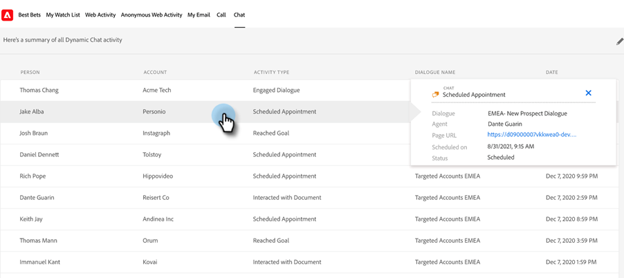

# 動的チャットの統合 {#dynamic-chat-integration}

Sales Insight と動的チャットの統合について詳しく説明します。

>[!PREREQUISITES]
>
>* Sales Insight SFDC パッケージのバージョンは [2.4.0 以上である必要があります ](/help/marketo/product-docs/marketo-sales-insight/msi-for-salesforce/upgrading/upgrading-your-msi-package.md){target="_blank"}
>
>* [動的チャットの統合](/help/marketo/product-docs/demand-generation/dynamic-chat/dynamic-chat-overview.md){target="_blank"}セットアップを持っている必要があります。
>
>* Sales Insight[Operational Settings](/help/marketo/product-docs/marketo-sales-insight/msi-for-salesforce/configuration/marketo-sales-insight-configuration-tab-in-salesforce.md#operational-settings){target="_blank"} で、「API Secret Key」フィールドに値が入力されていることを確認します。 含まれていない場合は、その取得方法を参照してください [ こちら ](/help/marketo/product-docs/marketo-sales-insight/msi-for-salesforce/configuration/configure-marketo-sales-insight-in-salesforce-enterprise-unlimited.md#configure-sales-insight-in-marketo){target="_blank"}。

## Marketo Sales Insight の「設定」タブ {#marketo-sales-insight-configuration-tab}

動的チャットの統合を有効にする手順は以下のとおりです。

1. Salesforce アカウントにログインし、タブバーの最後にある「+」をクリックして「**Marketo Sales Insight の設定**」をクリックします。

1. 「Visualforce パネル」をクリックして展開します。

   

1. 「**動的チャットデータを有効にする**」チェックボックスを選択します。

   

## 機能の概要 {#feature-overview}

次の動的チャットのアクティビティは、Sales Insight ユーザが利用できます。

ダイアログにエンゲージ：訪問者がチャットボットをクリックしてダイアログに移動したときに、Marketo にログインし、Sales Insight に入力されます。

* ダイアログ名
* ページ URL
* ステータス（開始済み／離脱済み／完了済み）

予定をスケジュール：訪問者がチャットボットを使用して予定を正常にスケジュールしたら、Marketo にログインし、Sales Insight に入力されます。

* ダイアログ名
* エージェント
* ページ URL
* スケジュール日（日付とタイムスタンプを挿入）
* ステータス（スケジュール済み、再スケジュール済み、キャンセル済み）

目標を達成：任意のダイアログフローで訪問者が目標に達したときに、Marketo にログインし、Sales Insight に入力されます。

* ダイアログ名
* 目標名
* ページ URL

ドキュメントの操作：訪問者がチャットボット経由で共有されたドキュメントを操作すると、Marketo にログインし、Sales Insight に入力されます。

* ダイアログ名
* ドキュメント
* ステータス

チャットアクティビティは Insights ダッシュボードで利用できます。

「チャット」タブは、リードパネルと取引先責任者パネルで使用できます。アクティビティタイプ、ダイアログ名、日付の各列が含まれます。

アクティビティタイプをクリックすると、そのタイプに関する詳細を確認できます。

同様に、アカウントパネルと商談パネルには、名前、アクティビティタイプ、ダイアログ名、日付列が含まれます。

「チャット」タブは、「グローバル Marketo」タブにも表示されます。これには、次の列と共に、3 つのアクティビティタイプ（ダイアログにエンゲージ、予定をスケジュール、目標を達成）が含まれます。

* 人物
* アカウント
* アクティビティタイプ（ダイアログにエンゲージ、予定をスケジュール、目標を達成）
* ダイアログ名
* 日時タイムスタンプ

ここでも、アクティビティタイプをクリックすると、そのアクティビティの詳細を確認できます。

>[!NOTE]
>
>「動的チャットデータを有効にする」チェックボックスが無効になっている場合、次の機能は無効になります。
>
>* Insights ダッシュボードのチャットアクティビティの行（スマートグリッドと週別リスト表示）
>* リード、取引先責任者、アカウント、商談の各パネルの「チャット」タブ
>* 「グローバル Marketo」タブの「チャット」タブ
>
>これらの機能の 1 つのみを無効にすることはできません。

