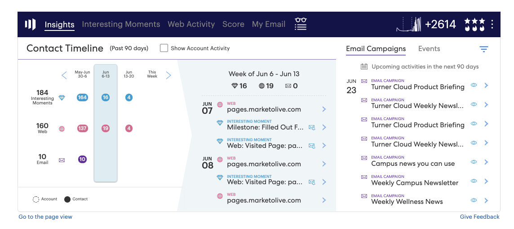

# インサイトダッシュボード機能の概要 {#insights-dashboard-feature-overview}

販売インサイトダッシュボードで使用できる機能の詳細を説明します。

>[!PREREQUISITES]
>
>最新の MSI SFDC パッケージと [設定](/help/marketo/product-docs/marketo-sales-insight/msi-for-salesforce/configuration/configuration-for-existing-customers.md).

## 取引先責任者のレイアウト {#contact-layout}

**係合速度グリッド**

* このスマートグリッドには、過去 90 日間の興味深い瞬間、電子メール、Web アクティビティが含まれています
* 「アカウントを表示」アクティビティを選択できます。これにより、すべてのアカウントレベルの「興味深い瞬間」、「E メール」、「Web アクティビティ」が連絡先ビューにレイヤーされます。
* 特定の週を強調表示して、その週内のアクティビティを確認できます
* 既定の表示：現在の週が選択されています

**エンゲージメントのドリルダウンと概要**

* 興味深い瞬間、E メール、Web アクティビティのアクティビティ・カードのドリルダウン
* 興味深い瞬間アクティビティカード — 購読オプションを含む
* 電子メールアクティビティカード — プレビューオプションを含む
* Web アクティビティカード — リンクをクリックする機能を含む
* 週別サマリバーには、その週の興味深い瞬間、電子メール、Web アクティビティが表示されます。 各アイコンはクリック可能で、特定のアクティビティを示すフィルターとして使用できます
* 既定の表示：現在のビューのアクティビティのリストです

**今後の電子メールキャンペーンおよびイベント**

「電子メールキャンペーン」タブ

* 次の 90 日以内にスケジュールされた電子メールプログラムまたはデフォルトプログラムの一部であるキャンペーンが含まれます
* Not specific to the contact/lead (i.e., list of campaigns is a generic list of all email campaigns scheduled in the Marketo instance). The list of campaigns across all lead, contact, account, and opportunity panels will be the same
* If campaign recurrence is such that it runs more than three times in the next 90 days, only the next three runs will be shown at any given point in time (similar to the behavior in Marketo)
* The activity details card in this section will have a preview option. If the flow includes multiple send email steps, all emails will be available to preview. Within the send email flow step, if there are multiple “email choices”, the default option will be available for preview
* フィルターには、「検索」と「日付範囲」が含まれます

「イベント」タブ：

* 今後 90 日以内にスケジュールされたイベントプログラムを含む
* フィルターオプションを使用して、（管理者設定に基づいて）すべてのイベント/招待イベントを表示します。
* 招待イベントを選択すると、特定の連絡先が招待されたイベントとメンバーのステータスが表示されます
* すべてのイベントを選択すると、次の 90 日以内にスケジュールされたイベントのリストが表示されます
* このセクションのアクティビティの詳細カードには、プレビューオプションがあります
* フィルターには、「検索」、「招待イベントのみ表示」および「日付範囲」が含まれます。

## リードのレイアウト {#lead-layout}

**係合速度グリッド**

* このスマートグリッドには、過去 90 日間の興味深い瞬間、電子メール、Web アクティビティが含まれています
* User can highlight specific week in order to see activities within that week
* Default View: Current week is selected
* “Show Account Activity” feature is not available on leads since it is not a part of any account in Salesforce until it gets converted to a contact

**エンゲージメントのドリルダウンと概要**

* 興味深い瞬間、E メール、Web アクティビティのドリルダウンアクティビティカード
* Interesting Moments Activity card - Includes Subscribe Option
* 電子メールアクティビティカード — プレビューオプションを含む
* Web アクティビティカード — リンクをクリックする機能を含む
* 週別サマリバーには、その週の興味深い瞬間、電子メール、Web アクティビティが表示されます。 各アイコンはクリック可能で、特定のアクティビティを示すフィルターとして使用できます
* 既定の表示：現在のビューのアクティビティのリストです

**今後の電子メールキャンペーンおよびイベント：**

「電子メールキャンペーン」タブ

* 次の 90 日以内にスケジュールされた電子メールプログラムまたはデフォルトプログラムの一部であるキャンペーンが含まれます
* Not specific to the contact/lead (i.e., list of campaigns is a generic list of all email campaigns scheduled in the Marketo instance). すべてのリード、連絡先、アカウント、オポチュニティのパネルにわたるキャンペーンのリストは同じです
* キャンペーンの繰り返しで、次の 90 日間に 3 回以上実行される場合、任意の時点で次の 3 回の実行のみが表示されます (Marketoの動作と同様 )
* この節のアクティビティの詳細カードには、プレビューオプションが表示されます。 If the flow includes multiple send email steps, all emails will be available to preview. 「E メールの送信」フロー手順で、「E メールの選択肢」が複数ある場合は、デフォルトのオプションをプレビューできます
* フィルターには、「検索」と「日付範囲」が含まれます

「イベント」タブ：

* Includes Event Programs scheduled within the next 90 days
* フィルターオプションを使用して、（管理者設定に基づいて）すべてのイベント/招待イベントを表示します。
* 招待イベントを選択すると、特定の連絡先が招待されたイベントとメンバーのステータスが表示されます
* すべてのイベントを選択すると、次の 90 日以内にスケジュールされたイベントのリストが表示されます
* このセクションのアクティビティの詳細カードには、プレビューオプションがあります
* フィルターには、「検索」、「招待イベントのみ表示」および「日付範囲」が含まれます。

## アカウントのレイアウト {#account-layout}

**係合速度グリッド**

* このスマートグリッドには、過去 90 日間の興味深い瞬間、電子メール、Web アクティビティが含まれ、アカウント内のすべての連絡先に対して表示されます
* 特定の週を強調表示して、その週内のアクティビティを確認できます
* 既定の表示：現在の週が選択されています

**エンゲージメントのドリルダウンと概要**

* 連絡先名を含む、興味深い瞬間、E メール、Web アクティビティのドリルダウンアクティビティカード
* 興味深い瞬間アクティビティカード — 購読オプションを含む
* 電子メールアクティビティカード — プレビューオプションを含む
* Web アクティビティカード — リンクをクリックする機能を含む
* 週別サマリバーには、その週の興味深い瞬間、電子メール、Web アクティビティが表示されます。 各アイコンはクリック可能で、特定のアクティビティを示すフィルターとして使用できます
* 既定の表示：現在のビューのアクティビティのリストです

**今後の電子メールキャンペーンおよびイベント**

「電子メールキャンペーン」タブ

* 次の 90 日以内にスケジュールされた電子メールプログラムまたはデフォルトプログラムの一部であるキャンペーンが含まれます
* 連絡先/リードに固有のものではありません ( つまり、キャンペーンのリストは、Marketoインスタンスでスケジュールされたすべての電子メールキャンペーンの一般的なリストです )。 すべてのリード、連絡先、アカウント、オポチュニティのパネルにわたるキャンペーンのリストは同じです
* キャンペーンの繰り返しで、次の 90 日間に 3 回以上実行される場合、任意の時点で次の 3 回の実行のみが表示されます (Marketoの動作と同様 )
* この節のアクティビティの詳細カードには、プレビューオプションが表示されます。 フローに複数の電子メール送信手順が含まれる場合、すべての電子メールをプレビューできます。 「E メールの送信」フロー手順で、「E メールの選択肢」が複数ある場合は、デフォルトのオプションをプレビューできます
* フィルターには、「検索」と「日付範囲」が含まれます

「イベント」タブ：

* 今後 90 日以内にスケジュールされたイベントプログラムを含む
* フィルターオプションを使用して、（管理者設定に基づいて）すべてのイベント/招待イベントを表示します。
* 招待イベントを選択すると、特定の連絡先が招待されたイベントとメンバーのステータスが表示されます
* すべてのイベントを選択すると、次の 90 日以内にスケジュールされたイベントのリストが表示されます
* Activity details card in this section has preview option
* フィルターには、「検索」、「招待イベントのみ表示」および「日付範囲」が含まれます。

## 商談のレイアウト {#opportunity-layout}

**係合速度グリッド**

* This smart grid includes Interesting Moments, Email and Web Activity in the last 90 days for all contacts in the Opportunity
* User can highlight specific week in order to see activities within that week
* 既定の表示：現在の週が選択されています

**Engagement Drill-Down and Summary**

* Drill-down activity cards for Interesting Moments, Email and Web Activity, including contact name
* 興味深い瞬間アクティビティカード — 購読オプションを含む
* 電子メールアクティビティカード — プレビューオプションを含む
* Web アクティビティカード — リンクをクリックする機能を含む
* Weekly Summary bar will show Interesting Moments, Email and Web Activity for that week. 各アイコンはクリック可能で、特定のアクティビティを示すフィルターとして使用できます
* Default View: This is a list of activities of current view

**Upcoming Email Campaigns and Events** Email Campaigns tab:

* 次の 90 日以内にスケジュールされた電子メールプログラムまたはデフォルトプログラムの一部であるキャンペーンが含まれます
* Not specific to the contact/lead (i.e., list of campaigns is a generic list of all email campaigns scheduled in the Marketo instance). The list of campaigns across all lead, contact, account, and opportunity panels will be the same
* キャンペーンの繰り返しで、次の 90 日間に 3 回以上実行される場合、任意の時点で次の 3 回の実行のみが表示されます (Marketoの動作と同様 )
* この節のアクティビティの詳細カードには、プレビューオプションが表示されます。 フローに複数の電子メール送信手順が含まれる場合、すべての電子メールをプレビューできます。 「E メールの送信」フロー手順で、「E メールの選択肢」が複数ある場合は、デフォルトのオプションをプレビューできます
* Filters include “Search” and “Date Range”

「イベント」タブ：

* Includes Event Programs scheduled within the next 90 days
* フィルターオプションを使用して、（管理者設定に基づいて）すべてのイベント/招待イベントを表示します。
* Selecting invited events will show events that specific contact has been invited to, along with member status
* すべてのイベントを選択すると、次の 90 日以内にスケジュールされたイベントのリストが表示されます
* このセクションのアクティビティの詳細カードには、プレビューオプションがあります
* フィルターには、「検索」、「招待イベントのみ表示」および「日付範囲」が含まれます。

>[!NOTE]
>
>アカウントまたは Opportunity の連絡先が 800 人を超える場合、ダッシュボードにはデータは表示されません。 ただし、個々の連絡先に移動して、そのインサイトとエンゲージメントを確認することができます。 If your Account has more than 800 contacts, &quot;Show Account Level Activity&quot; will be disabled.
