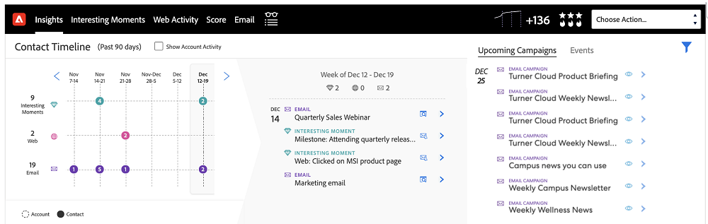
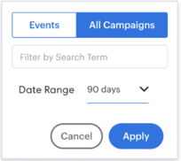
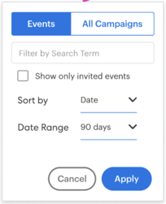

# Insights ダッシュボード機能の概要 {#insights-dashboard-feature-overview}

[!DNL Sales Insights] ダッシュボードで使用できる機能の詳細を説明します。

>[!PREREQUISITES]
>
>最新の MSI SFDC パッケージと[設定](/help/marketo/product-docs/marketo-sales-insight/msi-for-salesforce/configuration/configuration-for-existing-customers.md)が必要です。

## 連絡先レイアウト {#contact-layout}

**エンゲージメント速度グリッド**

* このスマートグリッドには、過去 90 日間の注目のアクション、メール、web アクティビティが含まれます
* ユーザーは、「[!UICONTROL アカウントを表示]」アクティビティを選択できます。これにより、取引先責任者表示で、すべてのアカウントレベルの注目のアクション、メール、web アクティビティがレイヤー化されます
* ユーザーは、特定の週をハイライト表示して、その週内のアクティビティを確認できます
* デフォルトの表示：現在の週が選択されています

**エンゲージメントのドリルダウンと概要**

* 注目のアクション、メール、web アクティビティのアクティビティカードをドリルダウンします
* 注目のアクションアクティビティカード - 購読オプションが含まれます
* メールアクティビティカード - プレビューオプションが含まれます
* Web アクティビティカード - リンクをクリックする機能が含まれます
* 週間サマリーバーには、その週の注目のアクション、メール、web アクティビティが表示されます。 各アイコンはクリック可能な状態で、特定のアクティビティを表示するフィルターとして利用できます
* デフォルトの表示：現在表示されているアクティビティのリスト

**今後のメールキャンペーンおよびイベント**

「メールキャンペーン」タブ：

* 今後 90 日以内にスケジュールされたメールプログラムまたはデフォルトプログラムの一部であるキャンペーンが含まれます
* 連絡先／リードに固有のものではありません（つまり、キャンペーンのリストは、Marketo インスタンスでスケジュールされたすべてのメールキャンペーンの汎用リストです）。 すべてのリード、連絡先、アカウント、商談パネルにわたるキャンペーンのリストは同じになります
* キャンペーンの繰り返しが 90 日間に 3 回以上実行される場合、任意の時点で次の 3 回の実行のみが表示されます（Marketo の動作と同様）。
* このセクションのアクティビティの詳細カードには、プレビューオプションが表示されます。 フローに複数のメール送信手順が含まれる場合、すべてのメールをプレビューできます。 メール送信フローステップ内で「メールの選択肢」が複数ある場合は、デフォルトのオプションをプレビューできます
* フィルターには、「[!UICONTROL 検索]」と「[!UICONTROL 日付範囲]」が含まれます

「イベント」タブ：

* 今後 90 日以内にスケジュールされたイベントプログラムが含まれます
* すべてのイベント／招待イベントを表示するには、フィルターオプションを使用します（管理者設定に基づきます）。
* 招待イベントを選択すると、特定の連絡先が招待されたイベントとメンバーステータスが表示されます
* すべてのイベントを選択すると、90 日以内にスケジュールされたイベントのリストが表示されます
* このセクションのアクティビティの詳細カードには、プレビューオプションがあります
* フィルターには、「[!UICONTROL 検索]」、「[!UICONTROL 招待されたイベントのみを表示]」および「[!UICONTROL 日付範囲]」が含まれます

## リードレイアウト {#lead-layout}

**エンゲージメント速度グリッド**

* このスマートグリッドには、過去 90 日間の注目のアクション、メール、web アクティビティが含まれます&#x200B;
* ユーザーは、特定の週をハイライト表示して、その週内のアクティビティを確認できます
* デフォルトの表示：現在の週が選択されています
* リードは取引先責任者に変換されるまで [!DNL Salesforce] のどのアカウントにも含まれないので、リードでは「[!UICONTROL アカウントアクティビティの表示]」機能を使用できません

**エンゲージメントのドリルダウンと概要**

* 注目のアクション、メール、web アクティビティのアクティビティカードをドリルダウンします
* 注目のモーメントアクティビティカード - 購読オプションが含まれます
* メールアクティビティカード - プレビューオプションが含まれます
* Web アクティビティカード - リンクをクリックする機能が含まれます
* 週間サマリーバーには、その週の注目のアクション、メール、web アクティビティが表示されます。 各アイコンはクリック可能な状態で、特定のアクティビティを表示するフィルターとして利用できます
* デフォルトの表示：現在表示されているアクティビティのリスト

**今後のメールキャンペーンおよびイベント：**

「メールキャンペーン」タブ：

* 今後 90 日以内にスケジュールされたメールプログラムまたはデフォルトプログラムの一部であるキャンペーンが含まれます
* 連絡先／リードに固有のものではありません（つまり、キャンペーンのリストは、Marketo インスタンスでスケジュールされたすべてのメールキャンペーンの汎用リストです）。 すべてのリード、連絡先、アカウント、商談パネルにわたるキャンペーンのリストは同じになります
* キャンペーンの繰り返しが 90 日間に 3 回以上実行される場合、任意の時点で次の 3 回の実行のみが表示されます（Marketo の動作と同様）。
* このセクションのアクティビティの詳細カードには、プレビューオプションが表示されます。 フローに複数のメール送信手順が含まれる場合、すべてのメールをプレビューできます。 メール送信フローステップ内で「メールの選択肢」が複数ある場合は、デフォルトのオプションをプレビューできます
* フィルターには、「[!UICONTROL 検索]」と「[!UICONTROL 日付範囲]」が含まれます

「イベント」タブ：

* 今後 90 日以内にスケジュールされたイベントプログラムが含まれます
* すべてのイベント／招待イベントを表示するには、フィルターオプションを使用します（管理者設定に基づきます）。
* 招待イベントを選択すると、特定の連絡先が招待されたイベントとメンバーステータスが表示されます
* すべてのイベントを選択すると、90 日以内にスケジュールされたイベントのリストが表示されます
* このセクションのアクティビティの詳細カードには、プレビューオプションがあります
* フィルターには、「[!UICONTROL 検索]」、「[!UICONTROL 招待されたイベントのみを表示]」および「[!UICONTROL 日付範囲]」が含まれます。

## アカウントレイアウト {#account-layout}

**エンゲージメント速度グリッド**

* このスマートグリッドには、アカウント内のすべての取引先責任者に対して、過去 90 日間の注目のモーメント、メール、web アクティビティが含まれます
* ユーザーは、特定の週をハイライト表示して、その週内のアクティビティを確認できます
* デフォルトの表示：現在の週が選択されています

**エンゲージメントのドリルダウンと概要**

* 注目のアクション、メール、web アクティビティのアクティビティカードで、取引先責任者名を含めたドリルダウンが可能です
* 注目のモーメントアクティビティカード - 購読オプションが含まれます
* メールアクティビティカード - プレビューオプションが含まれます
* Web アクティビティカード - リンクをクリックする機能が含まれます
* 週間サマリーバーには、その週の注目のアクション、メール、web アクティビティが表示されます。 各アイコンはクリック可能な状態で、特定のアクティビティを表示するフィルターとして利用できます
* デフォルトの表示：現在表示されているアクティビティのリスト

**今後のメールキャンペーンおよびイベント**

「メールキャンペーン」タブ：

* 今後 90 日以内にスケジュールされたメールプログラムまたはデフォルトプログラムの一部であるキャンペーンが含まれます
* 連絡先／リードに固有のものではありません（つまり、キャンペーンのリストは、Marketo インスタンスでスケジュールされたすべてのメールキャンペーンの汎用リストです）。 すべてのリード、連絡先、アカウント、商談パネルにわたるキャンペーンのリストは同じになります
* キャンペーンの繰り返しが 90 日間に 3 回以上実行される場合、任意の時点で次の 3 回の実行のみが表示されます（Marketo の動作と同様）。
* このセクションのアクティビティの詳細カードには、プレビューオプションが表示されます。 フローに複数のメール送信手順が含まれる場合、すべてのメールをプレビューできます。 メール送信フローステップ内で「メールの選択肢」が複数ある場合は、デフォルトのオプションをプレビューできます
* フィルターには、「[!UICONTROL 検索]」と「[!UICONTROL 日付範囲]」が含まれます

「イベント」タブ：

* 今後 90 日以内にスケジュールされたイベントプログラムが含まれます
* すべてのイベント／招待イベントを表示するには、フィルターオプションを使用します（管理者設定に基づきます）。
* 招待イベントを選択すると、特定の連絡先が招待されたイベントとメンバーステータスが表示されます
* すべてのイベントを選択すると、90 日以内にスケジュールされたイベントのリストが表示されます
* このセクションのアクティビティの詳細カードには、プレビューオプションがあります
* フィルターには、「[!UICONTROL 検索]」、「[!UICONTROL 招待されたイベントのみを表示]」および「[!UICONTROL 日付範囲]」が含まれます

## 商談レイアウト {#opportunity-layout}

**エンゲージメント速度グリッド**

* このスマートグリッドには、商談内のすべての取引先責任者に対して、過去 90 日間の注目のアクション、メール、web アクティビティが含まれます
* ユーザーは、特定の週をハイライト表示して、その週内のアクティビティを確認できます
* デフォルトの表示：現在の週が選択されています

**エンゲージメントのドリルダウンと概要**

* 注目のアクション、メール、web アクティビティのアクティビティカードで、取引先責任者名を含めたドリルダウンが可能です
* 注目のモーメントアクティビティカード - 購読オプションが含まれます
* メールアクティビティカード - プレビューオプションが含まれます
* Web アクティビティカード - リンクをクリックする機能が含まれます
* 週間サマリーバーには、その週の注目のアクション、メール、web アクティビティが表示されます。 各アイコンはクリック可能な状態で、特定のアクティビティを表示するフィルターとして利用できます
* デフォルトの表示：現在表示されているアクティビティのリスト

「**今後のメールキャンペーンおよびイベント**&#x200B;メールキャンペーン」タブ：

* 今後 90 日以内にスケジュールされたメールプログラムまたはデフォルトプログラムの一部であるキャンペーンが含まれます
* 連絡先／リードに固有のものではありません（つまり、キャンペーンのリストは、Marketo インスタンスでスケジュールされたすべてのメールキャンペーンの汎用リストです）。 すべてのリード、連絡先、アカウント、商談パネルにわたるキャンペーンのリストは同じになります
* キャンペーンの繰り返しが 90 日間に 3 回以上実行される場合、任意の時点で次の 3 回の実行のみが表示されます（Marketo の動作と同様）。
* このセクションのアクティビティの詳細カードには、プレビューオプションが表示されます。 フローに複数のメール送信手順が含まれる場合、すべてのメールをプレビューできます。 メール送信フローステップ内で「メールの選択肢」が複数ある場合は、デフォルトのオプションをプレビューできます
* フィルターには、「[!UICONTROL 検索]」と「[!UICONTROL 日付範囲]」が含まれます

「イベント」タブ：

* 今後 90 日以内にスケジュールされたイベントプログラムが含まれます
* すべてのイベント／招待イベントを表示するには、フィルターオプションを使用します（管理者設定に基づきます）。
* 招待イベントを選択すると、特定の連絡先が招待されたイベントとメンバーステータスが表示されます
* すべてのイベントを選択すると、90 日以内にスケジュールされたイベントのリストが表示されます
* このセクションのアクティビティの詳細カードには、プレビューオプションがあります
* フィルターには、「[!UICONTROL 検索]」、「[!UICONTROL 招待されたイベントのみを表示]」および「[!UICONTROL 日付範囲]」が含まれます

>[!NOTE]
>
>アカウントまたは商談に 800 名を超える連絡先がある場合、ダッシュボードにはデータが表示されません。 ただし、個々の連絡先に移動して、インサイトとエンゲージメントを確認できます。 お使いのアカウントに 800 名を超える取引先責任者がある場合、「[!UICONTROL アカウントレベルのアクティビティの表示]」は無効になります。
