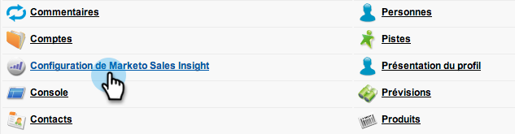
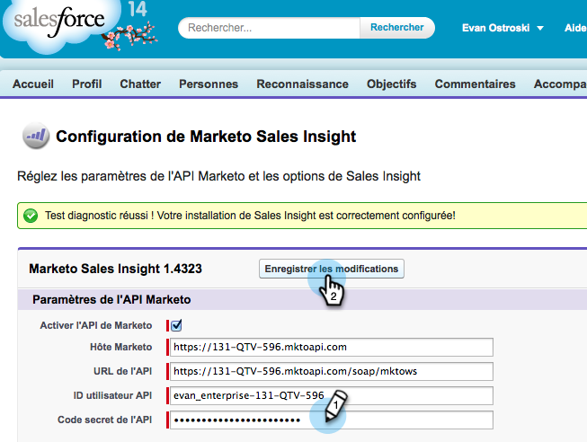
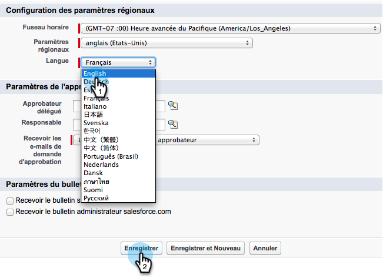

# Salesforce での多言語サポートに向けた Sales Insight の準備 {#prepare-sales-insight-for-multi-lingual-support-in-salesforce}

>[!NOTE]
>
>**管理者権限が必要**

Marketo Sales Insight は言語別に格納されます。したがって、複数の言語を扱う場合は、言語ごとに別個に認証情報を入力する必要があります。

>[!NOTE]
>
>Sales Insight は現在、次の言語をサポートしています。
>
>* 英語
>* フランス語
>* ドイツ語

>
>
それ以外の言語は、デフォルトで英語に設定されます。

## Marketo Sales Insight の新しい言語の追加 {#adding-a-new-language-for-marketo-sales-insight}

1. Salesforce にログインします。右上隅の名前のドロップダウンで、「**設定**」をクリックします。

   

1. 「**マイ個人情報**」で、「**個人情報**」をクリックします。

   

1. 「**編集**」をクリックします。

   

1. 言語を選択し、「**保存**」をクリックします。

   

1. これで、Salesforce インターフェイスが選択した言語に変わります。「**+**」アイコンをクリックすると、使用可能なタブがすべて表示されます。

   

1. 「**Marketo Sales Insight** を設定」をクリックします（選択した言語で）。

   

1. Marketo に移動します。「[Marketo Sales Insight **API 設定**&#x200B;の詳細](/help/marketo/product-docs/marketo-sales-insight/msi-for-salesforce/configuration/configure-marketo-sales-insight-in-salesforce-enterprise-unlimited.md#configure-marketo-sales-insight)」を見つけます。

   

1. Marketo から API の詳細を入力し、「**保存**」をクリックします。

   

## Salesforce を英語に戻す {#change-salesforce-back-to-english}

Salesforce 組織のカスタマイズが完了したら、次の手順で個人設定を英語に戻します。

>[!NOTE]
>
>次のスクリーンショットは、英語の説明を含むフランス語版です。前の手順で選択した言語のテキストと同じ画面が表示されます。

1. 自分の名前で、「**設定**」をクリックします。

1. 「**マイ個人情報**」の「**個人情報**」をクリックします。

   

1. 「**編集**」をクリックします。

   

1. 「言語」ドロップダウンから「**英語**」を選択し、「**保存**」をクリックします。

   

   これで、Salesforce が英語に戻りました。
