# Salesforce での多言語サポートに向けたセールスインサイトの準備 {#prepare-sales-insight-for-multi-lingual-support-in-salesforce}

>[!NOTE]
>
>**管理者権限が必要**

Marketo セールスインサイトは言語別に格納されます。 したがって、複数の言語を扱う場合は、言語ごとに別個に資格情報を入力する必要があります。

>[!NOTE]
>
>[!DNL Sales Insight] は現在、次をサポートしています。
>
>* 英語
>* フランス語
>* ドイツ語
>
>それ以外の言語は、デフォルトで英語に設定されます。

## [!DNL Marketo Sales Insight] 用の新しい言語の追加 {#adding-a-new-language-for-marketo-sales-insight}

1. [!DNL Salesforce] にログインします。 右上隅の名前のドロップダウンで、「**[!UICONTROL 設定]**」をクリックします。

   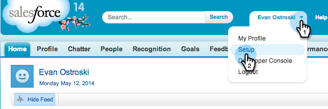

1. 「**[!UICONTROL マイ個人情報]**」で、「**[!UICONTROL 個人情報]**」をクリックします。

   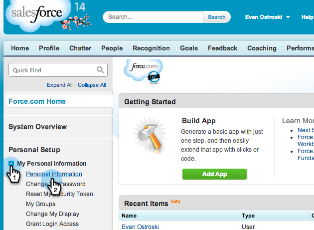

1. 「**[!UICONTROL 編集]**」をクリックします。

   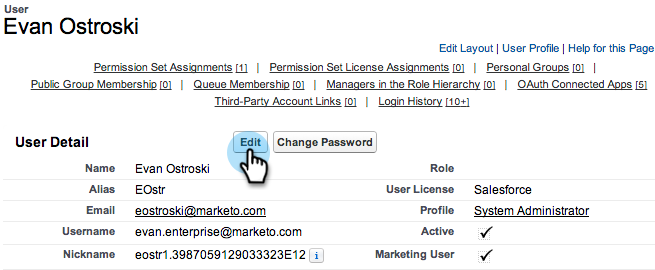

1. 言語を選択し、「**[!UICONTROL 保存]**」をクリックします。

   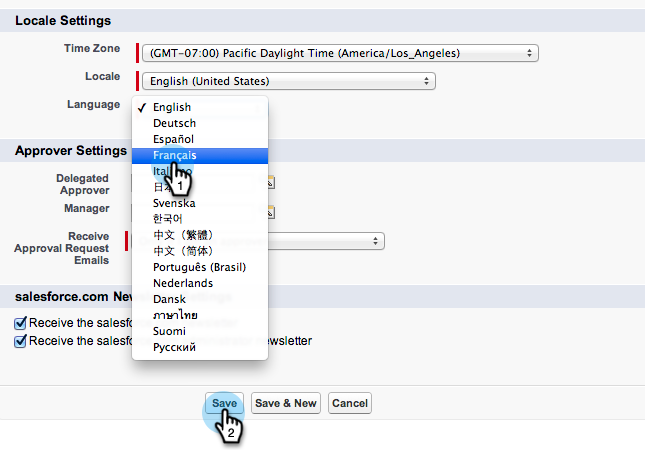

1. これで、[!DNL Salesforce] インターフェイスが選択した言語に変わります。 「**+**」アイコンをクリックすると、使用可能なタブがすべて表示されます。

   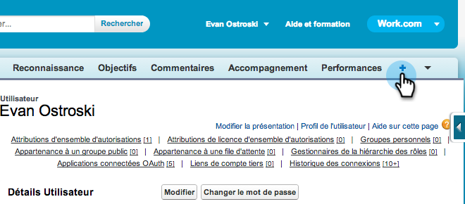

1. 「**[!UICONTROL Marketo セールスインサイト]**&#x200B;設定」をクリックします（選択した言語で）。

   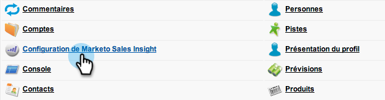

1. Marketo に移動します。 [[!DNL Marketo Sales Insight] **[!UICONTROL &#x200B; API 設定&#x200B;]**&#x200B;の詳細](/help/marketo/product-docs/marketo-sales-insight/msi-for-salesforce/configuration/configure-marketo-sales-insight-in-salesforce-enterprise-unlimited.md#configure-marketo-sales-insight)を見つけます。

   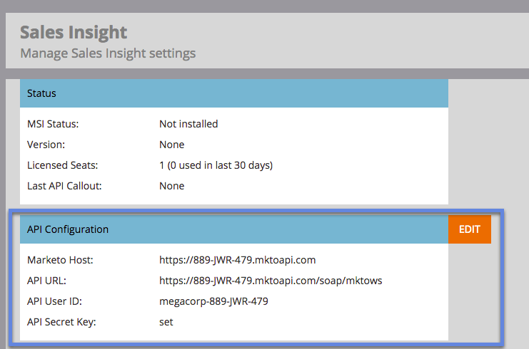

1. Marketo から API の詳細を入力し、「**[!UICONTROL 保存]**」をクリックします。

   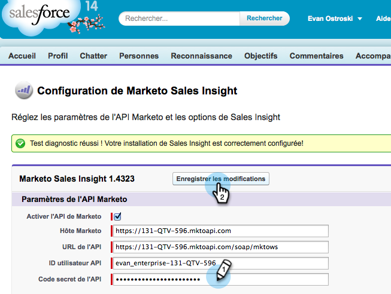

## [!DNL Salesforce] を英語に戻す {#change-salesforce-back-to-english}

[!DNL Salesforce] 組織のカスタマイズが完了したら、次の手順で個人設定を英語に戻します。

>[!NOTE]
>
>次のスクリーンショットは、英語の説明を含むフランス語版です。  前の手順で選択した言語のテキストと同じ画面が表示されます。

1. 自分の名前で、「**[!UICONTROL 設定]**」をクリックします。

1. 「**[!UICONTROL マイ個人情報]**」の「**[!UICONTROL 個人情報]**」をクリックします。

   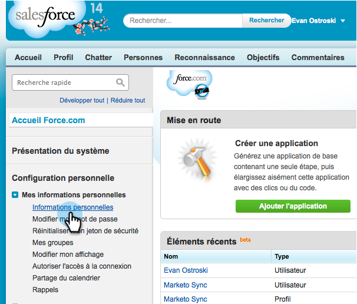

1. 「**[!UICONTROL 編集]**」をクリックします。

   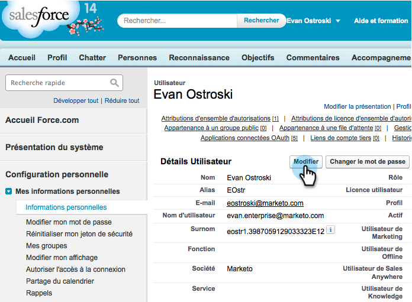

1. 「言語」ドロップダウンから「**[!UICONTROL 英語]**」を選択し、「**[!UICONTROL 保存]**」をクリックします。

   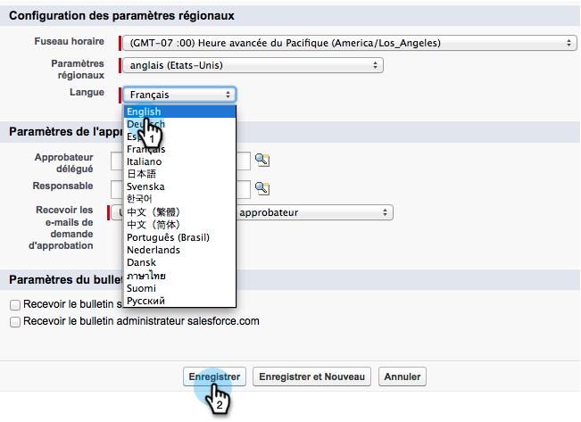

   これで、[!DNL Salesforce] が英語に戻りました。
