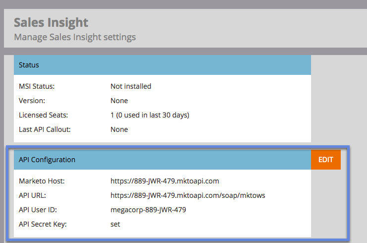

# Salesforceでの多言語サポートのためのSales Insightの準備{#prepare-sales-insight-for-multi-lingual-support-in-salesforce}

>[!NOTE]
>
>**必要な管理者権限**

Marketoセールスインサイトは言語別に保存されています。 したがって、複数の言語で機能させる場合は、言語ごとに資格情報を個別に入力する必要があります。

>[!NOTE]
>
>Sales Insightは、現在、次の機能をサポートしています。
>
>* 英語
>* フランス語
>* ドイツ語

>
>
その他の言語はデフォルトで英語に設定されます。

## Marketo販売インサイト用の新しい言語の追加{#adding-a-new-language-for-marketo-sales-insight}

1. Salesforceにログインします。 右上隅の自分の名前のドロップダウンで、「**セットアップ**」をクリックします。

   

1. 「**個人情報**」で、「**個人情報**」をクリックします。

   

1. 「**編集**」をクリックします。

   

1. 言語を選択し、「**保存**」をクリックします。

   

1. これで、Salesforceインターフェイスは選択された言語になりました。 **+**&#x200B;アイコンをクリックすると、使用可能なすべてのタブを表示できます。

   

1. 「**Marketo販売インサイトを設定**」（選択した言語で）をクリックします。

   

1. Marketo に移動. [Marketo販売インサイト&#x200B;**API構成**&#x200B;の詳細](/help/marketo/product-docs/marketo-sales-insight/msi-for-salesforce/configuration/configure-marketo-sales-insight-in-salesforce-enterprise-unlimited.md#configure-marketo-sales-insight)を探します。

   

1. MarketoからAPIの詳細を入力し、「**保存**」をクリックします。

   

## Salesforceを英語に戻す{#change-salesforce-back-to-english}

Salesforce組織のカスタマイズが完了したら、次の方法で個人設定を英語に戻します。

>[!NOTE]
>
>フランス語でのスクリーンショットは英語での説明を含む。  前の手順で選択した言語のテキストと同じ画面が表示されます。

1. 自分の名前の下にある&#x200B;**セットアップ**&#x200B;をクリックします。

1. **個人情報**&#x200B;の下の&#x200B;**個人情報**&#x200B;をクリックします。

   

1. 「**編集**」をクリックします。

   

1. 「言語」ドロップダウンから「**英語**」を選択し、「**保存**」をクリックします。

   

   今、セールスフォースは英語で戻ってきました！
