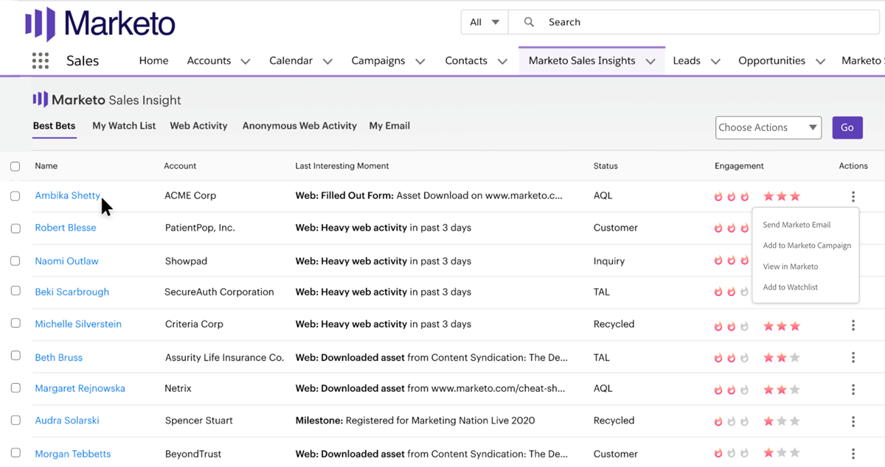
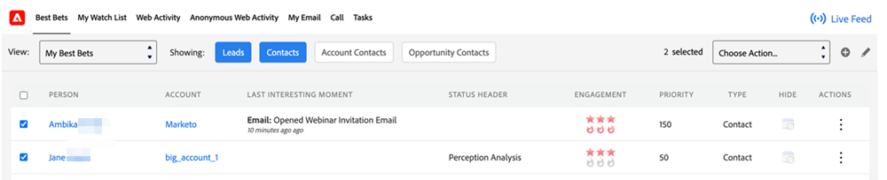

# [!DNL Best Bets] {#best-bets}

「[!DNL Best Bets]」タブには、優先度に基づいて緊急度と相対スコアを使用して計算された、すべてのホットリードのリストが表示されます。

>[!CAUTION]
>
>最有望見込客の数が 1,000 を超えないように注意してください。超過すると、ページの読み込みが停止する可能性があります。 その場合は、フィルターを使用して最有望見込客の合計数を絞り込みます。

**フィルターオプション**

次の各ボタンをクリックすると、[!DNL Best Bets] を表示できます。

* リード：CRM で割り当てられているすべてのリードの [!DNL Best Bets] を確認できます。
* 取引先責任者：CRM に割り当てられているすべての取引先責任者の [!DNL Best Bets] を確認できます。
* アカウントの取引先責任者：取引先責任者自体が割り当てられていない場合でも、CRM で割り当てられたアカウントに属するすべての取引先責任者の [!DNL Best Bets] を確認できます。
* 商談の取引先責任者：取引先責任者自体が割り当てられていない場合でも、CRM で割り当てられた商談に属するすべての取引先責任者の [!DNL Best Bets] を確認できます。

**注意事項**

デフォルトでは、「リードと連絡先」ボタンが選択されています。 1 つ以上のフィルターオプションを選択でき、4 つのオプションのうち少なくとも 1 つを常に選択する必要があります。

所有していないリードや取引先責任者を「非表示にする」ことはできません。

**インラインエンゲージメント**

「[!UICONTROL アクション]」列の下のデータメニューをクリックすると、次のエンゲージメントオプションを使用して、特定のリードまたは取引先責任者にアクセスできます。

* [!UICONTROL Marketo メールを送信]
* [!UICONTROL Marketo キャンペーンに追加]
* [!UICONTROL Marketo 内に表示]
* [!UICONTROL ウォッチリストに追加]

**一括アクション**

チェックボックスを使用して、1 つ以上のリードまたは取引先責任者を [!DNL Best Bets] ページから選択し、次のエンゲージメントオプションを使用してグループとしてリーチできます。

* [!UICONTROL Marketo メールを送信]
* [!UICONTROL Marketo キャンペーンに追加]
* [!UICONTROL ウォッチリストに追加]

>[!NOTE]
>
>ウォッチリストに追加するには、取引先責任者／リードがデフォルトパーティションに存在する必要があります。
