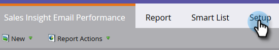

# Sales Insight のメール効果レポート {#sales-insight-email-performance-report}

Salesforce、Microsoft Dynamics、Gmail または Outlook プラグインを通じて送信されるメールのパフォーマンスを表示します。

## レポートの生成 {#generate-a-report}

1. 「**分析**」をクリックします。

   

1. 「**Sales Insight のメール効果**」をクリックします。

   

1. 「**設定**」タブをクリックし、必要な値を選択します。

   

1. 「**レポート**」タブをクリックします。

   

   これで完了です。セールスチームから送信されたメールの効果を確認できます。

   >[!NOTE]
   >
   >配信ステータスは、Sales Insight を通じて送信されたメールに対しては取得されず、このレポートやアクティビティログには含まれません。

>[!TIP]
>
>メールの名前をクリックして、メールプレビューツールで開きます。

## セールス担当者別グループ {#group-by-sales-rep}

設定を変更すると、このレポートをセールス担当者別グループで表示できます。

1. 「**設定**」をクリックします。「**電子メール**」をダブルクリックします。

   

1. 「**セールス担当者**&#x200B;別グループ」を選択します。

   

1. 「**保存**」をクリックします。

   

1. 「**レポート**」タブをクリックします。

   

   簡単ですね。これで、セールス担当者別にグループ化されたメールの効果を確認できます。
