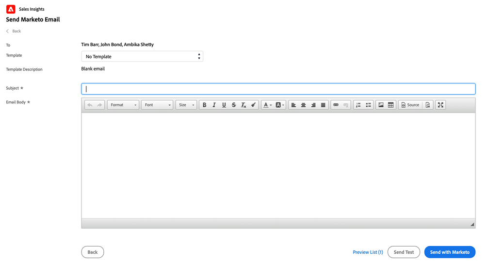

# Marketo Sales Insight の複数レコードへのメール送信 {#send-an-email-to-multiple-records-in-marketo-sales-insight}

Marketo Sales Insight を使用して、Marketo のメールを複数の人に簡単に送信できます。それでは始めましょう。

1. Salesforce で、「**リード**」または「**連絡先**」をクリックします。

   

1. 「**移動**」をクリックして、開いているすべてのリードを表示します。

   

1. リスト表示で、メールを送信するすべてのリード／連絡先を確認し、「**Marketo メールの送信（クラシック）**」をクリックします。

   

   >[!NOTE]
   >
   >Salesforce Lightning を使用している場合、ボタンは「**Marketo メールの送信（lightning）**」と表示されます。

   >[!TIP]
   >
   >ボタンが表示されない場合[リスト表示に Marketo ボタンを追加](/help/marketo/product-docs/marketo-sales-insight/msi-for-salesforce/configuration/add-bulk-action-buttons-to-salesforce-classic.md)したか確認してください。

1. メールを作成してください。終了したら「**Marketo で送信**」をクリックします。

   

   >[!TIP]
   >
   >[Sales Insight にメールを公開](/help/marketo/product-docs/marketo-sales-insight/msi-for-salesforce/features/actions-in-the-msi-panel/send-marketo-email/publish-an-email-to-sales-insight.md)して、そのメールから選択することができます。

   >[!NOTE]
   >
   >一度に最大 200 通の Marketo メールを送信できます。
