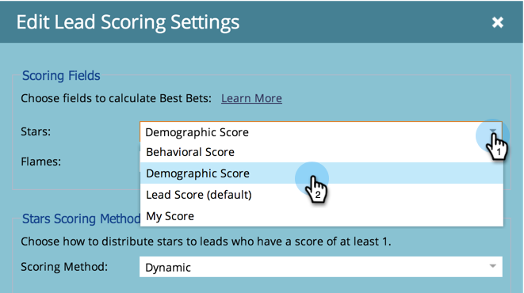

# [!UICONTROL  で ] 星 [!UICONTROL  と ] 炎 [!DNL Sales Insight] に使用するスコアフィールドを設定 {#set-score-fields-to-be-used-for-stars-and-flames-in-sales-insight}

>[!NOTE]
>
>**管理者権限が必要**

デフォルト [!DNL Marketo Sales Insight] は、「リードスコア **[!UICONTROL フィールドを使用して星と炎を計算します]** 別のフィールドを選択する場合は、次をおこないます。

>[!TIP]
>
>カスタムスコアフィールドがまだない場合は、[作成](/help/marketo/product-docs/administration/field-management/create-a-custom-field-in-marketo.md)します。

>[!NOTE]
>
>**定義**
>
>* **[!UICONTROL 星]**：星は、他のリードと比較した合計リードスコアを表します。
>* **[!UICONTROL 炎]**：炎は緊急度を表し、リードのスコアが最近どの程度変化したかを示します。
>

1. 「**[!UICONTROL 管理者]**」で、「**[!UICONTROL Sales Insight]**」をクリックします。

   

1. **[!UICONTROL リードスコア設定]**&#x200B;で、「**[!UICONTROL 編集]**」をクリックします。

   

1. **[!UICONTROL 星]**&#x200B;で使用するフィールドを選択します。

   

1. **[!UICONTROL 炎]**&#x200B;で使用するフィールドを選択します。

   

1. 「**[!UICONTROL 保存]**」をクリックします。

   

   >[!NOTE]
   >
   >再計算 [!DNL Sales insight] はしばらく時間がかかります。 後で CRM をチェックして星と炎を確認できます。

   >[!MORELIKETHIS]
   >
   >[優先度、緊急度、相対スコア、最有望見込客](/help/marketo/product-docs/marketo-sales-insight/msi-for-salesforce/features/stars-and-flames/priority-urgency-relative-score-and-best-bets.md)
