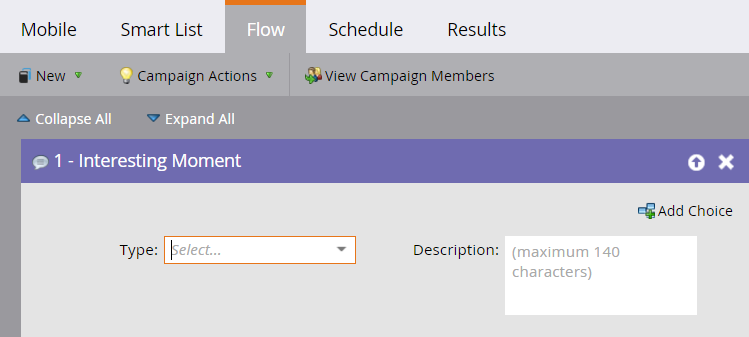
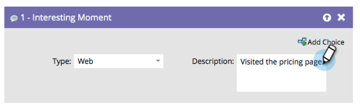

# 注目のアクションの概要 {#interesting-moments-overview}

注目のアクションフローステップを使用して、スマートキャンペーンでリードが行っている注目のアクションをセールスチームが把握できるようにします。

>[!AVAILABILITY]
>
>興味深い瞬間を使用するには、[!DNL Marketo Sales Insight]または[[!DNL Marketo Sales Connect]](/help/marketo/product-docs/marketo-sales-connect/marketo/interesting-moments-in-sales-connect.md) ユーザーである必要があります。

1. 使用する注目のアクションのタイプを選択します。

   

1. セールスチームに表示するテキストを定義します。

   

>[!TIP]
>
>**少ないほうが効果的です**。 セールスチームと協力して、注目のアクションが実際に注目するべきものであることを確認します。

また、注目のアクションにトークンを使用して動的な説明を作成すると、大いに役立ちます。

>[!MORELIKETHIS]
>
>* [注目のアクションの使用](/help/marketo/product-docs/marketo-sales-insight/msi-for-salesforce/features/tabs-in-the-msi-panel/interesting-moments/using-interesting-moments.md)
>* [注目のアクションのトークン](/help/marketo/product-docs/marketo-sales-insight/msi-for-salesforce/features/tabs-in-the-msi-panel/interesting-moments/trigger-tokens-for-interesting-moments.md)
